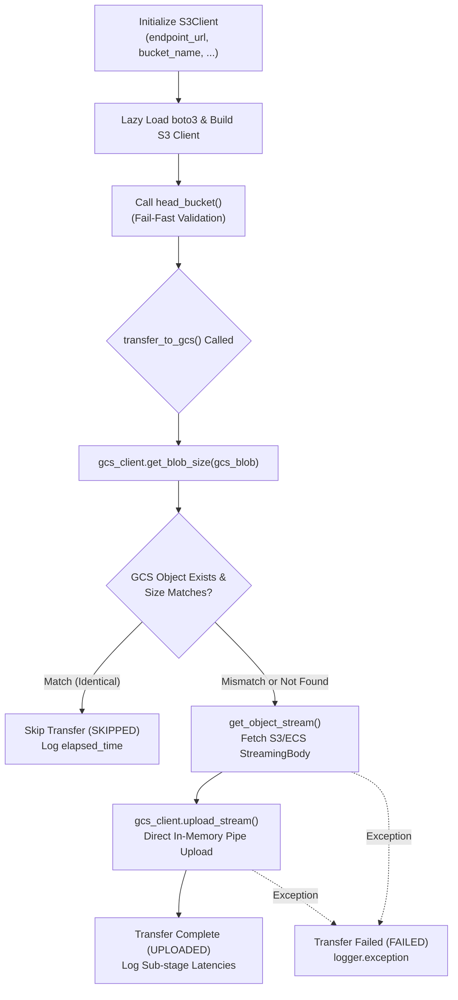

# 3.1. AWS S3 and Dell ECS Object Storage Client (`S3Client`)

> **Module**: `agent_common.clients.S3Client`  
> **Key Methods**: `list_objects()`, `get_object_stream()`, `get_object_size()`, `transfer_to_gcs()`  
> **Dependencies**: `boto3>=1.26.0`, `botocore`

---

## 1. Overview & Purpose

In enterprise hybrid cloud architectures, organizations frequently store and transfer high-volume datasets across both public clouds like **AWS S3** and on-premises S3-compatible object storage such as **Dell ECS (Elastic Cloud Storage)**.

`agent_common.clients.S3Client` provides a unified, production-hardened client interface for any S3-compliant storage platform.

Key design principles include:
1. **Third-Party SDK Lazy Loading**: Defers importing `boto3` until first use, preventing unnecessary memory overhead and ensuring lightweight process initialization.
2. **Fail-Fast Early Connectivity Validation**: Calls `head_bucket()` immediately during initialization to detect network configuration issues or missing bucket permissions before processing tasks.
3. **High-Throughput Paging Generator**: Safely traverses millions of object keys via Python generators (`yield`) without risking Out-Of-Memory (OOM) errors.
4. **Zero-Copy GCS Pipeline Streaming & Smart Skipping**: Streams objects directly from S3/ECS to Google Cloud Storage (GCS) in memory without intermediate disk I/O, automatically skipping transfers when an identical file already exists at the destination.

---

## 2. Architecture & Transfer Pipeline



---

## 3. Core Methods & Specifications

### 3.1. Constructor (`__init__`)
```python
def __init__(
    self,
    endpoint_url_str: str | None = None,
    access_key_str: str | None = None,
    secret_key_str: str | None = None,
    bucket_name_str: str = "",
    timeout_seconds_int: int | None = None,
    region_name_str: str | None = None,
) -> None
```
- **Parameters**:
  - `endpoint_url_str`: Endpoint URL for on-premises S3-compatible storage such as Dell ECS (leave `None` for standard AWS S3).
  - `access_key_str`: S3 Access Key ID (optional in IAM Role environments).
  - `secret_key_str`: S3 Secret Access Key (optional in IAM Role environments).
  - `bucket_name_str`: Target bucket name (**Mandatory**).
  - `timeout_seconds_int`: Network socket connection and read timeout in seconds (falls back to `config.transfer.timeout_seconds_int`).
  - `region_name_str`: AWS region identifier (e.g., `'ap-northeast-2'`).
- **Fail-Fast Behavior**: Verifies bucket accessibility immediately via `head_bucket()`. Raises `ConnectionError` on failure.

### 3.2. Paged Object Listing (`list_objects`)
```python
def list_objects(self, prefix_str: str = "") -> Generator[Dict[str, Any], None, None]
```
- Uses `boto3`'s `list_objects_v2` paginator to lazily stream object metadata dictionaries without buffering all records in memory.

### 3.3. In-Memory Streaming Body (`get_object_stream`)
```python
def get_object_stream(self, key_str: str = "") -> Any
```
- Obtains the raw `StreamingBody` for the specified object, allowing immediate pipe forwarding to downstream destinations.

### 3.4. Object Size Lookup (`get_object_size`)
```python
def get_object_size(self, key_str: str = "") -> int | None
```
- Fast metadata lookup of the object's `ContentLength` via `head_object` without retrieving payload data.

### 3.5. Direct GCS Transfer with Smart Skipping (`transfer_to_gcs`)
```python
def transfer_to_gcs(
    self,
    gcs_client_obj: GcsClient,
    s3_key_str: str = "",
    gcs_blob_name_str: str = "",
    size_int: int = 0,
) -> str
```
- Pre-checks GCS destination blob size. Returns `"SKIPPED"` if identical.
- Streams payload into GCS and returns `"UPLOADED"` upon success, or `"FAILED"` upon error.
- Emits structured single-line telemetry logging each latency stage (`CheckTime`, `S3StreamTime`, `GCSUploadTime`, `TotalElapsed`).

---

## 4. Practical Usage Examples

### 4.1. Initializing for Dell ECS or AWS S3
```python
from agent_common.clients import S3Client

# 1) Dell ECS On-Premises Configuration
ecs_client = S3Client(
    endpoint_url_str="https://ecs.mycorp.internal:9021",
    access_key_str="MY_ECS_ACCESS_KEY",
    secret_key_str="MY_ECS_SECRET_KEY",
    bucket_name_str="raw-lake-bucket",
    timeout_seconds_int=60,
)

# 2) Standard AWS S3 Configuration (IAM Role)
s3_client = S3Client(
    bucket_name_str="my-aws-s3-bucket",
    region_name_str="ap-northeast-2",
)
```

### 4.2. Paged Traversal & Direct GCS Streaming
```python
from agent_common.clients import S3Client, GcsClient

s3_client = S3Client(
    endpoint_url_str="https://ecs.company.com:9021",
    access_key_str="ACCESS_KEY",
    secret_key_str="SECRET_KEY",
    bucket_name_str="source-bucket",
)

gcs_client = GcsClient(
    bucket_name_str="target-gcs-bucket",
    credentials_path_str="secrets/gcp_sa_key.json",
)

# Stream and migrate objects under a date prefix
target_prefix_str = "raw/events/2026/08/24/"

for obj_dict in s3_client.list_objects(prefix_str=target_prefix_str):
    s3_key_str: str = obj_dict["Key"]
    size_int: int = obj_dict["Size"]
    gcs_blob_str: str = f"lake/{s3_key_str.lstrip('/')}"
    
    status_str = s3_client.transfer_to_gcs(
        gcs_client_obj=gcs_client,
        s3_key_str=s3_key_str,
        gcs_blob_name_str=gcs_blob_str,
        size_int=size_int,
    )
    print(f"[{status_str}] {s3_key_str} -> {gcs_blob_str} ({size_int:,} bytes)")
```

---

## 5. Troubleshooting & Diagnostics

| Exception | Root Cause | Recommended Action |
| :--- | :--- | :--- |
| `ImportError: 'boto3' package is required` | Missing `boto3` library | Run `pip install agent_common[clients]` or `pip install boto3` |
| `ValueError: S3/ECS bucket_name_str is mandatory` | `bucket_name_str` missing or empty | Provide a valid non-empty bucket name |
| `ConnectionError: connection_failed` | Incorrect endpoint URL, network firewall, or invalid IAM credentials | Verify endpoint reachability (`curl -k`) and verify access keys |
| `RuntimeError: list_failed` | Network timeout during paginated listing | Increase `timeout_seconds_int` and verify network proxy settings |
| `RuntimeError: transfer_failed` | Broken stream connection during transfer | Check object integrity and upstream storage health |
