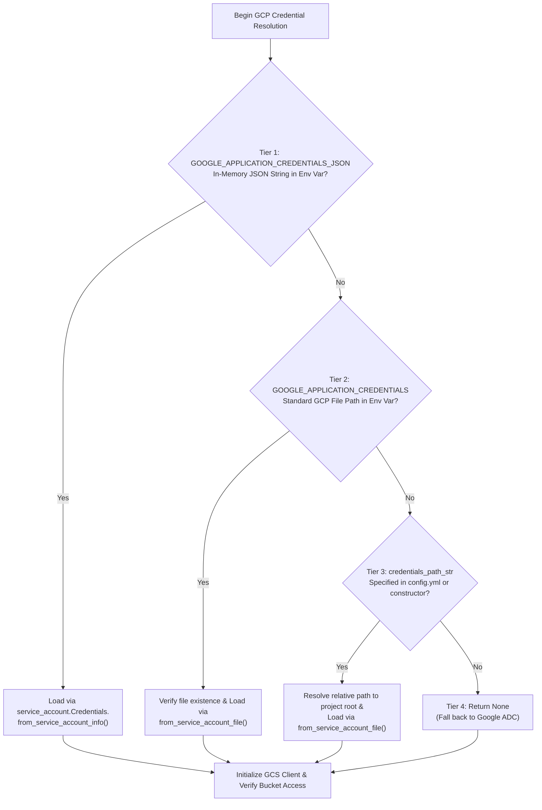

# 3.2. Google Cloud Storage Streaming Client & Multi-Tier Authentication (`GcsClient`)

> **Module**: `agent_common.clients.GcsClient`  
> **Key Methods**: `get_blob_size()`, `upload_stream()`, `_resolve_gcp_credentials()`  
> **Dependencies**: `google-cloud-storage>=2.10.0`, `google-auth`

---

## 1. Overview & Purpose

Google Cloud Storage (GCS) serves as the primary data landing zone for analytics lakes and BigQuery pipelines.

In enterprise data engineering and autonomous agent architectures, applications run across heterogeneous infrastructures (developer workstations, on-premises Airflow servers, Google Compute Engine VMs, GKE pods). Injecting credentials consistently across these environments requires a flexible hierarchy. Additionally, streaming large multi-gigabyte files without buffering them entirely in memory or writing them to local scratch disks prevents Out-Of-Memory (OOM) failures and disk exhaustion.

`agent_common.clients.GcsClient` provides a **4-stage credential resolution hierarchy** and a **zero-disk streaming upload engine** to ensure secure, resilient storage connectivity.

---

## 2. Four-Tier GCP Credential Resolution Architecture

`GcsClient` resolves GCP credentials (`google.auth.credentials.Credentials`) according to the following strict order of precedence:



### Hierarchy Details:
1. **Tier 1 (`GOOGLE_APPLICATION_CREDENTIALS_JSON`)**:
   - Parses the raw JSON string directly from the environment variable. Ideal for containerized environments (K8s secrets, CI/CD runners) where storing physical credential files on disk is prohibited.
2. **Tier 2 (`GOOGLE_APPLICATION_CREDENTIALS`)**:
   - Reads from the file path specified in Google's standard environment variable.
3. **Tier 3 (`credentials_path_str`)**:
   - Uses the key file path defined in `config.yml` or passed to the constructor. Relative paths are automatically resolved against the project root via `ConfigLoader.project_path`.
4. **Tier 4 (Google ADC - Application Default Credentials)**:
   - Uses metadata server tokens (GKE Workload Identity, GCE service accounts) or local `gcloud auth application-default login` credentials.

---

## 3. Core Methods & Specifications

### 3.1. Constructor (`__init__`)
```python
def __init__(
    self,
    bucket_name_str: str = "",
    credentials_path_str: str = "",
    timeout_seconds_int: int | None = None,
) -> None
```
- **Parameters**:
  - `bucket_name_str`: Target GCS bucket name (**Mandatory**).
  - `credentials_path_str`: Path to service account key JSON file (optional).
  - `timeout_seconds_int`: Network connection and upload timeout in seconds (falls back to `config.transfer.timeout_seconds_int`).
- **Behavior**:
  - Lazy-loads Google Cloud client libraries via `_get_gcs()`.
  - Resolves credentials via the 4-tier mechanism.
  - Verifies bucket existence and permissions immediately via `get_bucket(timeout=...)` (Fail-Fast).

### 3.2. Blob Size Lookup (`get_blob_size`)
```python
def get_blob_size(self, destination_blob_name_str: str = "") -> int | None
```
- Retrieves the byte size (`int`) of the target GCS blob. Returns `None` if the blob does not exist.

### 3.3. Streaming Upload (`upload_stream`)
```python
def upload_stream(
    self,
    stream_any: Any = None,
    destination_blob_name_str: str = "",
    size_int: int = 0,
    timeout_int: int | None = None,
) -> None
```
- Uploads an open binary stream directly to GCS via `blob.upload_from_file(stream, size=size_int, timeout=...)`.
- Streams payload data in chunks without full-file buffering in RAM.
- Raises `RuntimeError` with detailed diagnostics upon network interruptions or permission failures.

---

## 4. Practical Usage Examples

### 4.1. File-Based Authentication
```python
from agent_common.clients import GcsClient

gcs_client = GcsClient(
    bucket_name_str="my-enterprise-data-lake",
    credentials_path_str="config/secrets/gcp_sa_key.json",
    timeout_seconds_int=120,
)
```

### 4.2. In-Memory JSON Authentication (K8s Pod / CI/CD)
```bash
export GOOGLE_APPLICATION_CREDENTIALS_JSON='{"type": "service_account", "project_id": "my-project", ...}'
```

```python
from agent_common.clients import GcsClient

# Automatically resolves credentials from GOOGLE_APPLICATION_CREDENTIALS_JSON
gcs_client = GcsClient(bucket_name_str="my-enterprise-data-lake")
```

### 4.3. Streaming In-Memory Bytes to GCS
```python
import io
from agent_common.clients import GcsClient

gcs_client = GcsClient(bucket_name_str="analytics-bucket")

payload_bytes = b'{"record_id": "REC_001", "status": "COMPLETED"}\n'
stream_obj = io.BytesIO(payload_bytes)
target_blob_str = "records/2026/08/24/rec_001.json"

gcs_client.upload_stream(
    stream_any=stream_obj,
    destination_blob_name_str=target_blob_str,
    size_int=len(payload_bytes),
)

size_int = gcs_client.get_blob_size(target_blob_str)
print(f"Verified GCS Upload: {target_blob_str} ({size_int} bytes)")
```

---

## 5. Troubleshooting & Diagnostics

| Exception | Root Cause | Recommended Action |
| :--- | :--- | :--- |
| `ImportError: 'google-cloud-storage' package is required` | GCS SDK not installed | Run `pip install agent_common[clients]` or `pip install google-cloud-storage` |
| `ValueError: GCS bucket_name_str is mandatory` | `bucket_name_str` is missing or empty | Provide a valid bucket name |
| `FileNotFoundError: Key file not found` | Specified `credentials_path_str` does not exist | Check path syntax and project root resolution |
| `ValueError: Failed to parse in-memory JSON credentials` | Invalid JSON syntax in `GOOGLE_APPLICATION_CREDENTIALS_JSON` | Verify environment variable JSON escaping |
| `ConnectionError: connection_failed (403 Forbidden)` | Missing Storage Object Admin / Creator permissions | Grant necessary IAM roles on target GCS bucket |
| `RuntimeError: transfer_failed` | Network timeout during payload transmission | Increase `timeout_seconds_int` and verify `NO_PROXY` settings |
