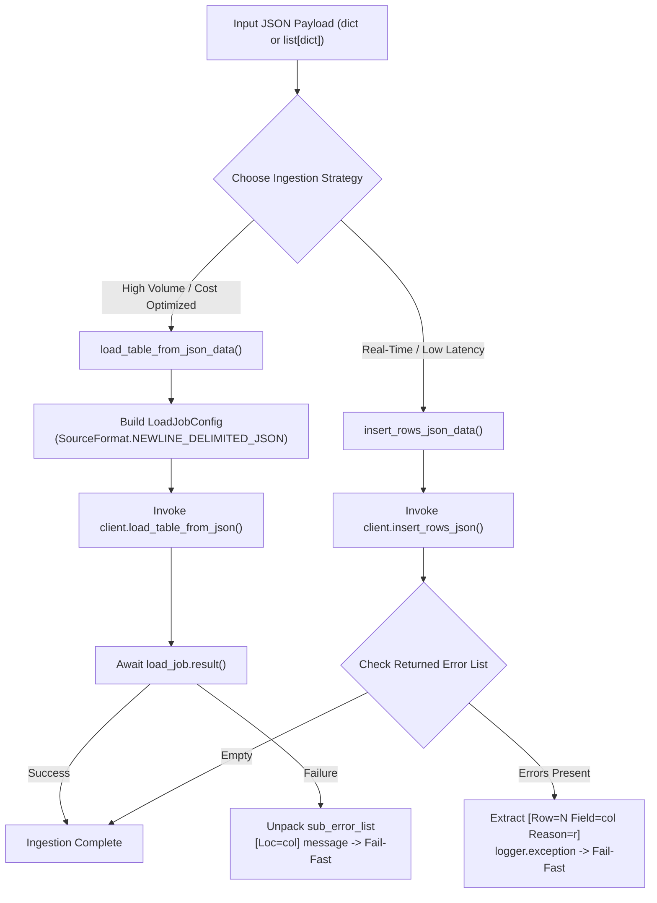

# 3.3. BigQuery Batch Loading & Streaming Ingestion Client (`BigQueryClient`)

> **Module**: `agent_common.clients.BigQueryClient`  
> **Key Methods**: `load_table_from_json_data()`, `insert_rows_json_data()`, `query()`, `get_existing_keys()`  
> **Dependencies**: `google-cloud-bigquery>=3.10.0`, `google-auth`

---

## 1. Overview & Purpose

Google Cloud BigQuery is a serverless, highly-scalable enterprise data warehouse designed for real-time and analytical data processing.

Depending on pipeline throughput and latency requirements, data ingestion into BigQuery typically follows one of two strategies:
1. **Batch Load (`load_table_from_json_data`)**: High-throughput, zero-cost bulk ingestion utilizing BigQuery's free load job quotas.
2. **Streaming Ingestion (`insert_rows_json_data`)**: Low-latency, row-level ingestion making events queryable within milliseconds.

`agent_common.clients.BigQueryClient` supports both ingestion methods, features detailed unpacking of nested BigQuery error arrays (`errors`, `location`, `reason`), and provides deduplication utilities to verify existing keys before queuing ingestion jobs.

---

## 2. Ingestion Strategies: Batch Load vs Streaming Ingestion



| Criterion | Batch Load (`load_table_from_json_data`) | Streaming Ingestion (`insert_rows_json_data`) |
| :--- | :--- | :--- |
| **Underlying API** | `client.load_table_from_json()` (Job-based) | `client.insert_rows_json()` (Streaming API) |
| **Pricing** | Free (utilizes shared BigQuery load quota) | Charged per MB streamed |
| **Availability** | Available upon job completion (a few seconds) | Immediate real-time querying |
| **Write Dispositions** | `WRITE_TRUNCATE`, `WRITE_APPEND`, `WRITE_EMPTY` | `WRITE_APPEND` only |
| **Best For** | Scheduled batch ETL, daily/hourly syncs | Real-time event capture, IoT sensors |

---

## 3. Core Methods & Specifications

### 3.1. Constructor (`__init__`)
```python
def __init__(
    self,
    project_id_str: str = "",
    dataset_id_str: str = "",
    table_id_str: str = "",
    credentials_path_str: str = "",
    timeout_seconds_int: int | None = None,
    ignore_unknown_values_bool: bool | None = None,
) -> None
```
- **Fail-Fast Schema Caching**: Resolves credentials via 4-tier authentication, applies `GOOGLE_CLOUD_PROJECT` overrides if present, and fetches the target `Table` object via `client.get_table()` to validate schema types before running ingestion operations.

### 3.2. Batch JSON Loading (`load_table_from_json_data`)
```python
def load_table_from_json_data(
    self,
    json_data_any: Any,
    timeout_int: int | None = None,
    ignore_unknown_values_bool: bool | None = None,
    write_disposition_str: str | None = None,
) -> None
```
- Executes asynchronous batch load jobs with `NEWLINE_DELIMITED_JSON` format.
- Unpacks nested error structures from `load_exc.errors` into a flattened format (`[Loc=col] message`) for instant diagnosis in log collectors.

### 3.3. Streaming Row Ingestion (`insert_rows_json_data`)
```python
def insert_rows_json_data(
    self,
    json_data_any: Any,
    timeout_int: int | None = None,
    ignore_unknown_values_bool: bool | None = None,
) -> None
```
- Directly inserts rows via the streaming API.
- Upon API errors, extracts specific row indices, column names, and error causes (`[Row=N Field=col Reason=r]`).

### 3.4. Arbitrary SQL Execution (`query`)
```python
def query(self, query_str: str, timeout_int: int | None = None) -> list[dict[str, Any]]
```
- Executes arbitrary SQL queries synchronously and serializes row sets into a list of dictionaries (`list[dict]`).

### 3.5. Key Deduplication Lookup (`get_existing_keys`)
```python
def get_existing_keys(self, field_name_str: str = "recvPath") -> set[str]
```
- Queries unique values of a given tracking column from the table and returns them as a Python `set[str]`, enabling `O(1)` deduplication checks during file ingestion loops.

---

## 4. Practical Usage Examples

### 4.1. Batch Load with Table Schema Validation
```python
from agent_common.clients import BigQueryClient

bq_client = BigQueryClient(
    project_id_str="my-gcp-project",
    dataset_id_str="analytics_dw",
    table_id_str="tb_daily_active_users",
    credentials_path_str="config/secrets/gcp_sa_key.json",
)

events_list = [
    {"user_id": "U1001", "event_type": "LOGIN", "event_time": "2026-08-24 09:00:00+09:00"},
    {"user_id": "U1002", "event_type": "PURCHASE", "event_time": "2026-08-24 09:05:00+09:00"},
]

bq_client.load_table_from_json_data(
    json_data_any=events_list,
    write_disposition_str="WRITE_APPEND",
)
print("Batch load completed successfully.")
```

### 4.2. Deduplicated Streaming Ingestion
```python
from agent_common.clients import BigQueryClient

bq_client = BigQueryClient(
    project_id_str="my-gcp-project",
    dataset_id_str="lake_raw",
    table_id_str="tb_s3_transferred_files",
)

# Fetch existing file keys to prevent duplicate ingestion
existing_keys = bq_client.get_existing_keys(field_name_str="s3_key")
print(f"Existing files in BigQuery: {len(existing_keys):,}")

incoming_key = "raw/events/20260824/data_01.json"
if incoming_key not in existing_keys:
    bq_client.insert_rows_json_data([
        {
            "s3_key": incoming_key,
            "transferred_at": "2026-08-24 10:00:00+09:00",
            "status": "SUCCESS",
        }
    ])
    print(f"Streamed metadata for new file: {incoming_key}")
```

### 4.3. Querying Master Data
```python
from agent_common.clients import BigQueryClient

bq_client = BigQueryClient(
    project_id_str="my-gcp-project",
    dataset_id_str="master_code",
    table_id_str="tb_codes",
)

rows = bq_client.query("SELECT code_id, code_name FROM `my-gcp-project.master_code.tb_codes` WHERE is_active = TRUE")
for r in rows:
    print(f"{r['code_id']}: {r['code_name']}")
```

---

## 5. Troubleshooting & Diagnostics

| Exception | Root Cause | Recommended Action |
| :--- | :--- | :--- |
| `ConnectionError: connection_failed` | Table not found or missing BigQuery Data Viewer role | Verify table reference and GCP IAM permissions |
| `RuntimeError: load_table_from_json_failed` | Schema violation (e.g. string provided for numeric field) | Inspect parsed `[Loc=field_name]` in log output and clean input data |
| `RuntimeError: BigQuery API insert 반환 상세 에러` | Streaming payload validation rejected | Review `[Row=N Field=col Reason=r]` diagnostic details in log |
| `RuntimeError: query_execution_failed` | Syntax error or query timeout | Ensure reserved identifiers are backtick-escaped and increase timeout |
