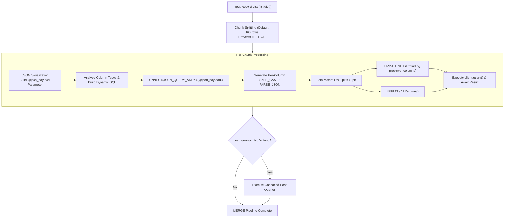

# 3.4. BigQuery High-Performance Inline MERGE (Upsert) Query Engine (`merge_table_from_json_data`)

> **Module**: `agent_common.clients.BigQueryClient`  
> **Key Methods**: `merge_table_from_json_data()`  
> **Dependencies**: `google-cloud-bigquery>=3.10.0`

---

## 1. Overview & Purpose

When synchronizing Change Data Capture (CDC) streams or updating latest entity states in a data warehouse, **MERGE INTO (Upsert)** operations are essential to prevent record duplication and guarantee data freshness.

Traditional BigQuery MERGE workflows often face significant engineering friction:
1. **Staging Table Overhead**: Creating, writing, and dropping temporary intermediate staging tables adds substantial I/O delay and infrastructure clutter.
2. **HTTP 413 & Query Parameter Limits**: Passing large JSON batches in a single query parameter frequently exceeds BigQuery API payload size limits (10MB/100MB).
3. **Escaping Reserved Keywords & Special Characters**: Column names matching SQL keywords or containing non-ASCII/Unicode characters trigger compilation failures if not properly escaped.
4. **Strict Schema Type Coercion**: Unnesting JSON arrays without explicit SQL type casting causes BigQuery type validation errors.

`BigQueryClient.merge_table_from_json_data` resolves these challenges through a **pure inline MERGE engine** that executes upserts directly via parameterized JSON arrays without temporary staging tables.

---

## 2. Inline MERGE Engine Architecture



---

## 3. Method Specifications & Parameter Rules

### 3.1. Method Signature
```python
def merge_table_from_json_data(
    self,
    json_data_any: Any,
    pk_key_str: str = "id",
    preserve_columns_list: list[str] | None = None,
    column_types_dict: dict[str, str] | None = None,
    matched_condition_str: str | None = None,
    not_matched_condition_str: str | None = None,
    post_queries_list: list[dict[str, Any]] | None = None,
    chunk_size_int: int = 100,
    timeout_int: int | None = None,
) -> None
```

### 3.2. Parameter Definitions
- `json_data_any`: Target record dictionary or list of dictionaries to upsert.
- `pk_key_str`: Primary key column name used for record matching (Default: `'id'`).
- `preserve_columns_list`: Columns that should **retain their existing values on UPDATE** rather than being overwritten (e.g., original creation timestamps `created_at`).
- `column_types_dict`: Explicit SQL type mapping dictionary (e.g., `{"price": "NUMERIC", "meta": "JSON"}`). Unspecified columns are automatically inferred from Python data types:
  - `dict`, `list` -> `PARSE_JSON(JSON_QUERY(item, '$.\"col\"'))`
  - `bool` -> `SAFE_CAST(JSON_VALUE(...) AS BOOL)`
  - `int` -> `SAFE_CAST(JSON_VALUE(...) AS INT64)`
  - `float` -> `SAFE_CAST(JSON_VALUE(...) AS FLOAT64)`
  - `str` -> `JSON_VALUE(...)`
- `matched_condition_str`: Extra predicate appended to `WHEN MATCHED` (e.g., `"AND S.updated_at > T.updated_at"`).
- `not_matched_condition_str`: Extra predicate appended to `WHEN NOT MATCHED` (e.g., `"AND S.is_deleted = FALSE"`).
- `post_queries_list`: Sequential post-processing queries executed after the MERGE completes (`[{"sql": "...", "params": [...]}, ...]`).
- `chunk_size_int`: Chunk division batch size to avoid query parameter size limits (Default: `100`).

---

## 4. Practical Usage Examples

### 4.1. Standard Upsert with Preserved Creation Timestamps
```python
from agent_common.clients import BigQueryClient

bq_client = BigQueryClient(
    project_id_str="my-gcp-project",
    dataset_id_str="service_db",
    table_id_str="tb_member_profile",
)

members = [
    {
        "member_id": "M001",
        "name": "Alex",
        "login_count": 42,
        "is_vip": True,
        "created_at": "2026-01-01 00:00:00+09:00",
        "last_login_at": "2026-08-24 15:30:00+09:00",
    },
    {
        "member_id": "M002",
        "name": "Sarah",
        "login_count": 1,
        "is_vip": False,
        "created_at": "2026-08-24 15:35:00+09:00",
        "last_login_at": "2026-08-24 15:35:00+09:00",
    },
]

# Preserve created_at on existing records while updating mutable fields
bq_client.merge_table_from_json_data(
    json_data_any=members,
    pk_key_str="member_id",
    preserve_columns_list=["created_at"],
    chunk_size_int=100,
)
```

### 4.2. Explicit Types & Conditional Merge
```python
from agent_common.clients import BigQueryClient

bq_client = BigQueryClient(
    project_id_str="my-gcp-project",
    dataset_id_str="iot_lake",
    table_id_str="tb_device_telemetry",
)

telemetry = [
    {
        "device_id": "DEV-9901",
        "sensor_metrics": {"temp": 26.5, "humidity": 60},
        "event_time": "2026-08-24 16:00:00+09:00",
        "status": "NORMAL",
    }
]

bq_client.merge_table_from_json_data(
    json_data_any=telemetry,
    pk_key_str="device_id",
    column_types_dict={
        "sensor_metrics": "JSON",
        "event_time": "TIMESTAMP",
    },
    matched_condition_str="AND S.event_time > T.event_time",
)
```

---

## 5. Generated SQL Compilation Walkthrough

The generated parameterized MERGE query:

```sql
MERGE `my-gcp-project.service_db.tb_member_profile` T
USING (
    SELECT
      JSON_VALUE(item, '$."member_id"') AS `member_id`,
      JSON_VALUE(item, '$."name"') AS `name`,
      SAFE_CAST(JSON_VALUE(item, '$."login_count"') AS INT64) AS `login_count`,
      SAFE_CAST(JSON_VALUE(item, '$."is_vip"') AS BOOL) AS `is_vip`,
      TIMESTAMP(JSON_VALUE(item, '$."created_at"')) AS `created_at`,
      TIMESTAMP(JSON_VALUE(item, '$."last_login_at"')) AS `last_login_at`
    FROM UNNEST(JSON_QUERY_ARRAY(@json_payload)) AS item
) S
ON T.`member_id` = S.`member_id`
WHEN MATCHED THEN
  UPDATE SET
    T.`name` = S.`name`,
    T.`login_count` = S.`login_count`,
    T.`is_vip` = S.`is_vip`,
    T.`last_login_at` = S.`last_login_at`
WHEN NOT MATCHED THEN
  INSERT (`member_id`, `name`, `login_count`, `is_vip`, `created_at`, `last_login_at`)
  VALUES (S.`member_id`, S.`name`, S.`login_count`, S.`is_vip`, S.`created_at`, S.`last_login_at`)
```

- Column names are wrapped in backticks (`` ` ``) to eliminate reserved word conflicts.
- `created_at` is excluded from `UPDATE SET` but preserved in `INSERT`.

---

## 6. Troubleshooting & Diagnostics

| Exception | Root Cause | Recommended Action |
| :--- | :--- | :--- |
| `ValueError: Unsupported JSON data format structure` | Input payload is not a dict or list | Ensure data conforms to structured row format |
| `RuntimeError: Type mismatch` | Inferred SQL type conflicts with table schema | Supply explicit types via `column_types_dict` |
| `RuntimeError: Payload too large (413)` | Single chunk exceeds API request quota | Reduce `chunk_size_int` from 100 to 50 or 20 |
| `RuntimeError: db_table_merge_failed` | SQL syntax error in custom condition string | Validate `matched_condition_str` clause syntax |
