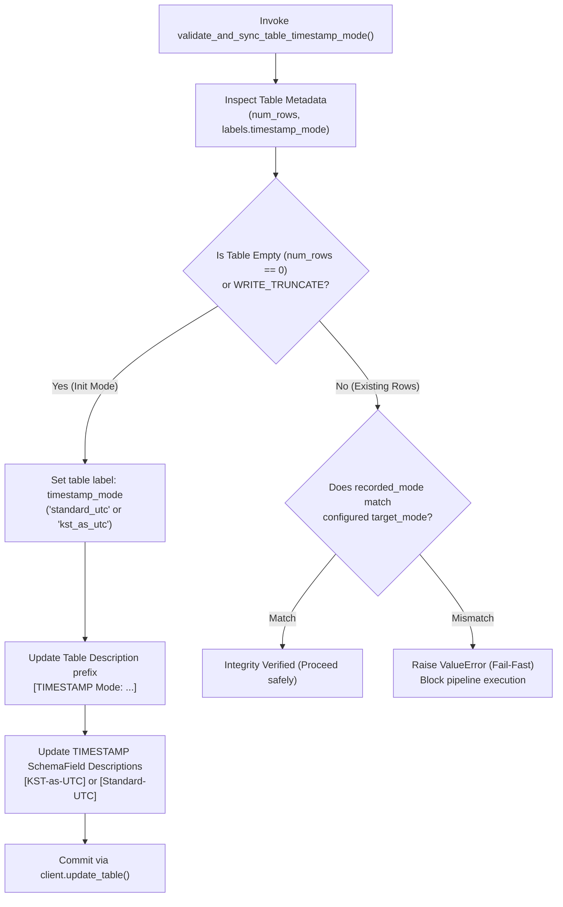

# 3.5. BigQuery Timestamp Offset Conversion & Table Timestamp Mode Synchronization

> **Module**: `agent_common.clients.BigQueryClient`  
> **Key Methods**: `convert_to_bigquery_timestamp()`, `validate_and_sync_table_timestamp_mode()`  
> **Configuration**: `config.bigquery.timezone_offset_str`, `config.bigquery.kst_as_utc_timestamp_bool`

---

## 1. Overview & Purpose

Google Cloud BigQuery internally stores all `TIMESTAMP` column values as **microsecond-precision UTC (+00:00)**. However, enterprise environments frequently encounter conflicting operational requirements:

1. **Standard UTC Mode (`Standard-UTC`)**:
   - Stores true UTC timestamps, leaving timezone translation to SQL queries (`DATETIME(ts, 'Asia/Seoul')`).
2. **Display Convenience Mode (`KST-as-UTC`)**:
   - Stores Korean Standard Time (KST) digits directly with a `+00:00` (UTC) offset so BI tools (Looker Studio, console UI) display local business hours without extra transformation.

If data adhering to both modes is mixed in the same table, a permanent 9-hour time drift corrupts historical analytics and daily aggregation reports.

`BigQueryClient` provides **string timestamp normalization** and **fail-fast table metadata validation** to prevent timezone pollution.

---

## 2. Table Timestamp Mode Synchronization Architecture



---

## 3. Core Methods & Specifications

### 3.1. Timestamp Normalization (`convert_to_bigquery_timestamp`)
```python
def convert_to_bigquery_timestamp(
    self,
    val_any: Any,
    default_tz_offset_str: Optional[str] = None,
) -> Optional[str]
```
- **Supported Formats**:
  - ISO 8601 strings (`2026-08-24T15:30:00+09:00`, `2026-08-24 15:30:00Z`)
  - Space/slash delimited datetimes (`2026/08/24 15:30:00`)
  - 14-digit compact strings (`20260824153000` -> `2026-08-24 15:30:00`)
  - 8-digit date strings (`20260824` -> `2026-08-24 00:00:00`)
- **Timezone Precedence**:
  1. Explicit offset in source string (`Z`, `+09:00`)
  2. Function argument `default_tz_offset_str`
  3. Configuration setting `config.bigquery.timezone_offset_str` (Default: `+09:00`)
  4. System local timezone (`TimeUtils.get_system_timezone_offset_str()`)

### 3.2. Table Timestamp Mode Validation (`validate_and_sync_table_timestamp_mode`)
```python
def validate_and_sync_table_timestamp_mode(
    self,
    write_disposition_str: str = "WRITE_APPEND",
) -> None
```
- **Execution Rules**:
  1. If table is empty or being truncated (`WRITE_TRUNCATE`), synchronizes table labels and column descriptions to current configuration.
  2. If table contains data, verifies that `labels["timestamp_mode"]` matches `kst_as_utc_timestamp_bool`. Raises `ValueError` immediately on mismatch.

---

## 4. Practical Usage Examples

### 4.1. Timestamp Parsing & Conversion
```python
from agent_common.clients import BigQueryClient

bq_client = BigQueryClient(
    project_id_str="my-project",
    dataset_id_str="analytics",
    table_id_str="tb_events",
)

# Convert 14-digit string -> "2026-08-24 15:30:00+09:00"
ts_str = bq_client.convert_to_bigquery_timestamp("20260824153000")
print(f"Normalized Timestamp: {ts_str}")
```

### 4.2. Pre-Ingestion Mode Verification in Batch Pipelines
```python
from agent_common.clients import BigQueryClient

bq_client = BigQueryClient(
    project_id_str="my-project",
    dataset_id_str="analytics",
    table_id_str="tb_daily_settlement",
)

# Fail fast if table mode contradicts pipeline configuration
bq_client.validate_and_sync_table_timestamp_mode(write_disposition_str="WRITE_APPEND")

# Safely proceed with load
bq_client.load_table_from_json_data(
    json_data_any=[{"settle_id": "S100", "settle_time": "2026-08-24 18:00:00+09:00"}],
    write_disposition_str="WRITE_APPEND",
)
```

---

## 5. Metadata Labeling Conventions

| Metadata Field | Standard-UTC Mode (`False`) | KST-as-UTC Mode (`True`) |
| :--- | :--- | :--- |
| **Table Label** | `timestamp_mode: "standard_utc"` | `timestamp_mode: "kst_as_utc"` |
| **Table Description** | `[TIMESTAMP Mode: Standard-UTC] Recorded in standard UTC.` | `[TIMESTAMP Mode: KST-as-UTC] Recorded in KST digits with +00:00 offset.` |
| **Column Description** | `[Standard-UTC] Event Timestamp` | `[KST-as-UTC] Event Timestamp` |

---

## 6. Troubleshooting & Diagnostics

| Exception | Root Cause | Recommended Action |
| :--- | :--- | :--- |
| `ValueError: Fail-Fast timestamp mode mismatch` | Target table was written with a conflicting mode | Either truncate the table or adjust `config.bigquery.kst_as_utc_timestamp_bool` |
| `RuntimeError: BigQuery table metadata update failed` | Missing `bigquery.tables.update` IAM permission | Grant BigQuery Data Editor or Admin role |
