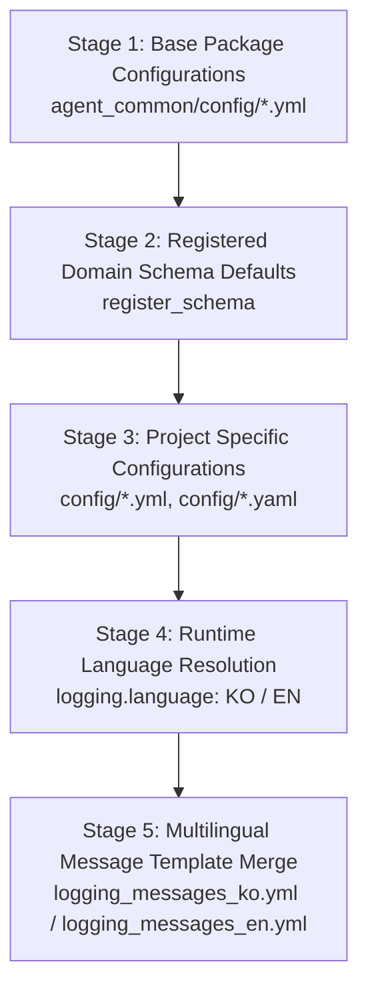

# 1.1. Hierarchical YAML Configuration Parsing & Deep Merge

> **Module**: `agent_common.config_loader.ConfigLoader`  
> **Key Methods**: `ConfigLoader.get_settings()`, `ConfigLoader._deep_merge()`

---

## 1. Overview & Purpose

In large-scale distributed data pipelines and agent service environments, managing redundant configurations across shared libraries and specialized applications is critical. The `agent_common` package provides a **hierarchical YAML parsing and recursive Deep Merge** architecture.

A standard dictionary `update()` replaces keys at the root level, obliterating nested configuration blocks. `ConfigLoader` traverses deeply nested structures in-place, preserving existing sub-keys while cleanly overriding specified properties.

---

## 2. Five-Stage Hierarchical Merge Priority

When `ConfigLoader.get_settings()` is called, settings are cumulatively merged across five distinct stages. Subsequent stages override preceding stages:



1. **Stage 1 (Base Package Configurations)**:
   - Loads base defaults from `agent_common/config/` (such as `default_agent_common.yml` and `llmpool.yml`) in alphabetical order.
   - Note: `logging_messages*.yml` files are deferred until Stage 4 language resolution.
2. **Stage 2 (Dynamically Registered Domain Schemas)**:
   - Merges default schemas registered via `ConfigLoader.register_schema()` by the consuming application.
3. **Stage 3 (Project-Specific Overrides)**:
   - Reads and merges all `.yml` and `.yaml` files in the project root's `config/` directory.
   - Project-level keys override library base defaults.
4. **Stage 4 (Language Resolution)**:
   - Evaluates the active log message language (`KO` or `EN`) from environment variables (`AGENT_LOG_LANGUAGE`, `LOGGING_LANGUAGE`), `logging.language` configuration, or runtime overrides (`ConfigLoader.set_language()`).
5. **Stage 5 (Message Template Dictionaries)**:
   - Loads the corresponding package dictionary (`logging_messages_ko.yml` or `logging_messages_en.yml`), followed by project-level message overrides if present.

---

## 3. Recursive Deep Merge Algorithm

The internal implementation of `ConfigLoader._deep_merge`:

```python
@staticmethod
def _deep_merge(target: dict[str, Any], incoming: dict[str, Any]) -> None:
    for key, value in incoming.items():
        if isinstance(value, dict) and isinstance(target.get(key), dict):
            ConfigLoader._deep_merge(target[key], value)
        else:
            target[key] = value
```

- **When both sides are dictionaries**: Recursively merges individual nested keys without overwriting sibling keys.
- **When either side is a scalar or non-dict**: The `incoming` value directly replaces the `target` value.
- **When values are lists**: Replaces the list wholesale to ensure explicit intent rather than arbitrary list concatenation.

---

## 4. Practical Usage Example

### 4.1. Configuration Files

**Package Base Configuration (`agent_common/config/default_agent_common.yml`)**:
```yaml
ecs:
  endpoint_url: "https://storage.example.com"
  max_retries_int: 3
  timeout_int: 30

logging:
  level_str: "INFO"
  language: "EN"
```

**Project Configuration (`config/config.yml`)**:
```yaml
ecs:
  # Retain endpoint_url, override only max_retries_int
  max_retries_int: 5

# Add new project-specific configuration block
transfer:
  max_workers_int: 8
```

### 4.2. Access via Python

```python
from agent_common.config_loader import config

# Access merged configuration
print(config.ecs.endpoint_url)         # "https://storage.example.com" (Base default retained)
print(config.ecs.max_retries_int)       # 5 (Overridden by project config)
print(config.ecs.timeout_int)           # 30 (Base default retained)
print(config.transfer.max_workers_int) # 8 (Project specific setting)
```

---

## 5. Automatic Project Root Discovery (`_find_project_root`)

`ConfigLoader` detects the root directory containing `config/config.yml` automatically using a 3-tier fallback strategy:

1. **Current Working Directory (CWD)**: Inspects `os.getcwd()` and its parent directories.
2. **Entrypoint Script Location**: Inspects `sys.argv[0]` and its parent directories.
3. **agent_common Package Location**: Inspects parent directories of the installed library.

This ensures seamless configuration discovery across Airflow DAGs, unit test suites, and interactive CLI executions without manual path passing.
