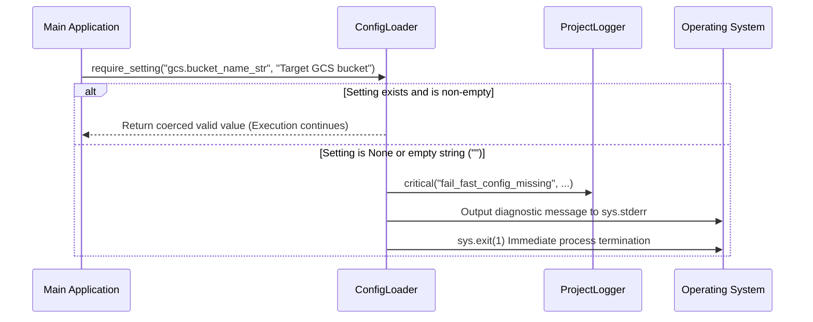

# 04. Fail-Fast Required Setting Validation (`require_setting`)

> **Module**: `agent_common.config_loader.ConfigLoader`  
> **Key Method**: `ConfigLoader.require_setting(path, message="", config_file=None)`  
> **Architecture Guideline**: `AGENTS.md` Rule 1.3 (Fail-Fast & Program Stability)

---

## 1. Overview & Architectural Principle

In production data pipelines and background tasks, running with missing database endpoints, storage buckets, or authentication parameters often results in late failures hours into a multi-terabyte data migration, causing data corruption or unrecoverable job states.

`ConfigLoader.require_setting()` implements the **Fail-Fast** engineering pattern. If any mandatory configuration setting is missing or empty, the application immediately outputs clear diagnostics and terminates execution (`sys.exit(1)`) during the **Startup Phase**, preventing compromised runtime execution.

---

## 2. Method Signature & Parameters

```python
def require_setting(
    self, 
    path: str, 
    message: str = "", 
    config_file: str | Path | None = None
) -> Any:
```

- **`path` (str, required)**: Dot-notation configuration path (e.g., `"ecs.endpoint_url"`, `"bigquery.dataset_id"`).
- **`message` (str, optional)**: Contextual guidance displayed to operators explaining why this setting is required.
- **`config_file` (str | Path | None, optional)**: Path to a specific YAML file to validate in isolation (defaults to the merged `config_dir`).
- **Returns (`Any`)**: The validated configuration value, guaranteed and coerced according to its type suffix (`_int`, `_str`, etc.).

---

## 3. Validation Logic & Execution Flow



### Evaluation Criteria (Treated as Missing):
1. The target key does not exist in the configuration tree.
2. The resolved value is `None`.
3. The value is a string and evaluates to empty (`""`) after calling `.strip()`.

---

## 4. Diagnostic Logging Output

When a mandatory setting is missing, a unified diagnostic message is written to both the console (`sys.stderr`) and `logger.critical`:

- **Missing Path**: `path`
- **Contextual Note**: `message`
- **Inspected Configuration File**: `config_file` and existence status (`[파일 존재함]` / `[파일 없음]`)
- **Available Root Keys in File**: `(조회된 파일 키: ['ecs', 'logging'])`

This enables infrastructure engineers and operators to pinpoint whether the issue is a typo, missing file, or schema discrepancy in seconds.

---

## 5. Practical Implementation Examples

### 5.1. Startup Validation in Main Entrypoint

```python
import sys
from agent_common.config_loader import ConfigLoader

loader = ConfigLoader()

# 1. Validate mandatory infrastructure connections (terminates immediately if absent)
ecs_endpoint: str = loader.require_setting(
    "ecs.endpoint_url", 
    message="Mandatory Dell ECS endpoint URL for storage access."
)

bq_table: str = loader.require_setting(
    "bigquery.table_id", 
    message="Target BigQuery destination table ID."
)

# 2. Benefit from automatic type coercion
max_retries: int = loader.require_setting(
    "transfer.max_retries_int",
    message="Maximum retry attempts on transfer failure."
)

print(f"Startup validation successful: ECS={ecs_endpoint}, BQ={bq_table}, Retries={max_retries}")
```

### 5.2. Isolated File Validation

Validate a specific file (e.g., `table_rules.yml`) independent of global configurations:

```python
pk_columns: list = loader.require_setting(
    "schema.pk_columns_list",
    message="Primary key column list is required for BigQuery MERGE deduplication.",
    config_file="config/table_rules.yml"
)
```

---

## 6. AGENTS.md Compliance

- **Rule 1.3.1**: Required configuration values must not fallback to arbitrary hardcoded in-memory constants. Terminate immediately with clear logs (Fail-Fast).
- **Rule 1.3.2**: Program termination due to configuration absence must only occur during early startup. Once initialization finishes, handle operational exceptions gracefully.
