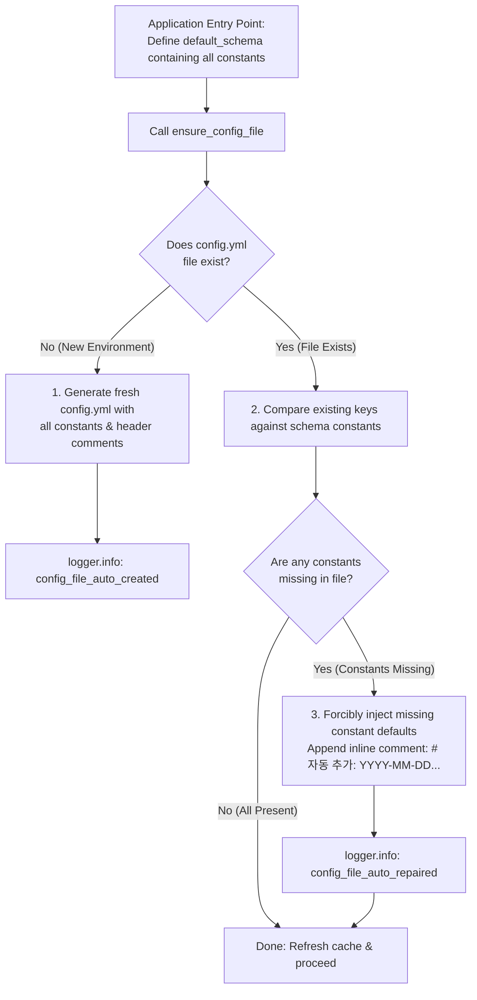

# 1.6. Externalizing All Constants to Configuration & Template Reconciliation (`ensure_config_file`)

> **Module**: `agent_common.config_loader.ConfigLoader`  
> **Key Methods**: `ConfigLoader.ensure_config_file()`, `ConfigLoader.register_schema()`  
> **Guiding Principle**: `AGENTS.md` Rule 1.1 (No Hardcoding & Configuration Separation)

---

## 1. Core Design Philosophy: Why This Feature Exists

> **"'Self-healing' is merely an operational mechanism; the true core objective is the externalization and visibility of all constants into configuration files."**

In many software systems, developers bury fallback constants and magic numbers (`max_workers = 4`, `batch_size = 500`, `timeout = 30`, etc.) deep within source code, silently falling back to them when configuration keys are missing.  
This practice causes critical problems:

- **Configuration as a Black Box**: Unless developers or operators read through the entire codebase, they have no visibility into what configurable constants exist or what their default values are.
- **Violation of the No-Hardcoding Principle**: As established in `AGENTS.md` Rule 1.1, all constants and operational parameters controlling runtime behavior must be thoroughly externalized to configuration files.

### Primary Purpose & How It Works

1. **Externalization of All Constants (Primary Goal)**:
   - Eliminates hidden constants in code by bringing them into `config.yml` with 100% transparency for developers and operators.
2. **Declaring the Baseline Schema at the Code Entry Point**:
   - To make every constant configurable, developers define a baseline configuration schema (`default_schema`) containing all system constants and their initial defaults **at the very beginning of the code / application entry point**.
3. **Forcible Injection of Constants ("Self-Healing" in Action)**:
   - If a setting key is absent in `config.yml`, instead of silently falling back to in-memory code defaults, the system **forcibly writes (injects) the baseline constant value directly into the configuration file**.
   - As a result, simply opening the generated or updated configuration file allows developers and users to immediately discover every available constant and fine-tune its value.

---

## 2. Method Signature & Parameters

```python
def ensure_config_file(
    self, 
    config_file_name: str = "config.yml", 
    default_schema: Optional[dict[str, Any]] = None
) -> Path:
```

- **`config_file_name` (str)**: Target YAML file name to inspect and reconcile (default: `"config.yml"`).
- **`default_schema` (dict | None)**: Baseline dictionary schema defined at the application entry point. (If omitted, falls back to schemas registered via `register_schema()`).
- **Returns (`Path`)**: Absolute `Path` object pointing to the ensured configuration file where all constants are materialized.

---

## 3. Constant Injection & File Reconciliation Workflow



### 3.1. Case 1: Initial Scaffolding (Clean Creation & Full Injection)
- Automatically creates parent directories (`config/`).
- Writes a formatted YAML document including all declared constants and guiding header comments (`templates.config_notice_header`).
- Users can inspect this file immediately to discover and tune every constant in the system.

### 3.2. Case 2: Missing Keys in Existing File (Forcible Injection & Inline Comments)
- Completely preserves user customizations and existing comments.
- Detects missing leaf constants and **forcibly appends** their default values to the YAML document.
- Appends timestamped inline comments (e.g., `# [자동 추가: 2026-09-04 14:30:00+09:00]`) to clearly inform operators which constants were automatically injected.

---

## 4. Practical Implementation Example

### 4.1. Application Entry Point Pattern

```python
from agent_common.config_loader import ConfigLoader

loader = ConfigLoader()

# ==============================================================================
# [Core Principle] Define all constants in the schema at the very beginning of the app.
# Eliminates in-code hardcoding and exposes all tunables transparently in config.yml.
# ==============================================================================
APP_DEFAULT_SCHEMA = {
    "transfer": {
        "max_workers_int": 4,          # Worker count constant
        "batch_size_int": 500,         # Batch row size constant
        "timeout_seconds_int": 30,     # Network timeout constant (sec)
        "enable_metrics_bool": True    # Metrics flag
    },
    "logging": {
        "level_str": "INFO",           # Default log level constant
        "language": "EN"               # Logging language
    }
}

# 1. Register baseline schema
loader.register_schema(APP_DEFAULT_SCHEMA)

# 2. Materialize all constants into config.yml (forcibly inject missing constants)
config_path = loader.ensure_config_file("config.yml", default_schema=APP_DEFAULT_SCHEMA)
print(f"Configuration file materialized with all constants: {config_path}")
```

### 4.2. File Output Before and After Reconciliation (`config/config.yml`)

If an operator previously only configured `max_workers_int: 8` and was unaware of the other constants, executing `ensure_config_file` updates the file to:

```yaml
transfer:
  max_workers_int: 8
  batch_size_int: 500  # [자동 추가: 2026-09-04 14:35:10+09:00]
  timeout_seconds_int: 30  # [자동 추가: 2026-09-04 14:35:10+09:00]
  enable_metrics_bool: true  # [자동 추가: 2026-09-04 14:35:10+09:00]
logging:
  level_str: "INFO"  # [자동 추가: 2026-09-04 14:35:10+09:00]
  language: "EN"  # [자동 추가: 2026-09-04 14:35:10+09:00]
```

- Existing operator customizations (`max_workers_int: 8`) remain untouched.
- All previously unknown or newly added constants are forcibly materialized into the file, making every tunable option immediately obvious and editable.

---

## 5. Architectural Benefits

1. **Complete Constant Externalization (Zero In-Code Hardcoding)**:
   - Eliminates magic numbers scattered across modules, consolidating all constants into the configuration file.
2. **Maximum Configuration Visibility**:
   - Operators and developers never need to reverse-engineer source code to discover available tunables; opening `config.yml` reveals everything.
3. **No Silent Fallbacks**:
   - Replaces implicit in-code defaults with explicit, physical values written to the configuration file, ensuring runtime consistency.
4. **Automated Zero-Friction Upgrades**:
   - New framework or service constants introduced in upgrades are populated automatically without breaking existing environments or requiring manual file diffing.
