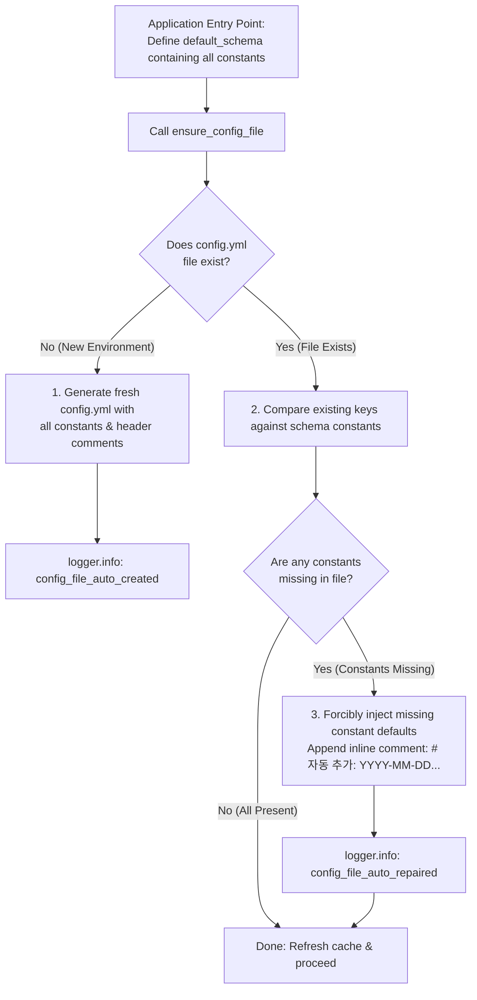

# 1.6. Externalizing All Constants to Configuration & Template Reconciliation (`ensure_config_file`)

> **Module**: `agent_common.config_loader.ConfigLoader`  
> **Key Methods**: `ConfigLoader.ensure_config_file()`, `ConfigLoader.register_schema()`  
> **Guiding Principle**: `AGENTS.md` Rule 1.1 (No Hardcoding & Configuration Separation)

---

## 1. Core Design Philosophy: Why This Feature Exists

> **"'Self-healing' is merely an operational mechanism; the true core objective is the externalization and visibility of all constants into configuration files."**

In many software systems, developers bury fallback constants and magic numbers (`max_workers = 4`, `batch_size = 500`, `timeout = 30`, etc.) deep within source code, silently falling back to them when configuration keys are missing.  
This practice causes critical problems:

- **Configuration as a Black Box**: Unless developers or operators read through the entire codebase, they have no visibility into what configurable constants exist or what their default values are.
- **Violation of the No-Hardcoding Principle**: As established in `AGENTS.md` Rule 1.1, all constants and operational parameters controlling runtime behavior must be thoroughly externalized to configuration files.

### Primary Purpose & How It Works

1. **Externalization of All Constants (Primary Goal)**:
   - Eliminates hidden constants in code by bringing them into `config.yml` with 100% transparency for developers and operators.
2. **Declaring the Baseline Schema at the Code Entry Point**:
   - To make every constant configurable, developers define a baseline configuration schema (`default_schema`) containing all system constants and their initial defaults **at the very beginning of the code / application entry point**.
3. **Forcible Injection of Constants ("Self-Healing" in Action)**:
   - If a setting key is absent in `config.yml`, instead of silently falling back to in-memory code defaults, the system **forcibly writes (injects) the baseline constant value directly into the configuration file**.
   - As a result, simply opening the generated or updated configuration file allows developers and users to immediately discover every available constant and fine-tune its value.

> [!CAUTION]
> ### ⚠️ Critical Rule: Defining Constants Separately or in the Middle of Code Defeats This Feature!
> The entire purpose of `ensure_config_file()` is to **"consolidate all system constants into a single entry-point schema and materialize them visibly into the configuration file."**  
> If developers adopt the following practices, **the value and purpose of this feature are completely negated**:
> 
> - **Defining standalone constants inside functions, classes, or middle of business logic**
> - **Declaring constants in separate files or variables without registering them in `default_schema`**
> 
> Any constant not declared in `default_schema` cannot be detected by `ensure_config_file()` and cannot be injected into `config.yml`, **leaving it as a hidden, unconfigurable black-box constant within the codebase**.  
> Therefore, you must strictly follow the **Single Source of Truth** principle: **all constants must be declared exclusively in `default_schema` at the application entry point, and accessed at runtime strictly via the global `config` object**.

---

## 2. Method Signature & Parameters

```python
def ensure_config_file(
    self, 
    config_file_name: str = "config.yml", 
    default_schema: Optional[dict[str, Any]] = None
) -> Path:
```

- **`config_file_name` (str)**: Target YAML file name to inspect and reconcile (default: `"config.yml"`).
- **`default_schema` (dict | None)**: Baseline dictionary schema defined at the application entry point. (If omitted, falls back to schemas registered via `register_schema()`).
- **Returns (`Path`)**: Absolute `Path` object pointing to the ensured configuration file where all constants are materialized.

---

## 3. Constant Injection & File Reconciliation Workflow



### 3.1. Case 1: Initial Scaffolding (Clean Creation & Full Injection)
- Automatically creates parent directories (`config/`).
- Writes a formatted YAML document including all declared constants and guiding header comments (`templates.config_notice_header`).
- Users can inspect this file immediately to discover and tune every constant in the system.

### 3.2. Case 2: Missing Keys in Existing File (Forcible Injection & Inline Comments)
- Completely preserves user customizations and existing comments.
- Detects missing leaf constants and **forcibly appends** their default values to the YAML document.
- Appends timestamped inline comments (e.g., `# [자동 추가: 2026-09-04 14:30:00+09:00]`) to clearly inform operators which constants were automatically injected.

---

## 4. Practical Implementation Example

### 4.1. Application Entry Point Pattern

```python
from agent_common.config_loader import ConfigLoader

loader = ConfigLoader()

# ==============================================================================
# [Core Principle] Define all constants in the schema at the very beginning of the app.
# Eliminates in-code hardcoding and exposes all tunables transparently in config.yml.
# ==============================================================================
APP_DEFAULT_SCHEMA = {
    "transfer": {
        "max_workers_int": 4,          # Worker count constant
        "batch_size_int": 500,         # Batch row size constant
        "timeout_seconds_int": 30,     # Network timeout constant (sec)
        "enable_metrics_bool": True    # Metrics flag
    },
    "logging": {
        "level_str": "INFO",           # Default log level constant
        "language": "EN"               # Logging language
    }
}

# 1. Register baseline schema
loader.register_schema(APP_DEFAULT_SCHEMA)

# 2. Materialize all constants into config.yml (forcibly inject missing constants)
config_path = loader.ensure_config_file("config.yml", default_schema=APP_DEFAULT_SCHEMA)
print(f"Configuration file materialized with all constants: {config_path}")
```

### 4.2. Multi-Program Constant Sharing & Schema Composition Pattern (`app_schema.py`)

Production systems (data pipelines, microservices, etc.) frequently consist of not just a single program, but **multiple independent executable entry points (API server, batch worker, streaming consumer, etc.) sharing the same database or storage infrastructure**.

> **Typical Multi-Service Architecture Example**:
> 1. `api_server.py`: Real-time web API service handling incoming client requests
> 2. `batch_worker.py`: Background batch program periodically aggregating and processing data
> 3. `stream_consumer.py`: Streaming consumer subscribing to message broker events (e.g., Kafka) and syncing to storage

In this setup, baseline infrastructure constants such as database connection settings (`database`), storage paths (`storage`), and common logging (`logging`) **must be shared across all programs**. On the other hand, service-specific parameters like port numbers (`port_int`), batch sizes (`batch_size_int`), or buffer limits (`buffer_size_int`) are **unique to each program**.

Declaring isolated `default_schema` blocks within each CLI script causes severe constant duplication, violating the DRY (Don't Repeat Yourself) principle and creating a maintenance hazard where tuning a common default requires editing multiple files.

The standard architectural solution is the **Schema Composition Pattern via a Dedicated Schema Module (`app/app_schema.py`)**.

#### 1) Centralized Schema Definition (`app/app_schema.py`)

Define reusable section schemas in dictionary objects, then compose program-specific schemas using Python's dictionary unpacking (`**`) operator:

```python
# app/app_schema.py
"""
Application common and program-specific configuration schema definition module.
"""

from typing import Any, Dict


# ==============================================================================
# 1. Base Section Schemas (DRY Principle)
# ==============================================================================
_BASE_DATABASE_SCHEMA: Dict[str, Any] = {
    "host_str": "127.0.0.1",
    "port_int": 5432,
    "pool_size_int": 10,
    "timeout_seconds_int": 30,
    "auto_reconnect_bool": True,
}

_BASE_STORAGE_SCHEMA: Dict[str, Any] = {
    "base_path_str": "/var/data/app",
    "temp_dir_str": "temp",
    "chunk_size_int": 1048576,  # 1MB
    "max_retries_int": 3,
}

_BASE_LOGGING_SCHEMA: Dict[str, Any] = {
    "language": "EN",
    "file_logging": False,
    "level": {
        "api": "INFO",
        "batch": "WARNING",
        "consumer": "INFO",
    },
}


# ==============================================================================
# 2. Program-Specific Schemas (Composed from Base Schemas)
# ==============================================================================

# Program 1: Web API Backend Service
API_SERVER_SCHEMA: Dict[str, Any] = {
    "database": _BASE_DATABASE_SCHEMA,
    "server": {
        "port_int": 8080,
        "max_connections_int": 500,
        "enable_cors_bool": True,
    },
    "logging": _BASE_LOGGING_SCHEMA,
}

# Program 2: Background Batch Processing Worker
BATCH_WORKER_SCHEMA: Dict[str, Any] = {
    "database": _BASE_DATABASE_SCHEMA,
    "storage": _BASE_STORAGE_SCHEMA,
    "batch": {
        "batch_size_int": 500,
        "max_workers_int": 4,
        "cron_schedule_str": "0 2 * * *",
    },
    "logging": _BASE_LOGGING_SCHEMA,
}

# Program 3: Event Stream Consumer
STREAM_CONSUMER_SCHEMA: Dict[str, Any] = {
    "database": _BASE_DATABASE_SCHEMA,
    "storage": _BASE_STORAGE_SCHEMA,
    "consumer": {
        "group_id_str": "events-consumer-group",
        "buffer_limit_int": 100,
        "flush_interval_seconds_int": 5,
    },
    "logging": _BASE_LOGGING_SCHEMA,
}
```

#### 2) Program Entry Point Implementation

Each program entry point imports its specific composed schema from `app_schema.py` and calls `ensure_config_file()`:

```python
# bin/run_api_server.py (API server entry point)
from agent_common.config_loader import ConfigLoader, config
from app.app_schema import API_SERVER_SCHEMA

loader = ConfigLoader()
loader.register_schema(API_SERVER_SCHEMA)
loader.ensure_config_file("config.yml", default_schema=API_SERVER_SCHEMA)

# Safely access guaranteed values at runtime via global config
port = config.server.port_int
db_host = config.database.host_str
```

```python
# bin/run_batch_worker.py (Batch worker entry point)
from agent_common.config_loader import ConfigLoader, config
from app.app_schema import BATCH_WORKER_SCHEMA

loader = ConfigLoader()
loader.register_schema(BATCH_WORKER_SCHEMA)
loader.ensure_config_file("config.yml", default_schema=BATCH_WORKER_SCHEMA)

# Safely access guaranteed values at runtime via global config
batch_size = config.batch.batch_size_int
max_workers = config.batch.max_workers_int
```

#### 3) Key Architectural Advantages
- **Progressive, Non-Destructive Reconciliation**:
  When `run_api_server.py` runs first, it writes the common baseline `database` settings and `server` constants to `config.yml`. When `run_batch_worker.py` runs later, it leaves existing keys intact and appends only the missing `storage` and `batch` constants with timestamped inline comments.
- **Zero Constant Duplication (DRY)**: Infrastructure constants exist in exactly one place (`app_schema.py`), simplifying global tuning.
- **Harmonious Coexistence in a Single `config.yml`**: Distinct log levels (`logging.level.api`, `logging.level.batch`, `logging.level.consumer`) and service parameters coexist cleanly within a single central configuration file.

---

### 4.3. File Output Before and After Reconciliation (`config/config.yml`)

If an operator previously only configured `max_workers_int: 8` and was unaware of the other constants, executing `ensure_config_file` updates the file to:

```yaml
transfer:
  max_workers_int: 8
  batch_size_int: 500  # [자동 추가: 2026-09-04 14:35:10+09:00]
  timeout_seconds_int: 30  # [자동 추가: 2026-09-04 14:35:10+09:00]
  enable_metrics_bool: true  # [자동 추가: 2026-09-04 14:35:10+09:00]
logging:
  level_str: "INFO"  # [자동 추가: 2026-09-04 14:35:10+09:00]
  language: "EN"  # [자동 추가: 2026-09-04 14:35:10+09:00]
```

- Existing operator customizations (`max_workers_int: 8`) remain untouched.
- All previously unknown or newly added constants are forcibly materialized into the file, making every tunable option immediately obvious and editable.

### 4.4. ⚠️ Anti-Pattern: Defining Constants In-Code or Mid-Stream (Negates Feature Purpose)

```python
# ==============================================================================
# ❌ [Critical Anti-Pattern] Defining separate constants mid-code despite using ensure_config_file
# ==============================================================================
def process_batches():
    # Defining constants inside functions or modules without declaring them in default_schema
    # prevents ensure_config_file from injecting them into config.yml.
    DEFAULT_TIMEOUT_SECONDS = 60    # ❌ Still a hidden black-box constant in code!
    MAX_BATCH_ROWS = 1000           # ❌ Operators cannot inspect or modify this from config.yml!
    ...


# ==============================================================================
# ⭕ [Recommended Pattern] Centralize all constants in entry-point schema; access via config
# ==============================================================================
# 1) Declare all constants in default_schema at application entry point (e.g., app_schema.py)
APP_DEFAULT_SCHEMA = {
    "transfer": {
        "timeout_seconds_int": 60,  # ⭕ Declared once at entry point
        "batch_rows_int": 1000,     # ⭕ Forcibly injected into config.yml if missing
    }
}
loader.ensure_config_file("config.yml", default_schema=APP_DEFAULT_SCHEMA)

# 2) Access strictly via the global config object within business logic
def process_batches():
    timeout = config.transfer.timeout_seconds_int  # ⭕ Completely synchronized with config.yml
    batch_rows = config.transfer.batch_rows_int    # ⭕ Instantly tunable without code modification
    ...
```

---

## 5. Architectural Benefits

1. **Complete Constant Externalization (Zero In-Code Hardcoding)**:
   - Eliminates magic numbers scattered across modules, consolidating all constants into the configuration file.
2. **Maximum Configuration Visibility**:
   - Operators and developers never need to reverse-engineer source code to discover available tunables; opening `config.yml` reveals everything.
3. **No Silent Fallbacks**:
   - Replaces implicit in-code defaults with explicit, physical values written to the configuration file, ensuring runtime consistency.
4. **Automated Zero-Friction Upgrades**:
   - New framework or service constants introduced in upgrades are populated automatically without breaking existing environments or requiring manual file diffing.
5. **Single Source of Truth for Constants**:
   - Consolidates fragmented, scattered constants across modules into the entry-point schema and `config.yml`, preventing ad-hoc hardcoded constant creation.
