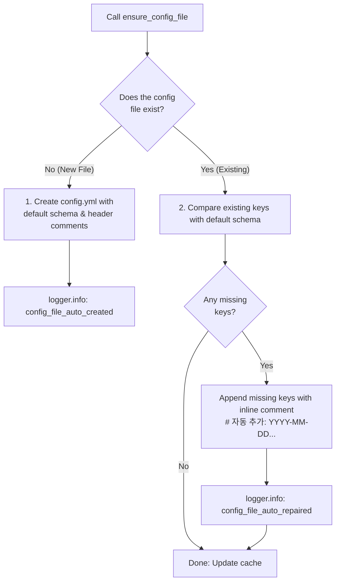

# 06. Self-Healing Configuration Templates (`ensure_config_file`)

> **Module**: `agent_common.config_loader.ConfigLoader`  
> **Key Methods**: `ConfigLoader.ensure_config_file()`, `ConfigLoader.register_schema()`

---

## 1. Overview & Problem Statement

Deploying services to fresh environments (local dev, staging, or production) without a valid `config.yml` causes immediate deployment failure. Furthermore, when upgraded library versions introduce new mandatory configuration keys, existing environments fail due to missing keys unless manually patched.

`ConfigLoader.ensure_config_file()` eliminates these deployment frictions through **automated self-healing**:

1. **Automatic Scaffolding**: If `config.yml` is missing, it creates the configuration directory and generates a fresh YAML file pre-populated with default schemas and standard headers.
2. **In-Place Self-Healing & Migration**: If `config.yml` already exists but lacks newly introduced schema keys, it **preserves all existing values and comments, appending only the missing keys alongside a timestamped inline comment**.

---

## 2. Method Signature & Parameters

```python
def ensure_config_file(
    self, 
    config_file_name: str = "config.yml", 
    default_schema: Optional[dict[str, Any]] = None
) -> Path:
```

- **`config_file_name` (str)**: Target YAML file name to inspect and reconcile (default: `"config.yml"`).
- **`default_schema` (dict | None)**: Baseline dictionary schema. (If omitted, falls back to schemas registered via `register_schema()`).
- **Returns (`Path`)**: Absolute `Path` object pointing to the ensured configuration file.

---

## 3. Two-Tier Self-Healing Workflow



### 3.1. Case 1: Initial Scaffolding
- Creates parent directories (`config/`) via `mkdir(parents=True)`.
- Writes a formatted YAML document including metadata headers (`templates.config_notice_header`).

### 3.2. Case 2: In-Place Key Repair
- Scans existing YAML mapping against baseline schema.
- Reconciles missing leaf keys without disturbing user-defined values.
- Appends inline comments: `# [자동 추가: 2026-09-04 14:30:00+09:00]` directly on modified lines for immediate operator transparency.

---

## 4. Practical Implementation Example

### 4.1. Application Bootstrapping

```python
from agent_common.config_loader import ConfigLoader

loader = ConfigLoader()

# 1. Define baseline application schema
APP_SCHEMA = {
    "transfer": {
        "max_workers_int": 4,
        "batch_size_int": 500,
        "enable_metrics_bool": True
    },
    "logging": {
        "level_str": "INFO",
        "language": "EN"
    }
}

# 2. Register baseline schema with ConfigLoader
loader.register_schema(APP_SCHEMA)

# 3. Ensure configuration file exists and contains all required keys
config_path = loader.ensure_config_file("config.yml", default_schema=APP_SCHEMA)
print(f"Configuration ensured: {config_path}")
```

### 4.2. File Output Before and After Healing (`config/config.yml`)

If the existing file only had `max_workers_int: 8`, executing `ensure_config_file` updates the file to:

```yaml
transfer:
  max_workers_int: 8
  batch_size_int: 500  # [자동 추가: 2026-09-04 14:35:10+09:00]
  enable_metrics_bool: true  # [자동 추가: 2026-09-04 14:35:10+09:00]
logging:
  level_str: "INFO"  # [자동 추가: 2026-09-04 14:35:10+09:00]
  language: "EN"  # [자동 추가: 2026-09-04 14:35:10+09:00]
```

Existing user customizations (`max_workers_int: 8`) remain completely untouched, while missing keys are safely populated.

---

## 5. Architectural Benefits

1. **Zero Deployment Failures**: New developer workstations and CI/CD runners can initialize without manually locating template files.
2. **Effortless Upgrades**: Adding new framework-level configuration keys to `agent_common` does not break legacy service configurations.
3. **Audit Trail**: Every automated modification is stamped with date/time comments and logged via `config_file_auto_repaired`.
