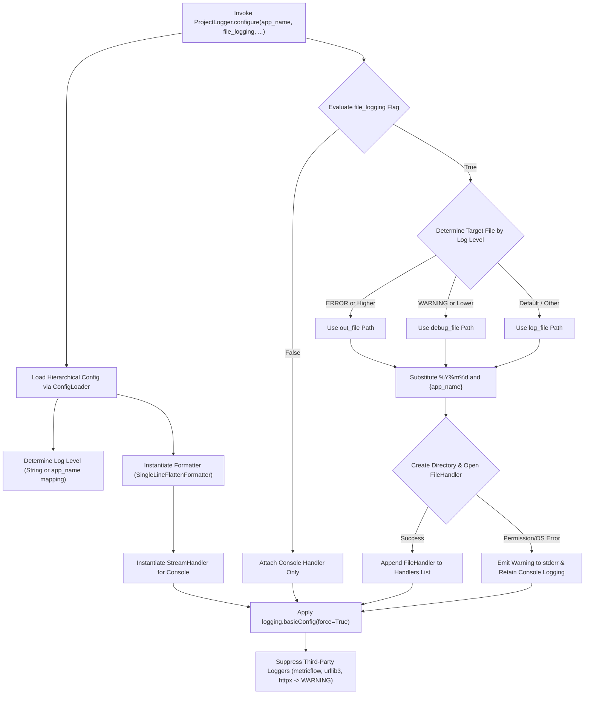

# 2.2. Batch Logging Environment Configuration & Handler Control (`ProjectLogger.configure`)

> **Module**: `agent_common.logger.ProjectLogger`  
> **Key Method**: `ProjectLogger.configure(config_dir=None, default_log_file="logs/app.log", app_name=None, file_logging=None)`

---

## 1. Overview & Enterprise Motivation

Python's built-in `logging` module presents notable challenges in distributed architectures and containerized microservices:

1. **Duplicate Handler Collisions**: Multiple modules calling `addHandler()` produce repeated, duplicated log lines.
2. **Scattered Output Management**: Developers need console logs locally, while production environments (Kubernetes, Airflow Pods) often require stdout streams or structured date-partitioned file logs.
3. **Third-Party Debug Log Noise**: High-volume diagnostic logs from packages like `urllib3`, `httpx`, and `botocore` flood output streams and mask critical business events.
4. **Volume Mounting Permissions & Crashes**: Process crashes when target log directories on mounted volumes lack write permissions.

`ProjectLogger.configure()` acts as an enterprise **centralized logging factory**, standardizing the logging environment across the application with a single call.

---

## 2. Architecture & Pipeline



---

## 3. Key Capabilities

### 3.1. Dynamic App-Name Based Log Level Resolution
In `config.yml`, configure per-application log levels using a dictionary:

```yaml
logging:
  level:
    default: "INFO"
    data_exporter: "DEBUG"
    api_server: "WARNING"
```

### 3.2. Level-Based File Routing (`out_file` vs `debug_file`)
- `ERROR`, `CRITICAL`: Directed to `logging.out_file`.
- `DEBUG`, `INFO`, `WARNING`: Directed to `logging.debug_file`.
- Default: Saved to `logging.file`.

### 3.3. Dynamic Path Templating
Supports date formats (e.g. `%Y%m%d`) and `{app_name}` placeholder substitution:
```yaml
logging:
  file: "logs/%Y%m%d/{app_name}.log"
```

### 3.4. Graceful Degradation on Permission/OS Errors
If directory creation fails due to `PermissionError` or `OSError` in containerized environments, `ProjectLogger` logs a warning to `sys.stderr` and falls back to console logging without crashing the process.

### 3.5. Noise Suppression for Third-Party Libraries
Automatically mutes verbose libraries (`metricflow`, `urllib3`, `httpx`) to `WARNING` level.

---

## 4. Configuration Specification (`config/config.yml`)

```yaml
logging:
  level: "INFO"
  format: "[%(asctime)s][%(levelname)s][%(filename)s:%(lineno)d %(funcName)s()] %(message)s"
  datefmt: "%Y-%m-%d %H:%M:%S"
  file_logging: true
  file: "logs/%Y%m%d/{app_name}.log"
  out_file: "logs/%Y%m%d/{app_name}_error.log"
  debug_file: "logs/%Y%m%d/{app_name}_debug.log"
```

---

## 5. Practical Code Examples

### 5.1. Standard Initialization Entrypoint

```python
from agent_common.logger import ProjectLogger

def main():
    # 1. Initialize logging configuration once at process startup
    ProjectLogger.configure(
        app_name="data_migrator",
        file_logging=True,
        default_log_file="logs/migrator.log"
    )

    # 2. Obtain logger instances in business modules
    logger = ProjectLogger("DataMigrator")
    logger.info("Pipeline initialized successfully")

if __name__ == "__main__":
    main()
```

### 5.2. Integration with Airflow & CLI Flags

```python
import argparse
from agent_common.logger import ProjectLogger

parser = argparse.ArgumentParser()
group = parser.add_mutually_exclusive_group()
group.add_argument("--file-log", "-fl", dest="file_log", action="store_true", default=None)
group.add_argument("--no-file-log", "-nfl", dest="file_log", action="store_false")
args = parser.parse_args()

# Pass CLI preference directly (defaults to config.yml when None)
ProjectLogger.configure(app_name="batch_job", file_logging=args.file_log)
```

---

## 6. Operational Best Practices

1. **Invocation Point**:
   - Call `configure()` exclusively at the entry point of your application (`main()` or CLI startup).
2. **Containerized Deployments**:
   - In Kubernetes or Docker environments, prefer `--no-file-log` (`file_logging: false`) to avoid filling local container storage and defer log collection to container runtime drivers.
3. **Idempotence & `force=True`**:
   - `ProjectLogger.configure()` uses `logging.basicConfig(..., force=True)`, resetting ad-hoc handlers added during module imports.
