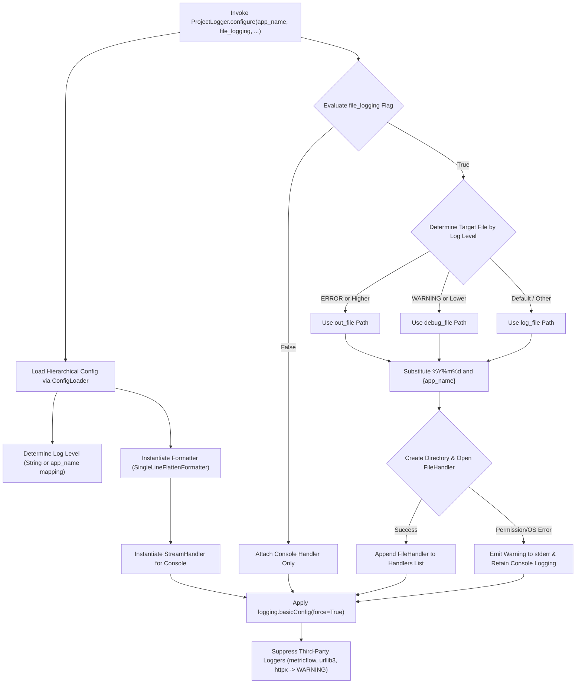

# 2.2. Batch Logging Environment Configuration & Handler Control (`ProjectLogger.configure`)

> **Module**: `agent_common.logger.ProjectLogger`  
> **Key Method**: `ProjectLogger.configure(config_dir=None, default_log_file_str="logs/app.log", app_name_str=None, file_logging_bool=None)`

---

## 1. Overview & Enterprise Motivation

Python's built-in `logging` module presents notable challenges in distributed architectures and containerized microservices:

1. **Duplicate Handler Collisions**: Multiple modules calling `addHandler()` produce repeated, duplicated log lines.
2. **Scattered Output Management**: Developers need console logs locally, while production environments (Kubernetes, Airflow Pods) often require stdout streams or structured date-partitioned file logs.
3. **Third-Party Debug Log Noise**: High-volume diagnostic logs from packages like `urllib3`, `httpx`, and `botocore` flood output streams and mask critical business events.
4. **Volume Mounting Permissions & Crashes**: Process crashes when target log directories on mounted volumes lack write permissions.

`ProjectLogger.configure()` acts as an enterprise **centralized logging factory**, standardizing the logging environment across the application with a single call.

---

## 2. Architecture & Pipeline



---

## 3. Key Capabilities

### 3.1. Dynamic App-Name Based Log Level Resolution
In `config.yml`, configure per-application log levels using a dictionary:

```yaml
logging:
  level:
    default: "INFO"
    data_exporter: "DEBUG"
    api_server: "WARNING"
```

### 3.2. Automatic Log Level Directory Creation (`log_file` with `{log_level}`)

`ProjectLogger.configure()` eliminates subjective, split routing keys (`out_file` vs `debug_file`) by consolidating into a single standard template `logging.log_file` that supports **`{log_level}` (lowercase) or `{LOG_LEVEL}` (uppercase)**:

- **Automated Level Directory Partitioning (`{log_level}`)**:
  - If `logging.level` is `WARNING`, logs are saved under `logs/pipeline/2026/09/08/warning/`.
  - If `logging.level` is `ERROR`, logs are saved under `logs/pipeline/2026/09/08/error/`.
  - Automatically isolates logs into appropriate level subdirectories without multiple configuration keys.
- **Backward Compatibility (Fallback)**:
  - For legacy configurations still defining `out_file` or `debug_file` without `log_file`, `ProjectLogger.configure()` seamlessly falls back to the legacy level routing rules.

#### Enterprise Data Pipeline Configuration Example:
```yaml
logging:
  # Program-specific log levels
  level:
    data_extractor: "WARNING"
    stream_processor: "WARNING"
    db_loader: "ERROR"
    
  # Unified standard log file path with dynamic {log_level} directory
  log_file: "logs/pipeline/%Y/%m/%d/{log_level}/{app_name}_out_%Y%m%dT%H%M%S.log"
```

> 💡 **Behavioral Example**:
> - When `data_extractor` runs with `WARNING` level, the folder `logs/pipeline/2026/09/08/warning/` is auto-created and logs are written there.
> - When `db_loader` runs with `ERROR` level, the folder `logs/pipeline/2026/09/08/error/` is auto-created, isolating error triage logs cleanly.

### 3.3. Dynamic Path Templating & Recursive Directory Creation

The `log_file` template string supports dynamic placeholders and date specifiers:

1. **`{app_name}` Placeholder**:
   - Replaced by the application name passed to `ProjectLogger.configure(app_name="data_extractor")` (or the script filename).
2. **`{log_level}` / `{LOG_LEVEL}` Placeholder**:
   - Replaced by the resolved runtime log level (lowercase `warning`, `error` / uppercase `WARNING`, `ERROR`), auto-generating level-specific directories.
3. **`%Y/%m/%d` Hierarchical Date Partitioning**:
   - Parsed via `datetime.now().strftime(...)` to automatically organize logs into year/month/day directory trees.
4. **`%Y%m%dT%H%M%S` ISO Compact Timestamp**:
   - Assigns a unique execution timestamp (e.g. `20260908T183000`), ensuring subsequent runs on the same date do not overwrite prior logs.
5. **Recursive Parent Directory Creation (`mkdir(parents=True, exist_ok=True)`)**:
   - Automatically builds missing nested directories (e.g. `logs/pipeline/2026/09/08/warning/`) before creating the file handler.

#### Dynamic Path Resolution Example:
```text
[Template in config.yml]
log_file: "logs/pipeline/%Y/%m/%d/{log_level}/{app_name}_out_%Y%m%dT%H%M%S.log"

[Runtime Invocation]
ProjectLogger.configure(app_name_str="data_extractor", file_logging_bool=True)
Execution Timestamp: 2026-09-08 18:30:00

[Resolved Log File Path]
logs/pipeline/2026/09/08/warning/data_extractor_out_20260908T183000.log
```

### 3.4. Graceful Degradation on Permission/OS Errors
If directory creation fails due to `PermissionError` or `OSError` in containerized environments, `ProjectLogger` logs a warning to `sys.stderr` and falls back to console logging without crashing the process.

### 3.5. Noise Suppression for Third-Party Libraries
Automatically mutes verbose libraries (`metricflow`, `urllib3`, `httpx`) to `WARNING` level.

---

## 4. Configuration Specification (`config/config.yml`)

```yaml
logging:
  # Program-specific or global log levels
  level:
    data_extractor: "WARNING"
    stream_processor: "WARNING"
    db_loader: "WARNING"
    default: "INFO"
  
  # Message template dictionary language (KO or EN)
  language: "KO"
  
  # Log format and date format (name: program/app name, caller: Class.method() or function())
  format: "[%(asctime)s][%(levelname)s][%(name)s][%(filename)s:%(lineno)d %(caller)s] %(message)s"
  datefmt: "%Y-%m-%d %H:%M:%S"
  file_logging: true
  
  # Standard consolidated log file template (auto-creates level subdirectories via {log_level})
  log_file: "logs/pipeline/out/%Y/%m/%d/{log_level}/{app_name}_out_%Y%m%dT%H%M%S.log"
```

---

## 5. Practical Code Examples

### 5.1. Standard Initialization Entrypoint

```python
from agent_common.logger import ProjectLogger

def main():
    # 1. Initialize logging configuration once at process startup
    ProjectLogger.configure(
        app_name_str="data_migrator",
        file_logging_bool=True,
        default_log_file_str="logs/migrator.log"
    )

    # 2. Obtain logger instances in business modules
    logger = ProjectLogger("DataMigrator")
    logger.info("Pipeline initialized successfully")

if __name__ == "__main__":
    main()
```

### 5.2. Integration with Airflow & CLI Flags

```python
import argparse
from agent_common.logger import ProjectLogger

parser = argparse.ArgumentParser()
group = parser.add_mutually_exclusive_group()
group.add_argument("--file-log", "-fl", dest="file_log", action="store_true", default=None)
group.add_argument("--no-file-log", "-nfl", dest="file_log", action="store_false")
args = parser.parse_args()

# Pass CLI preference directly (defaults to config.yml when None)
ProjectLogger.configure(app_name_str="batch_job", file_logging_bool=args.file_log)
```

---

## 6. Operational Best Practices

1. **Invocation Point**:
   - Call `configure()` exclusively at the entry point of your application (`main()` or CLI startup).
2. **Containerized Deployments**:
   - In Kubernetes or Docker environments, prefer `--no-file-log` (`file_logging: false`) to avoid filling local container storage and defer log collection to container runtime drivers.
3. **Idempotence & `force=True`**:
   - `ProjectLogger.configure()` uses `logging.basicConfig(..., force=True)`, resetting ad-hoc handlers added during module imports.
