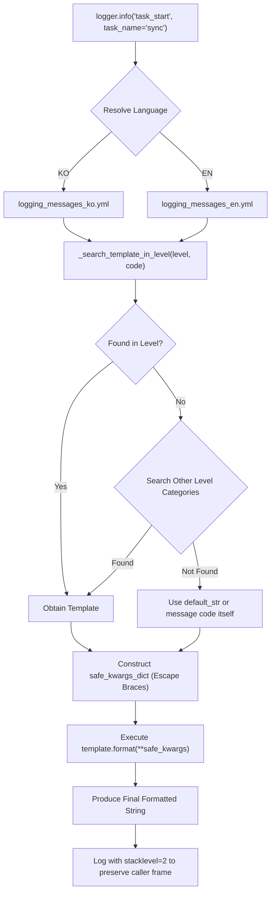

# 2.3. Multilingual Message Catalog & Code-Based Logging (`logging_messages_*.yml`, `log_msg`)

> **Module**: `agent_common.logger.ProjectLogger`  
> **Key Methods**: `ProjectLogger.get_log_msg()`, `ProjectLogger.log_msg()`, `ProjectLogger.set_language()`, `get_log_msg()`  
> **Catalog Files**: `agent_common/config/logging_messages_ko.yml`, `logging_messages_en.yml`

---

## 1. Overview & Enterprise Motivation

Hardcoding log messages directly inside application code creates several challenges in enterprise software:

1. **Rule Violations & Deployment Overhead**: Violates AGENTS.md Rule 1.1 (No Hardcoding). Modifying log messages requires code edits and redeployments.
2. **Global Team Operations**: Multinational operations centers (NOCs) and global engineering teams require logs in their preferred language (e.g. English vs Korean).
3. **Lack of Standard Metrics**: Free-form text messages make aggregation, automated alerts, and parsing fragile.

`ProjectLogger` addresses these concerns by decoupling message text from application code through an **external message catalog** with seamless **runtime language switching (KO ⇄ EN)**.

---

## 2. Architecture & Pipeline



---

## 3. Catalog Structure

### 3.1. English Catalog (`agent_common/config/logging_messages_en.yml`)

```yaml
logging_messages:
  INFO:
    task_start: "🚀 [{task_name}] task has started. (Targets: {target_count:,} items)"
    task_completed: "✅ [{task_name}] task has completed successfully."
    data_transfer_progress: "[{task_name}] Transfer progress: {processed_count:,}/{total_count:,} items ({percent:.1f}%)"
  
  WARNING:
    record_skipped: "⚠️ [{task_name}] Record skipped due to exclusion policy: {reason}"
    retry_attempt: "⚠️ Temporary connection failure. Retrying (Attempt: {attempt_count}/{max_retries})"
  
  ERROR:
    connection_failed: "❌ Failed to connect to {service_name}. (Reason: {error_msg})"
    schema_validation_failed: "❌ Required fields missing or schema validation failed: {detail}"
```

---

## 4. Key Implementation Details

### 4.1. Safe Kwargs Formatting (`safe_kwargs_dict`)
Prevents format string injection and `KeyError` crashes when user arguments contain curly braces (`{` or `}`), such as raw JSON strings:

```python
safe_kwargs_dict = {
    k: str(v).replace("{", "{{").replace("}", "}}") if isinstance(v, str) else v
    for k, v in kwargs.items()
}
```

### 4.2. Accurate Caller Tracing (`stacklevel=2`)
`ProjectLogger` uses `stacklevel=2` across all log methods (`info`, `warning`, `error`, `exception`), ensuring the log record references the actual business caller rather than internal wrapper lines.

### 4.3. Dynamic Runtime Language Switching
Supports in-process language switching without restarts:

- Class method: `ProjectLogger.set_language("EN")`
- Instance setter: `logger.language_set("EN")`
- Getter property: `logger.language`

---

## 5. Practical Code Examples

### 5.1. Code-Based Logging

```python
from agent_common.logger import ProjectLogger

logger = ProjectLogger("MigrationService")

# 1. Log with message code and template kwargs
logger.info("task_start", task_name="Cloud_Data_Sync", target_count=50000)

# 2. Progress log
logger.info(
    "data_transfer_progress",
    task_name="Cloud_Data_Sync",
    processed_count=25000,
    total_count=50000,
    percent=50.0,
)

# 3. Error logging with automatic failure counting & traceback preservation
try:
    raise TimeoutError("Endpoint unreachable")
except Exception as e:
    logger.exception("connection_failed", service_name="Cloud_Storage", error_msg=str(e))
```

### 5.2. Runtime Language Switching

```python
from agent_common.logger import ProjectLogger

logger = ProjectLogger("InternationalBatch")

# Default Korean output
logger.info("task_start", task_name="SyncJob", target_count=100)
# Output: [INFO] 🚀 [SyncJob] 작업이 시작되었습니다. (대상: 100건)

# Switch to English
ProjectLogger.set_language("EN")

logger.info("task_start", task_name="SyncJob", target_count=100)
# Output: [INFO] 🚀 [SyncJob] task has started. (Targets: 100 items)
```

### 5.3. Standalone String Extraction (`get_log_msg`)

```python
from agent_common.logger import get_log_msg

alert_str = get_log_msg("ERROR", "connection_failed", service_name="Kafka", error_msg="Timeout")
print(alert_str)
# -> "❌ Failed to connect to Kafka. (Reason: Timeout)"
```

---

## 6. Operational Best Practices

### 6.1. Project-Level Catalog Extension Example

In addition to standard messages provided by `agent_common`, consuming applications can define project-specific business messages or domain error codes in `<project_root>/config/logging_messages_en.yml`.

`ConfigLoader` applies **Stage 5 hierarchical deep merge**, keeping base library templates while overriding existing keys or inserting new domain codes.

#### 1) Define Project Catalog (`<project_root>/config/logging_messages_en.yml`)
```yaml
logging_messages:
  INFO:
    # Override standard base message with custom project branding
    task_start: "🔥 [Pipeline Start] {task_name} batch processing started. (Target: {target_count:,} items)"
    
    # Define new project-specific business message
    medallion_step_completed: "🏅 [{stage_name}] Transformation completed: Success {success_count:,} items, Excluded {excluded_count:,} items"

  ERROR:
    # Define domain-specific external error code
    auth_token_expired: "🚫 Auth server ({auth_url}) token renewal failed (HTTP Status: {status_code})"
```

#### 2) Python Invocation & Verification
```python
from agent_common.logger import ProjectLogger

logger = ProjectLogger("MedallionPipeline")

# 1. Call overridden message code
logger.info("task_start", task_name="SilverToGold", target_count=10000)
# Output: [INFO] 🔥 [Pipeline Start] SilverToGold batch processing started. (Target: 10,000 items)

# 2. Call new project-specific message code
logger.info(
    "medallion_step_completed",
    stage_name="Gold_Mart",
    success_count=9950,
    excluded_count=50,
)
# Output: [INFO] 🏅 [Gold_Mart] Transformation completed: Success 9,950 items, Excluded 50 items

# 3. Call project error code (automatically records failure count & traceback)
try:
    raise PermissionError("Token expired")
except Exception as e:
    logger.exception(
        "auth_token_expired",
        auth_url="https://auth.internal.example.com",
        status_code=401,
    )

# 4. Standard un-overridden package messages remain accessible
logger.info("task_completed", task_name="SilverToGold")
# Output: [INFO] ✅ [SilverToGold] task has completed successfully.
```

### 6.2. Naming Conventions
- Use lowercase `snake_case` codes indicating context and state (e.g., `db_query_failed`, `file_not_found`, `invalid_payload`).
