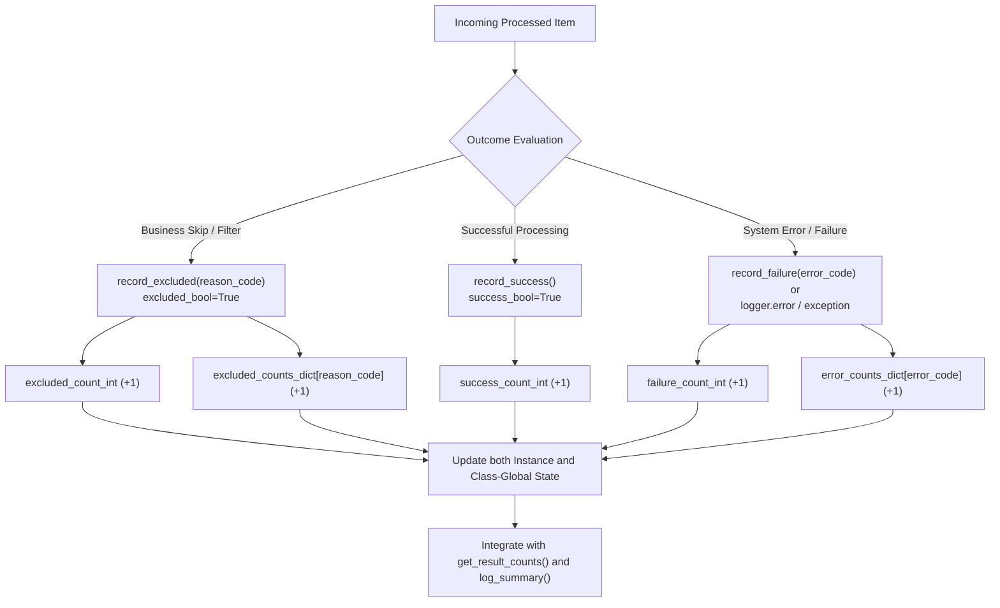

# 2.4. Real-Time Result Tracking & Error/Exclusion Classification (`record_result`, `record_error`, `record_exclusion`)

> **Module**: `agent_common.logger.ProjectLogger`  
> **Key Methods**: `update()`, `record_result()`, `record_success()`, `record_failure()`, `record_excluded()`, `record_error()`, `record_exclusion()`  
> **Inspection Methods**: `get_result_counts()`, `get_error_counts()`, `get_excluded_counts()`, `reset_result_counts()`

---

## 1. Overview & Enterprise Motivation

In high-throughput ETL pipelines and distributed workers, millions of records are processed across concurrent threads.

Classifying outcomes strictly into binary "Success" vs "Failure" causes severe production ambiguities:

1. **Confusing Intentional Business Filters with Failures**:
   - Records intentionally skipped due to business rules (e.g., soft-deleted rows, expired status codes, duplicate primary keys) get misclassified as errors, triggering false alerts.
2. **Lack of Granular Failure Telemetry**:
   - Knowing that 5,000 records failed is unhelpful without knowing whether 4,950 were schema mismatches and 50 were timeouts.
3. **Fragmented Metrics Across Workers**:
   - Isolated thread instances fail to aggregate holistic batch metrics when jobs finish.

`ProjectLogger` introduces a **three-tier outcome classification (Success, Failure, Excluded)** and a **dual instance & class-global aggregation model** to capture complete execution metrics.

---

## 2. Architecture & Classification Model



---

## 3. Core Methods & Mechanisms

### 3.1. Unified Update Method (`update`, `record_result`)

```python
def update(
    self,
    success_bool: bool = True,
    excluded_bool: bool = False,
    count_int: int = 1,
    log_id_str: str = "",
) -> None:
    inc_int: int = max(1, count_int)
    if excluded_bool:
        self.excluded_count_int += inc_int
        ProjectLogger._excluded_count_int += inc_int
        if log_id_str:
            self.record_exclusion(log_id_str, count_int=inc_int)
    elif success_bool:
        self.success_count_int += inc_int
        ProjectLogger._success_count_int += inc_int
    else:
        self.failure_count_int += inc_int
        ProjectLogger._failure_count_int += inc_int
        if log_id_str:
            self.record_error(log_id_str, count_int=inc_int)
```

- Modifies both instance fields and class-level globals (`ProjectLogger._error_counts_dict`, `ProjectLogger._excluded_counts_dict`).
- Allows aggregation across multiple logger instances instantiated across different modules.

### 3.2. Status Convenience Methods

- `record_success(count_int=1)`: Increments success tally.
- `record_failure(count_int=1, log_id_str="")`: Increments failure tally and records error code.
- `record_excluded(log_id_or_count="", count_int=1)`: Increments exclusion tally and records exclusion code.

### 3.3. Automatic Error Hook
Calls to `logger.error()`, `logger.critical()`, and `logger.exception()` automatically increment failure counts and record the error code/exception name without requiring manual increments.

---

## 4. Practical Code Examples

```python
from agent_common.logger import ProjectLogger

logger = ProjectLogger("DataPipeline")

records = [
    {"id": "A101", "status": "ACTIVE", "score": 95},
    {"id": "A102", "status": "DELETED", "score": 80},
    {"id": "A103", "status": "ACTIVE", "score": "INVALID"},
    {"id": "A104", "status": "EXPIRED", "score": 70},
    {"id": "A105", "status": "ACTIVE", "score": 100},
]

for item in records:
    # 1. Check exclusion policies
    if item["status"] == "DELETED":
        logger.record_excluded("deleted_record_skipped")
        continue
    if item["status"] == "EXPIRED":
        logger.record_excluded("db_deleted_status_skipped")
        continue

    # 2. Process record
    try:
        score = int(item["score"])
        logger.record_success()
    except (ValueError, TypeError) as e:
        logger.record_failure(log_id_str="invalid_data_type")
        logger.exception("invalid_data_format", record_id=item["id"], error=str(e))

# 3. Retrieve metrics
counts = logger.get_result_counts()
print("Result counts:", counts)
# -> {'success': 2, 'failure': 1, 'excluded': 2}

print("Error breakdown:", logger.get_error_counts())
# -> {'invalid_data_type': 1, 'invalid_data_format': 1}

print("Exclusion breakdown:", logger.get_excluded_counts())
# -> {'deleted_record_skipped': 1, 'db_deleted_status_skipped': 1}
```

---

## 5. Multi-Worker Global Telemetry

When multiple worker threads handle jobs concurrently:

```python
from agent_common.logger import ProjectLogger

logger1 = ProjectLogger("Worker-1")
logger1.record_success(10)
logger1.record_error("network_timeout", 2)

logger2 = ProjectLogger("Worker-2")
logger2.record_success(20)
logger2.record_error("network_timeout", 1)
logger2.record_error("auth_failed", 1)

# Read aggregated global counts
global_errors = ProjectLogger.get_global_error_counts()
print(global_errors)
# -> {'network_timeout': 3, 'auth_failed': 1}
```

---

## 6. Operational Best Practices

1. **Lowercase Snake-Case Standard for Log IDs**:
   - Error and exclusion reason codes must strictly follow **lowercase snake_case** (e.g., `db_deleted_status_skipped`, `db_duplicate_pk_skipped`, `network_timeout`, `schema_mismatch`).
   - Because template keys in message dictionaries (`logging_messages_*.yml`) are defined in lowercase `snake_case`, using lowercase ensures that `log_summary()` and `get_log_id_description()` automatically map the code to human-readable explanations.
2. **Direct Integration with `log_summary()`**:
   - Recorded error and exclusion counts are automatically sorted by frequency and summarized in `logger.log_summary()`.
