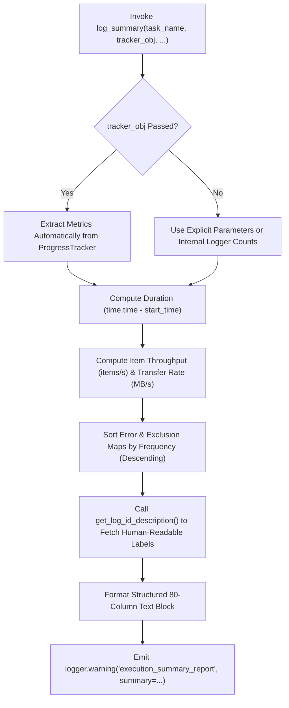

# 2.5. Automatic Summary Report Generation (`log_summary`)

> **Module**: `agent_common.logger.ProjectLogger`  
> **Key Methods**: `ProjectLogger.log_summary()`, `ProjectLogger.get_log_id_description()`  
> **Related Class**: `agent_common.utils.ProgressTracker`

---

## 1. Overview & Enterprise Motivation

Upon the completion of large-scale batch workloads, migrations, or Airflow tasks, operations teams need immediate visibility into core operational metrics:

1. **Total Execution Time & Throughput**: Exact wall-clock duration and processing rate (items/sec).
2. **Outcome Distribution**: Numbers of items succeeded, failed, and intentionally skipped/excluded.
3. **Categorized Error & Exclusion Diagnostics**: Exact breakdowns of error codes with human-readable explanations.
4. **Data Transfer Bandwidth**: Total volume transferred (MB) and average network transfer rate (MB/s).

`ProjectLogger.log_summary()` satisfies these operational requirements by compiling a structured, **high-visibility 80-column summary report block** logged at `WARNING` level.

---

## 2. Architecture & Pipeline



---

## 3. Key Capabilities

### 3.1. Dynamic Label Resolution (`get_log_id_description`)
Translates error and exclusion codes into descriptive titles using the active message catalog (`logging_messages_*.yml`):

- Input Code: `db_deleted_status_skipped`
- Resolved Output: `* db_deleted_status_skipped (Record excluded due to expired asset status 09): 120 items`

### 3.2. Precise Throughput & Bandwidth Computation
- **Wall Time**: Formatted as minutes and seconds with sub-second precision.
- **Processing Rate**: Items per second (`items/sec`).
- **Data Throughput**: Megabytes (`MB`) and average speed (`MB/s`).

### 3.3. Seamless Integration with `ProgressTracker`
Passing a `ProgressTracker` instance via `tracker_obj` automatically binds start time, total items, processed counts, and byte counters.

---

## 4. Standard Summary Report Sample

```text
================================================================================
                         [ECS to BigQuery Migration Summary]
================================================================================
- Start / End Time       : 2026-09-04 22:00:00 ~ 2026-09-04 22:05:30
- Total Elapsed Time     : 5m 30.0s (330.00s)
--------------------------------------------------------------------------------
- Total Target Items     : 100,000 items
- Succeeded / Failed     : 99,500 items / 300 items
- Excluded (Skip)        : 200 items
- Error Breakdown (Total 300 items):
  * network_timeout (Connection timeout to storage): 250 items
  * schema_mismatch (Required columns missing or type error): 50 items
- Exclusion Breakdown (Total 200 items):
  * db_deleted_status_skipped (Record excluded due to expired asset status 09): 150 items
  * db_duplicate_pk_skipped (Duplicate primary key skipped): 50 items
- Total Data Transferred : 1,024.50 MB (Avg 3.10 MB/s)
- Average Processing Rate: 303.03 items/sec
- [Metadata] Executed by Airflow Worker pod: worker-prod-04
================================================================================
```

---

## 5. Practical Code Examples

### 5.1. Explicit Parameters Usage

```python
import time
from agent_common.logger import ProjectLogger

logger = ProjectLogger("BatchPipeline")
start_time = time.time()

# Record workload outcomes
logger.record_success(count_int=950)
logger.record_failure(count_int=30, log_id_str="network_timeout")
logger.record_failure(count_int=20, log_id_str="schema_mismatch")
logger.record_excluded("db_deleted_status_skipped", count_int=50)

# Output summary report
logger.log_summary(
    task_name_str="Customer Data Sync",
    total_items_int=1050,
    start_time_float=start_time,
    total_bytes_int=1024 * 1024 * 150,
    extra_lines_list=[
        "Target Dataset: customer_dw.activity_logs",
        "Target Table: prod_dw.daily_snapshot",
    ]
)
```

### 5.2. `ProgressTracker` Integrated Usage

```python
from agent_common.logger import ProjectLogger
from agent_common.utils import ProgressTracker

logger = ProjectLogger("DataPipeline")
tracker = ProgressTracker(total_items_int=50000, logger_obj=logger, item_name_str="records")

for item in data_items:
    try:
        tracker.increment_success(bytes_int=len(item))
    except Exception as e:
        tracker.increment_failure(error_msg_str=str(e))

# ProgressTracker delegates to logger.log_summary() with tracked metrics
tracker.log_summary(extra_lines_list=["Batch Version: v1.2.0"])
```

---

## 6. Operational Best Practices

1. **Visibility via `WARNING` Level**:
   - `log_summary()` deliberately emits at `WARNING` level so that production runs with higher threshold filters (`logging.level: WARNING`) still output the final job summary.
2. **Context Enrichment via `extra_lines_list`**:
   - Pass partition dates, cluster IDs, or pipeline parameters into `extra_lines_list` for auditability and compliance.
