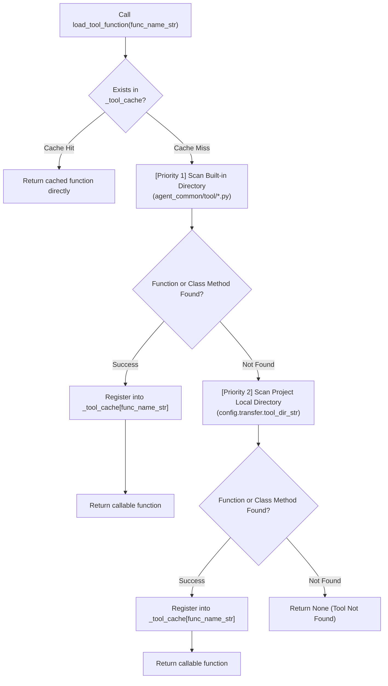

# 4.1. Dual Tool Hierarchy Discovery & Dynamic Loading (`ToolParser`)

> **Module**: `agent_common.tool_parser.ToolParser`  
> **Key Methods**: `load_tool_function()`, `scan_rules_for_tool_functions()`  
> **Dependencies**: `importlib`, `inspect`, `pathlib`, `agent_common.logger.ProjectLogger`, `agent_common.config_loader.ConfigLoader`

---

## 1. Overview & Purpose

In enterprise data migration and medallion pipeline architectures, raw data from source systems (such as Dell ECS, databases, and third-party APIs) must be transformed and sanitized using various modular transformation functions ("Tools") before ingestion into analytics platforms.

Coupling these tool functions into a single monolithic directory introduces severe maintenance issues:
1. **Pollution of Standard vs. Domain Logic**: Mixing organization-wide standard utilities (e.g., standard timestamp generation in `DateTimeUtils`) with project-specific proprietary transformation logic breaks common library reusability and boundaries.
2. **Deployment Friction**: Modifying a single project-specific conversion rule requires redeploying the entire enterprise-wide core package (`agent_common`).

To solve this, `ToolParser` implements a **two-tier hierarchical discovery mechanism**:
- **Priority 1 (Built-in Standard Tools)**: Scans built-in enterprise tools distributed within `agent_common` (`agent_common/tool/`).
- **Priority 2 (Project Local Tools)**: Scans application-specific tools located at the project directory configured in `config.yml` under `transfer.tool_dir_str` (e.g., `medallion/tool/`).

Furthermore, loaded function references are cached in an in-memory dictionary (`_tool_cache`), guaranteeing zero repeated disk I/O and zero re-import overhead during high-throughput batch processing of millions of records.

---

## 2. Hierarchical Discovery Architecture & Flow



---

## 3. Function Resolution Algorithm

When passed a function name (`func_name_str`), `ToolParser` resolves the target via a 3-step inspection strategy:

1. **Module-level Function Lookup**:
   - Searches top-level module declarations (e.g., `def custom_parser(...)`).
2. **Explicit `ClassName.method_name` Lookup**:
   - If `func_name_str` contains a dot (`.`) (e.g., `DateTimeUtils.get_now_compact`), locates the class and extracts the method directly.
3. **Automated Class-Method Introspection**:
   - If only a method name is provided (e.g., `get_now_compact`), inspects all class definitions in the discovered modules to automatically resolve matching methods.

---

## 4. Key Method Specifications

### 4.1. Tool Function Dynamic Loading (`load_tool_function`)
```python
def load_tool_function(self, func_name_str: str) -> Optional[Callable]
```
- **Parameters**:
  - `func_name_str`: Name of the tool function to resolve (e.g., `'get_now_compact'`, `'DateTimeUtils.get_now_compact'`, `'custom_hash_key'`).
- **Returns**: A callable Python function object (`Callable`), or `None` if not found.
- **Characteristics**: Thread-safe in-memory caching ensures that subsequent lookups execute in sub-microsecond time.

### 4.2. Fail-Fast Rule Scanning (`scan_rules_for_tool_functions`)
```python
def scan_rules_for_tool_functions(self, rule_node_any: Any, found_funcs_set: Set[str]) -> None
```
- **Parameters**:
  - `rule_node_any`: Rule dictionary, list, or string expressions.
  - `found_funcs_set`: A `set` object to collect detected function names.
- **Enterprise Benefit**:
  - Recursively scans mapping configurations (`table_rules.yml`, `mapping.yml`) prior to pipeline execution.
  - Validates that all referenced tool functions exist before processing starts, achieving **Fail-Fast stability** without mid-stream job crashes.

---

## 5. Practical Code Examples

### 5.1. Dynamic Resolution of Built-in and Project Tools
```python
from agent_common.tool_parser import ToolParser

tool_parser = ToolParser()

# 1. Resolve built-in class method (Priority 1)
now_func = tool_parser.load_tool_function("DateTimeUtils.get_now_compact")
print(now_func())  # e.g., '20260918203000'

# 2. Resolve by method name alone (automated introspection)
today_func = tool_parser.load_tool_function("get_today_yyyymmdd")
print(today_func())  # e.g., '20260918'

# 3. Resolve project-specific local tool (Priority 2, from medallion/tool/)
custom_tool = tool_parser.load_tool_function("code_sanitizer")
if custom_tool:
    clean_val = custom_tool("RAW_DATA_123")
```

### 5.2. Fail-Fast Startup Validation
```python
from agent_common.tool_parser import ToolParser
from agent_common.logger import ProjectLogger

logger = ProjectLogger("PipelineValidator")
tool_parser = ToolParser()

rules = {
    "target_table": "dw_orders",
    "columns": {
        "ingested_at": "{DateTimeUtils.get_now_timestamp()}",
        "order_token": "{generate_token(order_id)}",
    }
}

used_funcs = set()
tool_parser.scan_rules_for_tool_functions(rules, used_funcs)

missing = [fn for fn in used_funcs if tool_parser.load_tool_function(fn) is None]
if missing:
    logger.error("missing_tools_detected", missing_tools=missing)
    raise RuntimeError(f"Missing required tool functions: {missing}")
```

---

## 6. Best Practices & Caveats

1. **Built-in Precedence**: Standard built-in tools (`agent_common/tool/`) always take precedence over project-level tools with the same name. Avoid naming project-local tools identically to built-in utilities.
2. **Config-Driven Project Tool Path**: Customize the local tool directory via `config.transfer.tool_dir_str` in `config.yml` (defaults to `"medallion/tool"`).
3. **Mandatory Pre-flight Scanning**: Always invoke `scan_rules_for_tool_functions` at daemon initialization to detect typos or missing tool modules early.
