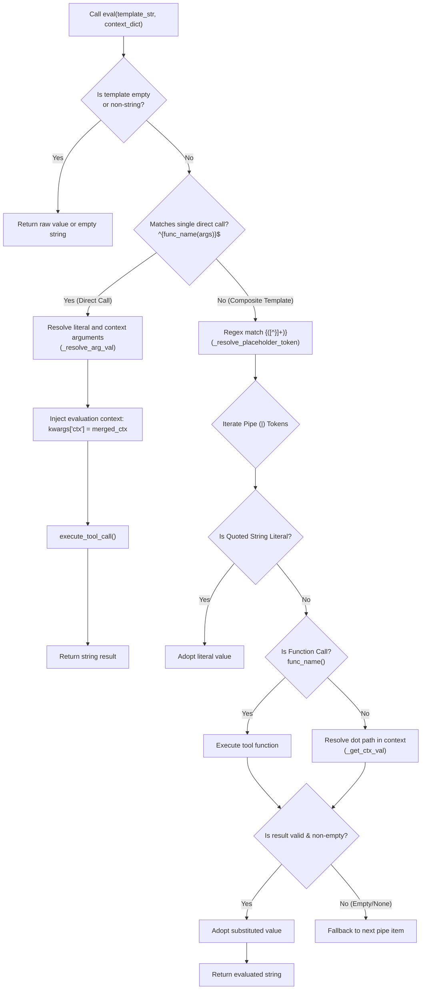

# 4.2. Declarative Template Evaluation & Expression Resolution (`ToolParser.eval`)

> **Module**: `agent_common.tool_parser.ToolParser`  
> **Key Methods**: `eval()`, `execute_tool_call()`  
> **Dependencies**: `re`, `inspect`, `agent_common.logger.ProjectLogger`, `agent_common.config_loader.ConfigLoader`

---

## 1. Overview & Purpose

In enterprise data engineering pipelines, dynamically mapping fields from raw input sources (S3/ECS keys, object metadata, nested JSON bodies) to target cloud data warehouse tables (BigQuery, GCS) requires a declarative, rule-driven evaluation engine. Hardcoded transformation logic increases coupling and necessitates software redeployments for simple mapping adjustments.

`ToolParser.eval()` provides a declarative template evaluation engine supporting:
1. **Direct Tool Function Invocation**: `"{DateTimeUtils.get_now_compact()}"`, `"{extract_domain(json.email)}"`
2. **Namespace Dot-Notation Lookups**: `"{ecs.key}"`, `"{sys.today}"`, `"{json.profile.user_id}"`
3. **Pipe (`|`) Fallback Precedence**: `"{meta.title|json.header.title|'UNTITLED'}"`
4. **Intelligent Argument Binding & Context Injection**: Automatically injects global evaluation context (`ctx=merged_ctx`) and bounds function parameters based on `inspect.signature`.

---

## 2. Evaluation Engine Architecture & Flow



---

## 3. Syntax & Expression Specifications

| Syntax Pattern | Example Expression | Behavior Description |
| :--- | :--- | :--- |
| **Direct Tool Call** | `"{get_today_yyyymmdd()}"`<br/>`"{DateTimeUtils.get_now_timestamp()}"` | Executes the resolved tool function directly and converts return value to string. |
| **Parameterized Tool Call** | `"{lookup_status('ACTIVE', json.status_code)}"` | Resolves string literal and context arguments, then binds them to the function. |
| **Namespace Dot Lookup** | `"{ecs.key}"`<br/>`"{json.customer.address.city}"` | Traverses nested dictionary structures safely via dot-notation. |
| **Pipe Fallback Chain** | `"{meta.title\|json.title\|'Default Title'}"` | Evaluates tokens from left to right; returns the first non-empty, non-null value. |
| **Composite String Formatting** | `"events/{sys.today}/{ecs.filename}.json"` | Combines static string prefixes/suffixes with multiple bracketed tokens. |

---

## 4. Key Method Specifications

### 4.1. Template Evaluation (`eval`)
```python
def eval(
    self,
    template_str: Optional[str],
    context_dict: Optional[Dict[str, Any]] = None,
) -> Optional[str]
```
- **Parameters**:
  - `template_str`: Expression template to evaluate (e.g., `'{sys.today}_{ecs.key}'`).
  - `context_dict`: Data dictionary containing bound namespaces (`ecs`, `sys`, `json`, `meta`, etc.).
- **Returns**: Fully substituted string result. Returns `None` if input is `None`.

### 4.2. Safe Tool Execution (`execute_tool_call`)
```python
def execute_tool_call(
    self,
    func_name_str: str,
    args_list: list[Any],
    kwargs_dict: Dict[str, Any],
) -> Any
```
- **Parameter Binding Safety**:
  - Uses `inspect.signature` to check whether the target tool function accepts `**kwargs`.
  - If unexpected keyword arguments are present, strips them down to explicitly declared parameters, preventing `TypeError: unexpected keyword argument` crashes.

---

## 5. Practical Code Examples

### 5.1. Evaluating Complex Expressions
```python
from agent_common.tool_parser import ToolParser

tool_parser = ToolParser()

context = {
    "ecs": {
        "key": "incoming/data/report_2026.parquet",
        "size": 2048576,
    },
    "meta": {
        "region": "ap-northeast-2",
        # 'title' is intentionally missing
    },
    "json": {
        "title": "Quarterly Financial Report",
    },
    "sys": {
        "today": "20260918",
    }
}

# 1. Built-in tool invocation
res1 = tool_parser.eval("{DateTimeUtils.get_now_compact()}", context)
print(res1)  # '20260918203000'

# 2. Dot-notation with fallback precedence
# meta.title is missing, so it resolves to json.title
res2 = tool_parser.eval("{meta.title|json.title|'Untitled'}", context)
print(res2)  # 'Quarterly Financial Report'

# 3. Composite path construction
res3 = tool_parser.eval("lake/{sys.today}/{ecs.key}", context)
print(res3)  # 'lake/20260918/incoming/data/report_2026.parquet'

# 4. Quoted literal fallback
res4 = tool_parser.eval("{meta.owner|'Admin'}", context)
print(res4)  # 'Admin'
```

### 5.2. Tool Function with Automatic Context Injection
```python
# Custom local tool: medallion/tool/archive_tagger.py
def build_archive_key(prefix: str = "archive", ctx: dict = None) -> str:
    today_str = ctx.get("sys", {}).get("today", "20260101")
    return f"{prefix}_{today_str}"

# Context is automatically passed in kwargs['ctx']
evaluated_key = tool_parser.eval("{build_archive_key(prefix='backup')}", context)
print(evaluated_key)  # 'backup_20260918'
```

---

## 6. Best Practices & Caveats

1. **Quoting Fallback String Constants**: Always wrap constant fallback values in single or double quotes (`{key|'default_val'}`). Unquoted words are interpreted as context variable keys.
2. **Fail-Fast Error Propagation**: If a tool function encounters an unhandled runtime exception during execution, `execute_tool_call` logs the full traceback via `logger.exception` and re-raises immediately.
3. **Standardized Context Schemas**: Structure your evaluation contexts using standard namespace keys (`sys`, `ecs`, `json`, `meta`) for enterprise-wide consistency.
