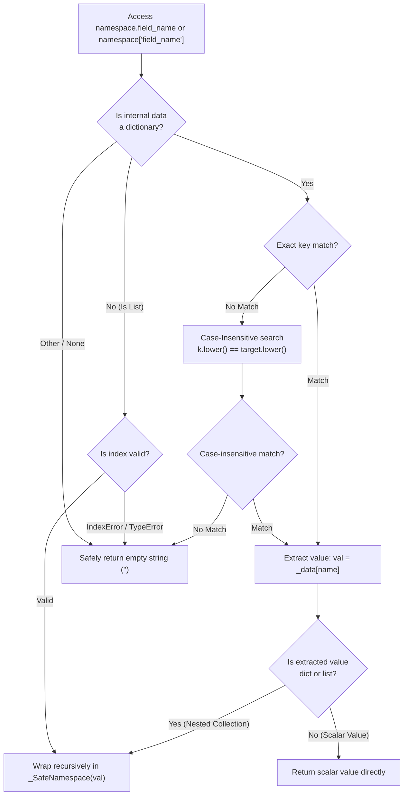

# 4.3. Safe Namespace Lookup & Case-Insensitive Access (`_SafeNamespace`)

> **Module**: `agent_common.tool_parser._SafeNamespace`  
> **Key Methods**: `__getattr__()`, `__getitem__()`, `__str__()`, `__bool__()`  
> **Dependencies**: Python Standard Library (Zero-dependency)

---

## 1. Overview & Purpose

External data sources (such as Dell ECS headers, legacy databases, and heterogeneous REST API responses) frequently exhibit casing inconsistencies (e.g., `userId` vs `USERID` vs `userid`) or missing keys across individual payload records.

Accessing nested structures via standard Python dict indexing (`data['user']['name']`) or attribute access (`data.user.name`) causes severe production issues:
1. **Unpredictable Pipeline Crashes**: A single record missing an optional metadata key in a multi-million row batch causes a fatal `KeyError` or `AttributeError`.
2. **Defensive Code Proliferation**: Developers are forced to litter business logic with tedious defensive patterns like `data.get('user', {}).get('name', '')`.

`_SafeNamespace` eliminates these problems by wrapping dictionaries and nested collections in an immutable, case-insensitive proxy that provides **safe dot-notation access** and returns an **empty string (`""`) on missing keys** without raising exceptions.

---

## 2. Safe Navigation Architecture & Wrapping Flow



---

## 3. Core Capabilities & Behavioral Specifications

### 3.1. Unified Dot-Notation and Key Indexing
A `_SafeNamespace` instance allows transparent interoperability between attribute lookup (`ns.user.name`) and bracket indexing (`ns['user']['name']`).

### 3.2. Case-Insensitive Resilient Resolution
Regardless of how keys are formatted in raw payloads (`"CreatedAt"`, `"created_at"`, `"CREATED_AT"`), lookups such as `ns.createdat` or `ns.createdAt` resolve to the underlying value automatically.

### 3.3. Deep Key-Missing Resilience
Traversing deeply nested non-existent paths (e.g., `ns.order.tracking.carrier.contact_phone`) returns an empty string (`""`) rather than triggering an exception.

### 3.4. Boolean & String Evaluation
- `__str__()`: Converts the encapsulated value to a string (or `""` if `None`).
- `__bool__()`: Mirrors the truthiness of the underlying payload. Empty dictionaries, empty lists, and empty strings safely evaluate to `False`.

---

## 4. Practical Code Examples

### 4.1. Resilient Traversal of Inconsistent Payloads
```python
from agent_common.tool_parser import _SafeNamespace

# Raw heterogeneous payload from external source
raw_payload = {
    "ResponseHeader": {
        "TRANSACTION_ID": "TX-109283",
        "SourceSystem": "CoreBilling"
    },
    "Data": {
        "records": [
            {"SKU": "A001", "Quantity": 20},
            {"SKU": "A002", "Quantity": 15}
        ]
    }
}

ns = _SafeNamespace(raw_payload)

# 1. Mixed-case dot-notation lookups
tx_id = ns.responseheader.transaction_id
print(tx_id)  # 'TX-109283'

source = ns.ResponseHeader.sourcesystem
print(source)  # 'CoreBilling'

# 2. Nested list and dictionary traversal
first_sku = ns.data.records[0].sku
print(first_sku)  # 'A001'

# 3. Missing deep keys resolve safely to empty string
missing_email = ns.data.metadata.author.email
print(f"Result: '{missing_email}'")  # Result: ''
print(bool(missing_email))            # False

# 4. Out-of-bounds list access
invalid_index = ns.data.records[99].sku
print(f"Result: '{invalid_index}'")  # Result: ''
```

---

## 5. Best Practices & Caveats

1. **Integration with `ToolParser`**: `_SafeNamespace` acts as the underlying binding layer for context objects in `ToolParser.eval()`, ensuring template authors never experience syntax crashes due to missing payload fields.
2. **Checking for Value Existence**: Because missing keys evaluate to `""`, clean boolean checks (`if ns.field_name:`) can be used without defensive guard clauses.
3. **No Overhead for Flat Values**: Scalar primitive values (integers, booleans, floats) are returned directly without wrapping, maintaining runtime execution speed.
