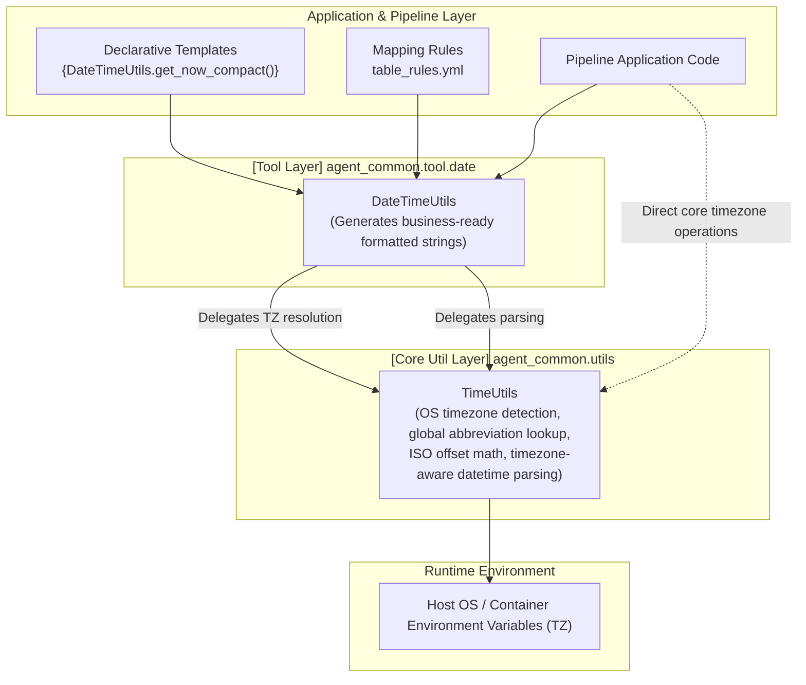

# 4.4. Built-in DateTime Tool (`DateTimeUtils`)

> **Module**: `agent_common.tool.date.DateTimeUtils`  
> **Key Methods**: `get_today_yyyymmdd()`, `get_now_timestamp()`, `get_now_no_tz()`, `get_now_compact()`, `parse_datetime()`  
> **Core Infrastructure Utility**: `agent_common.utils.TimeUtils` (handles system timezone detection and datetime parsing)

---

## 1. Overview & Purpose

In enterprise data pipelines and Medallion architectures, business transformation rules (`table_rules.yml`), cloud storage partition paths, and BigQuery ingestion schemas require standardized date and time representations.

Typical data platform requirements include:
- **BigQuery TIMESTAMP Ingestion**: Standard ISO 8601 timestamps formatted with timezone offsets (`YYYY-MM-DD HH:MM:SS+09:00` or `+00:00`).
- **Partition Directory Generation**: 8-digit compact dates (`YYYYMMDD`) that stay consistent across early-morning batch runs without unintended UTC rollbacks.
- **Console & Summary Reports**: Readable date strings without timezone offsets (`YYYY-MM-DD HH:MM:SS`).
- **Unique Batch Identifiers**: 14-digit compact timestamps (`YYYYMMDDHHMMSS`).

`DateTimeUtils` serves as `agent_common`'s **Priority 1 Built-in Tool**, providing lightweight, pre-compiled methods accessible both in Python code and within declarative template expressions (`{DateTimeUtils.get_today_yyyymmdd()}`).

---

## 2. Two-Tier Time Architecture: `DateTimeUtils` vs. `TimeUtils`

`agent_common` cleanly separates time-related responsibilities into a **Core Infrastructure Layer (`TimeUtils`)** and a **Presentation & Tool Layer (`DateTimeUtils`)**:



### 💡 Clear Division of Responsibilities
1. **`TimeUtils` (Core Infrastructure)**:
   - Detects real host OS and container (Kubernetes Pod) system timezones dynamically.
   - Interprets global timezone abbreviations (KST, UTC, JST, CST, EST, etc.) and ISO offsets.
   - Normalizes naive and aware datetime objects into timezone-aware datetimes.
2. **`DateTimeUtils` (Tool & Formatting Interface)**:
   - Built on top of `TimeUtils` to generate standardized string formats required for data lake partitioning, BigQuery loading, and reporting.
   - Seamlessly callable from `ToolParser` template expressions (`{DateTimeUtils.*}`).

---

## 3. Key Method Specifications

### 3.1. Current 8-Digit Date (`get_today_yyyymmdd`)
```python
@classmethod
def get_today_yyyymmdd(cls, tz_obj: Optional[timezone] = None) -> str
```
- **Format**: `YYYYMMDD` (e.g., `'20260918'`).
- **Use Case**: Daily partition directories and batch partition keys.
- **Enterprise Safety**: When `tz_obj` is omitted, dynamically resolves to the host/configured timezone (e.g., KST), eliminating early-morning date reversion bugs common in UTC-configured containers.

### 3.2. Standard ISO 8601 Timestamp (`get_now_timestamp`)
```python
@classmethod
def get_now_timestamp(cls, tz_obj: Optional[timezone] = None) -> str
```
- **Format**: `YYYY-MM-DD HH:MM:SS+09:00` or `+00:00` (e.g., `'2026-09-18 20:30:15+09:00'`).
- **Use Case**: BigQuery `TIMESTAMP` column ingestion and audit logs.

### 3.3. Clean Datetime Without Timezone (`get_now_no_tz`)
```python
@classmethod
def get_now_no_tz(cls, tz_obj: Optional[timezone] = None) -> str
```
- **Format**: `YYYY-MM-DD HH:MM:SS` (e.g., `'2026-09-18 20:30:15'`).
- **Use Case**: Terminal logging, markdown tables, and operator reports.

### 3.4. 14-Digit Compact Timestamp (`get_now_compact`)
```python
@classmethod
def get_now_compact(cls, tz_obj: Optional[timezone] = None) -> str
```
- **Format**: `YYYYMMDDHHMMSS` (e.g., `'20260918203015'`).
- **Use Case**: Unique backup file names, transaction IDs, and archive keys.

### 3.5. Datetime Normalization (`parse_datetime`)
```python
@classmethod
def parse_datetime(cls, dt_input_any: Any, default_tz_obj: Optional[timezone] = None) -> Optional[datetime]
```
- **Parameters**:
  - `dt_input_any`: `datetime` object, ISO 8601 string, or raw timestamp.
  - `default_tz_obj`: Fallback timezone when parsing naive timestamps.
- **Returns**: A timezone-aware `datetime` object, or `None` on failure.
- **Delegation**: Delegates directly to `TimeUtils.parse_datetime` to preserve system-wide consistency.

---

## 4. Practical Code Examples

### 4.1. Direct Python Invocations
```python
from agent_common.tool.date import DateTimeUtils
from agent_common.utils import TimeUtils

# 1. Generate system-timezone strings
today = DateTimeUtils.get_today_yyyymmdd()
print(f"Today: {today}")  # e.g., '20260918'

bq_ts = DateTimeUtils.get_now_timestamp()
print(f"BigQuery Timestamp: {bq_ts}")  # e.g., '2026-09-18 20:30:15+09:00'

compact_ts = DateTimeUtils.get_now_compact()
print(f"Compact: {compact_ts}")  # e.g., '20260918203015'

# 2. Explicit UTC timestamp generation
utc_tz = TimeUtils.resolve_timezone("UTC")
utc_ts = DateTimeUtils.get_now_timestamp(tz_obj=utc_tz)
print(f"UTC Timestamp: {utc_ts}")  # e.g., '2026-09-18 11:30:15+00:00'

# 3. Parse heterogeneous datetime representations
raw_iso = "2026-08-15T12:00:00Z"
normalized = DateTimeUtils.parse_datetime(raw_iso)
print(normalized)  # 2026-08-15 12:00:00+00:00
```

### 4.2. Declarative Template Evaluation
```python
from agent_common.tool_parser import ToolParser

tool_parser = ToolParser()

# Path construction via declarative template
template = "lake/events/{DateTimeUtils.get_today_yyyymmdd()}/{DateTimeUtils.get_now_compact()}_payload.json"

rendered_path = tool_parser.eval(template)
print(rendered_path)
# Output: lake/events/20260918/20260918203015_payload.json
```

---

## 5. Best Practices & Caveats

1. **When to Choose Which Module**:
   - Use `TimeUtils` when calculating timezone offsets, converting between world timezones, or performing datetime arithmetic.
   - Use `DateTimeUtils` when assembling standardized formatted strings for BigQuery, file paths, or template substitutions.
2. **Early-Morning Batch Operations**:
   - By leveraging `TimeUtils.resolve_timezone()`, `DateTimeUtils` automatically respects the runtime timezone environment, ensuring that overnight batches executed between 00:00 and 09:00 KST are not mistakenly recorded under the previous day's UTC date.
