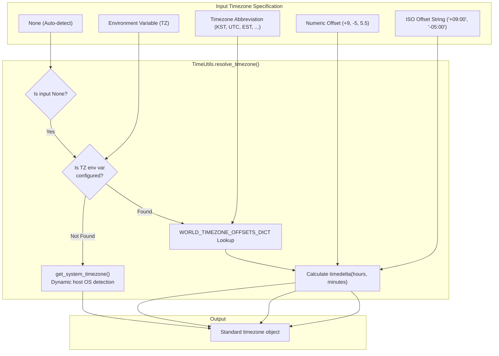

# 5.1. System Timezone Detection, Global Timezone Resolution & Datetime Normalization (`TimeUtils`)

> **Module**: `agent_common.utils.TimeUtils`  
> **Key Methods**: `get_system_timezone()`, `get_system_timezone_offset_str()`, `resolve_timezone()`, `format_timezone_offset()`, `parse_datetime()`  
> **Key Data Structure**: `WORLD_TIMEZONE_OFFSETS_DICT` (Pre-compiled map of 30+ global timezone offsets)  
> **Introduced**: `v0.4.69` (core util separation), `v0.4.74` (`parse_datetime` support)

---

## 1. Overview & Purpose

In enterprise hybrid cloud architectures, identical data pipelines execute across heterogeneous infrastructure environments:
- **On-premises Legacy Batch Servers**: Host OS configured with Korea Standard Time (`KST`, UTC+9).
- **Kubernetes Pods (Airflow, Cloud Run)**: Containers running in Coordinated Universal Time (`UTC`, UTC+0).

Relying on naive assumptions or unadorned `datetime.now()` calls introduces fatal production bugs:
1. **Early-Morning Partition Reversion**: Batch jobs running between 00:00 and 08:59 KST generate partition paths based on the previous day's UTC date, corrupting data lake structures.
2. **BigQuery TIMESTAMP Skew**: Naive timestamps loaded into BigQuery are assumed to be UTC, causing a 9-hour offset distortion.
3. **Multi-Region Ingestion Inconsistencies**: Heterogeneous inputs from US (EST/EDT), Europe (CET/CEST), and Asia (KST/JST) cannot be compared or merged reliably without timezone-aware normalization.

`TimeUtils` dynamically discovers the host OS/container's real local timezone at runtime, resolves global timezone abbreviations and ISO offsets, and provides **universal timezone-aware datetime normalization**.

---

## 2. Time Infrastructure Architecture & Pipeline



---

## 3. Global Timezone Directory (`WORLD_TIMEZONE_OFFSETS_DICT`)

`TimeUtils` natively bundles timezone offsets and Daylight Saving Time (DST) mappings across key global regions:

| Region | Abbreviation | UTC Offset | Representative Cities |
| :--- | :--- | :---: | :--- |
| **Standard Time** | `UTC`, `GMT`, `Z` | UTC+0 | London, Universal Coordinated Time |
| **Asia & Pacific** | `KST`, `JST` | UTC+9 | Seoul, Tokyo |
| | `CST_ASIA`, `HKT`, `SGT` | UTC+8 | Beijing, Shanghai, Hong Kong, Singapore |
| | `IST` | UTC+5:30 | New Delhi (India Standard Time) |
| | `ICT` | UTC+7 | Bangkok, Hanoi |
| | `AEST` / `AEDT` | UTC+10 / UTC+11 | Sydney (Standard / Daylight Saving) |
| | `NZST` / `NZDT` | UTC+12 / UTC+13 | Auckland (Standard / Daylight Saving) |
| **Europe** | `CET` / `CEST` | UTC+1 / UTC+2 | Paris, Berlin (Standard / Daylight Saving) |
| | `WET` / `WEST` | UTC+0 / UTC+1 | Lisbon, London (Standard / Daylight Saving) |
| | `BST` | UTC+1 | London (British Summer Time) |
| | `MSK` | UTC+3 | Moscow |
| **North America** | `EST` / `EDT` | UTC-5 / UTC-4 | New York, Washington D.C. |
| | `CST` / `CDT` | UTC-6 / UTC-5 | Chicago |
| | `MST` / `MDT` | UTC-7 / UTC-6 | Denver |
| | `PST` / `PDT` | UTC-8 / UTC-7 | Los Angeles, San Francisco |
| | `AKST` / `AKDT` | UTC-9 / UTC-8 | Anchorage |
| | `HST` | UTC-10 | Honolulu |

---

## 4. Key Method Specifications

### 4.1. Dynamic System Timezone Detection (`get_system_timezone`)
```python
@classmethod
def get_system_timezone(cls) -> timezone
```
- **Behavior**: Inspects `datetime.now().astimezone().utcoffset()` to dynamically extract the true local timezone of the running OS or container.
- **Returns**: A standard `timezone` object representing the local host (falls back to `timezone.utc` if undetectable).

### 4.2. Host System Offset String (`get_system_timezone_offset_str`)
```python
@classmethod
def get_system_timezone_offset_str(cls) -> str
```
- **Returns**: Formatted ISO 8601 offset string (e.g., `'+09:00'`, `'+00:00'`, `'-05:00'`).

### 4.3. Universal Timezone Resolver (`resolve_timezone`)
```python
@classmethod
def resolve_timezone(cls, tz_input_any: Optional[timezone | str | int | float] = None) -> timezone
```
- **Supported Formats**:
  - `None`: Reads `TZ` environment variable; falls back to `get_system_timezone()`.
  - `timezone`: Returns the instance as-is.
  - `str`: Accepts keywords (`"SYSTEM"`, `"LOCAL"`), abbreviations (`"KST"`, `"UTC"`, `"EST"`), and formatted offsets (`"+09:00"`, `"-04:00"`, `"+9"`).
  - `int` / `float`: Numeric hours offset (e.g., `9` ➔ `+09:00`, `5.5` ➔ `+05:30`).
- **Fail-Fast**: Raises `ValueError` immediately on invalid or unrecognized formats.

### 4.4. Datetime Normalization (`parse_datetime`)
```python
@classmethod
def parse_datetime(cls, dt_input_any: Any, default_tz_obj: Optional[timezone] = None) -> Optional[datetime]
```
- **Behavior**:
  - Naive `datetime`: Attached with `default_tz_obj` (or system default).
  - Aware `datetime`: Preserved.
  - ISO 8601 strings: Converted to timezone-aware datetime.
  - Suffix `"Z"`: Safely replaced with `"+00:00"` (UTC).
  - Nulls/invalid strings: Returns `None` gracefully without throwing exceptions.

---

## 5. Practical Code Examples

### 5.1. Resolving Timezones & Extracting Offsets
```python
from agent_common.utils import TimeUtils

# 1. Automatic host timezone detection
local_tz = TimeUtils.resolve_timezone()
print(f"Host Timezone: {local_tz}")
print(f"Host Offset: {TimeUtils.get_system_timezone_offset_str()}")

# 2. Resolving global abbreviations
kst = TimeUtils.resolve_timezone("KST")
est = TimeUtils.resolve_timezone("EST")
ist = TimeUtils.resolve_timezone("IST")  # India (+05:30)

print(f"KST: {kst}")  # UTC+09:00
print(f"EST: {est}")  # UTC-05:00
print(f"IST: {ist}")  # UTC+05:30

# 3. Numeric and ISO offset resolution
num_tz = TimeUtils.resolve_timezone(9)       # UTC+09:00
iso_tz = TimeUtils.resolve_timezone("-04:00") # UTC-04:00
```

### 5.2. Normalizing Heterogeneous Datetime Inputs
```python
from agent_common.utils import TimeUtils
from datetime import datetime

raw_inputs = [
    "2026-09-18T20:30:00Z",            # UTC ISO 8601
    "2026-09-18 20:30:00+09:00",       # KST ISO 8601
    datetime(2026, 9, 18, 20, 30, 0),  # Naive datetime
    None,                               # Null value
    "CORRUPTED_TIMESTAMP"               # Invalid format
]

for item in raw_inputs:
    normalized = TimeUtils.parse_datetime(item)
    print(f"Raw: {str(item):<25} ➔ Normalized: {normalized}")

# Output:
# Raw: 2026-09-18T20:30:00Z      ➔ Normalized: 2026-09-18 20:30:00+00:00
# Raw: 2026-09-18 20:30:00+09:00 ➔ Normalized: 2026-09-18 20:30:00+09:00
# Raw: 2026-09-18 20:30:00       ➔ Normalized: 2026-09-18 20:30:00+09:00
# Raw: None                      ➔ Normalized: None
# Raw: CORRUPTED_TIMESTAMP       ➔ Normalized: None
```

---

## 6. Architecture Synergy with `DateTimeUtils`

1. **Layered Separation of Concerns**:
   - `TimeUtils` is the **foundational compute engine** handling parsing, math, and timezone detection.
   - `DateTimeUtils` is the **formatting and template interface** built on top of `TimeUtils` for pipelines.
2. **Recommended Container Practice**:
   - In containerized runtimes (Docker/K8s), declare `ENV TZ=Asia/Seoul` in your Dockerfile or Pod spec. `TimeUtils` immediately acknowledges this standard environment variable.
