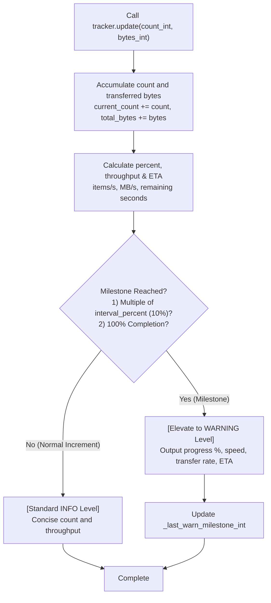

# 5.2. Multithreaded Progress Tracking & Milestone Telemetry (`ProgressTracker`)

> **Module**: `agent_common.utils.ProgressTracker`  
> **Key Methods**: `update()`  
> **Integration**: `agent_common.logger.ProjectLogger`, `agent_common.config_loader.config`

---

## 1. Overview & Purpose

Processing millions of objects in enterprise batch jobs (e.g., S3/ECS object replication or BigQuery table migration) demands accurate **real-time progress monitoring** and **Estimated Time of Arrival (ETA)** telemetry.

Naive logging strategies in high-volume environments face severe limitations:
1. **Log Flooding**: Logging every single item across 1,000,000 iterations inflates cloud log storage costs and exhausts disk I/O.
2. **Silent Failure / Hanging Ambiguity**: Emitting zero logs until the entire job completes leaves operators blind to whether the process is healthy or permanently frozen.
3. **Low Milestone Visibility**: Critical operational checkpoints (10%, 25%, 50%, 100%) get buried within verbose diagnostic logs.

`ProgressTracker` solves this by calculating throughput and ETAs in real-time, logging standard increments at the `INFO` level while **automatically elevating periodic milestones (e.g., every 10%) and 100% completion to the `WARNING` level**.

---

## 2. Telemetry Flow & Level Elevation



---

## 3. Configuration Schema & Specifications

`ProgressTracker` references settings configured under the `progress_tracker` section in `config.yml`:

```yaml
progress_tracker:
  interval_percent_int: 10       # Milestone warning interval (percentage %)
  default_task_name_str: "Task"  # Default task label
```

### 3.1. Constructor (`__init__`)
```python
def __init__(
    self,
    total_items_int: int,
    logger_obj: Any = None,
    task_name_str: Optional[str] = None,
    start_time_float: Optional[float] = None,
) -> None
```
- **Parameters**:
  - `total_items_int`: Total number of items to process.
  - `logger_obj`: `ProjectLogger` or standard `logging.Logger` instance.
  - `task_name_str`: Label displayed in log messages (defaults to `config.progress_tracker.default_task_name_str`).
  - `start_time_float`: Initial timestamp (defaults to current time).

### 3.2. State Update & Tiered Logging (`update`)
```python
def update(
    self,
    count_int: int = 1,
    bytes_int: int = 0,
    details_str: str = "",
) -> None
```
- **Log Message Formats**:
  - **Milestones (`WARNING`)**:  
    `[Task Milestone] Progress: 500/1,000 (50%) | Rate: 25.4 items/s 12.30 MB/s | ETA: 0m 19s`
  - **Standard Progress (`INFO`)**:  
    `[Task] 123/1,000 (12%) | 24.8 items/s (11.80 MB/s)`

---

## 4. Practical Code Examples

### 4.1. File Ingestion Tracking
```python
from agent_common.utils import ProgressTracker
from agent_common.logger import ProjectLogger
import time

logger = ProjectLogger("FilePipeline")
files = [{"name": f"chunk_{i}.bin", "size": 1024 * 1024} for i in range(100)]

tracker = ProgressTracker(
    total_items_int=len(files),
    logger_obj=logger,
    task_name_str="GCS Ingestion"
)

for f in files:
    time.sleep(0.02)  # Simulating transfer
    tracker.update(
        count_int=1,
        bytes_int=f["size"],
        details_str=f["name"]
    )
```

### 4.2. Multithreaded Batch Worker Tracking
```python
from concurrent.futures import ThreadPoolExecutor
from agent_common.utils import ProgressTracker
from agent_common.logger import ProjectLogger

logger = ProjectLogger("WorkerPool")
data_chunks = [range(i, i + 100) for i in range(0, 2000, 100)]

tracker = ProgressTracker(
    total_items_int=2000,
    logger_obj=logger,
    task_name_str="Parallel Processing"
)

def handle_chunk(chunk):
    # Process records
    tracker.update(count_int=len(chunk))

with ThreadPoolExecutor(max_workers=4) as pool:
    pool.map(handle_chunk, data_chunks)
```

---

## 5. Best Practices & Caveats

1. **Filtering for Operations Dashboards**: By configuring log aggregators (Datadog, CloudWatch, OpenSearch) to filter for `WARNING` messages from `ProgressTracker`, DevOps teams can track 10% progress checkpoints without reading through high-volume debug logs.
2. **Zero Total Items Protection**: Passing `total_items_int=0` is guarded internally (`max(1, total_items_int)`), preventing `ZeroDivisionError` crashes.
3. **Network Throughput Diagnostics**: Passing `bytes_int` automatically yields real-time `MB/s` bandwidth measurements, helping engineers quickly pinpoint network bottlenecks.
