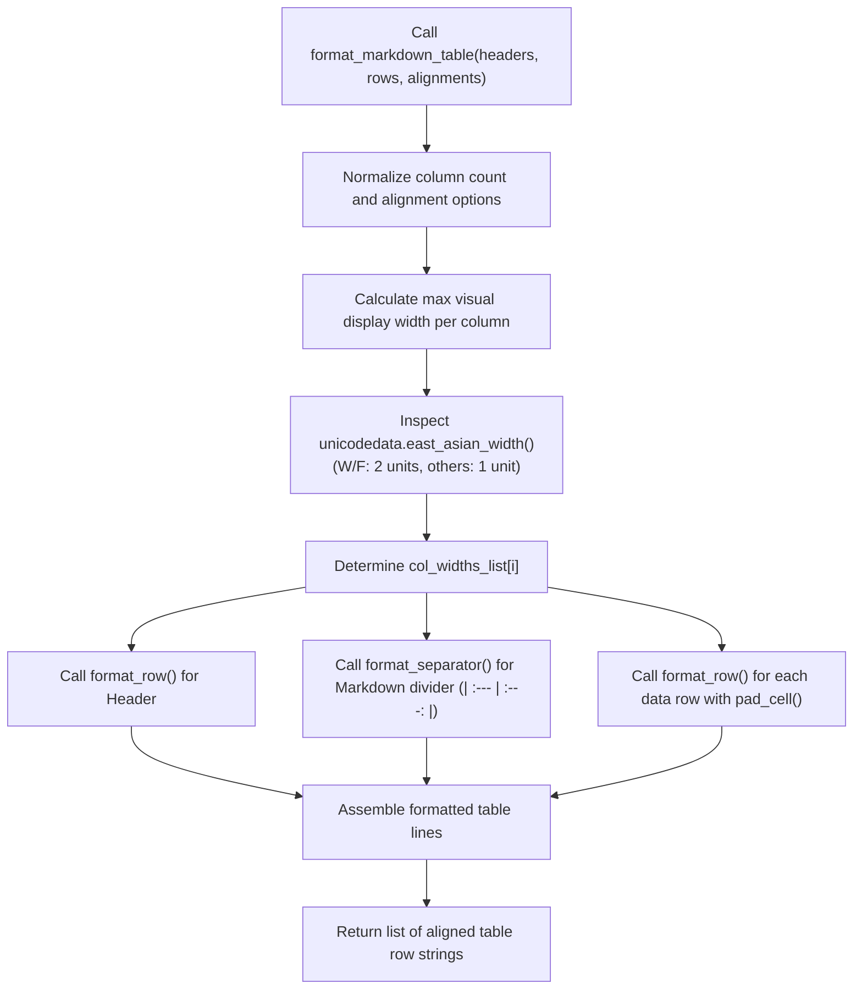

# 5.3. Unicode East Asian Width Alignment & Markdown Table Formatter (`TableFormatter`)

> **Module**: `agent_common.utils.TableFormatter`  
> **Key Methods**: `calculate_display_width()`, `format_markdown_table()`, `format_row()`, `format_separator()`, `pad_cell()`  
> **Dependencies**: `unicodedata` (Python Standard Library), `agent_common.config_loader.config`  
> **Introduced**: `v0.4.63`

---

## 1. Overview & Purpose

When emitting summary reports to terminal consoles or markdown-enabled messaging platforms (Slack, Teams, GitHub Actions), text containing East Asian characters (Korean Hangul, Chinese Hanzi, Japanese Kanji) frequently breaks tabular column alignment:

```text
# Broken table alignment caused by naive len() padding
| Task | File Name | Status |
| Export | sample.json | OK |
| 데이터_수집 | dataset.json | OK |   <-- Korean characters occupy 2 column cells, causing right border misalignment!
```

Python's standard `len("한글")` evaluates to `2` (the character count). However, in monospace terminal emulators and markdown viewers, **East Asian Wide and Fullwidth characters occupy two visual display columns (Display Width = 2)**.

`TableFormatter` utilizes `unicodedata.east_asian_width` to calculate the exact terminal display width of any Unicode string, automatically formatting Markdown and console tables with **pixel-perfect vertical alignment (`|`) across mixed-character datasets**.

---

## 2. Character Width Evaluation & Formatting Pipeline



---

## 3. East Asian Width Character Classifications

`TableFormatter` categorizes characters according to standard Unicode definitions:

| Code | Classification Category | Representative Examples | Visual Display Width |
| :---: | :--- | :--- | :---: |
| **`W`** | **Wide** | Hangul syllables (`가`, `나`), CJK Ideographs (`漢`, `字`), Japanese Kana | **2 columns** |
| **`F`** | **Fullwidth** | Fullwidth Latin (`Ａ`, `Ｂ`), Fullwidth symbols (`！`, `？`) | **2 columns** |
| **`Na`** | Narrow | ASCII letters (`A`, `b`), digits (`0`-`9`), basic punctuation | 1 column |
| **`H`** | Halfwidth | Halfwidth Katakana | 1 column |
| **`N`** | Neutral | Arabic, Hebrew, control characters | 1 column |
| **`A`** | Ambiguous | Select Greek/Cyrillic symbols | 1 column |

---

## 4. Key Method Specifications

### 4.1. Visual Column Width Calculation (`calculate_display_width`)
```python
@classmethod
def calculate_display_width(cls, text_str: str) -> int
```
- **Returns**: Visual cell count (`int`) occupied by the string on monospace displays.
- **Implementation**: Inspects `unicodedata.east_asian_width(c) in ("W", "F")` to assign 2 units to wide characters and 1 unit to all others.

### 4.2. Markdown Table Generation (`format_markdown_table`)
```python
@classmethod
def format_markdown_table(
    cls,
    headers_list: list[str],
    rows_list: list[list[str]],
    alignments_list: Optional[list[str]] = None,
) -> list[str]
```
- **Parameters**:
  - `headers_list`: Header labels.
  - `rows_list`: Matrix of string cells representing data rows.
  - `alignments_list`: Column alignments (`'left'`, `'center'`, `'right'` or Markdown tokens `':---'`, `':---:'`, `'---:'`).
- **Returns**: List of perfectly aligned Markdown table row strings.

### 4.3. Cell Padding Assembly (`pad_cell`)
```python
@classmethod
def pad_cell(
    cls,
    cell_text_str: str,
    target_width_int: int,
    align_mode_str: str = "left",
) -> str
```
- **Alignment Modes**:
  - `'left'`: Appends trailing spaces.
  - `'right'`: Prepends leading spaces.
  - `'center'`: Distributes spaces evenly on both sides.

---

## 5. Practical Code Examples

### 5.1. Aligning Tables with Mixed Korean & English Text
```python
from agent_common.utils import TableFormatter

headers = ["Stage", "Target File", "Records", "Elapsed", "Status"]
rows = [
    ["원천 추출", "ecs_export_20260918.csv", "12,500", "1.4s", "완료"],
    ["데이터 정제 및 변환", "cleaned_dataset.parquet", "12,498", "3.8s", "성공"],
    ["BigQuery 적재 (MERGE)", "analytics.tb_sales_log", "12,498", "2.1s", "성공"],
]
alignments = ["left", "left", "right", "right", "center"]

table_lines = TableFormatter.format_markdown_table(
    headers_list=headers,
    rows_list=rows,
    alignments_list=alignments
)

print("\n".join(table_lines))
```

**Output (Vertical borders remain aligned in monospace viewing)**:
```text
| Stage                 | Target File             | Records | Elapsed | Status |
| :-------------------- | :---------------------- | ------: | ------: | :----: |
| 원천 추출             | ecs_export_20260918.csv |  12,500 |    1.4s |  완료  |
| 데이터 정제 및 변환   | cleaned_dataset.parquet |  12,498 |    3.8s |  성공  |
| BigQuery 적재 (MERGE) | analytics.tb_sales_log  |  12,498 |    2.1s |  성공  |
```

---

## 6. Best Practices & Caveats

1. **Config-Driven Padding Thresholds**:
   - Minimum column dividers and padding values are externalized in `config.table_formatter` (`min_center_width_int: 5`, `min_default_width_int: 4`).
2. **Standardized Log Integration**:
   - `ProjectLogger.log_summary()` internally invokes `TableFormatter`, ensuring that all enterprise batch execution summaries are consistently aligned across production logs and operational notifications.
