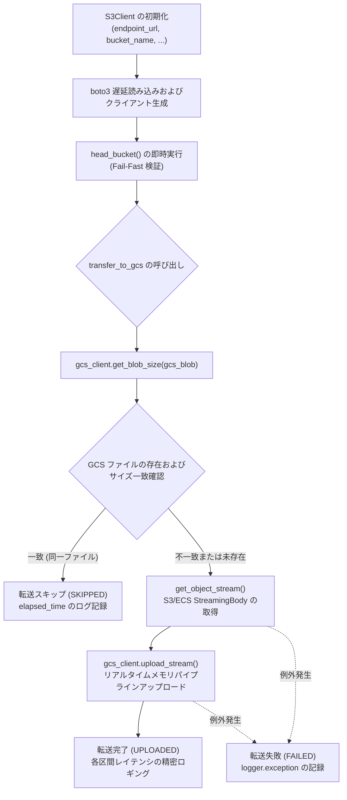

# 3.1. AWS S3 および Dell ECS オブジェクトストレージクライアント (`S3Client`)

> **所属モジュール**: `agent_common.clients.S3Client`  
> **中核メソッド**: `list_objects()`, `get_object_stream()`, `get_object_size()`, `transfer_to_gcs()`  
> **依存パッケージ**: `boto3>=1.26.0`, `botocore`

---

## 1. 概要およびエンタープライズにおける背景

エンタープライズハイブリッドクラウド環境では、パブリッククラウドである **AWS S3** だけでなく、オンプレミスオブジェクトストレージである **Dell ECS (Elastic Cloud Storage)** を併用して大容量データの蓄積や転送を実施します。

`agent_common.clients.S3Client` は、AWS S3 標準 API 仕様に準拠するすべてのオブジェクトストレージシステムを単一のインターフェースで制御する統合クライアントです。

特に以下のエンタープライズ要件を満たすよう設計されています:
1. **サードパーティ SDK の遅延読み込み (Lazy Loading)**: `boto3` モジュールを利用時点でのみ動的インポートし、不要なメモリ占有を防止して軽量環境での起動速度を担保。
2. **接続および権限の早期検証 (Fail-Fast)**: 初期化直後に `head_bucket()` を呼び出し、ネットワーク障害やバケット権限の問題を早期検出して遮断。
3. **大容量ページングジェネレーター**: 数百万件のオブジェクトをメモリ枯渇（OOM）を起こさず安全にストリーミング巡回（`yield`）。
4. **GCS ゼロコピーパイプライン転送とスマートスキップ**: ローカルディスク I/O を介さず S3/ECS から GCS へインメモリパイプラインでストリーミングアップロードを実施。転送先に同一サイズのファイルが既に存在する場合はスマートスキップしてネットワーク帯域の浪費を防止。

---

## 2. 中核アーキテクチャおよび転送パイプライン



---

## 3. 主要メソッドおよび機能仕様

### 3.1. コンストラクタ (`__init__`)
```python
def __init__(
    self,
    endpoint_url_str: str | None = None,
    access_key_str: str | None = None,
    secret_key_str: str | None = None,
    bucket_name_str: str = "",
    timeout_seconds_int: int | None = None,
    region_name_str: str | None = None,
) -> None
```
- **引数の説明**:
  - `endpoint_url_str`: Dell ECS 等のオンプレミスエンドポイント URL（AWS S3 利用時は `None`）
  - `access_key_str`: S3 Access Key ID（AWS IAM Role 環境では省略可能）
  - `secret_key_str`: S3 Secret Access Key（AWS IAM Role 環境では省略可能）
  - `bucket_name_str`: 参照・転送対象のバケット名 (**必須**)
  - `timeout_seconds_int`: 接続および読み込みタイムアウト秒数
  - `region_name_str`: AWS リージョン名（例: `'ap-northeast-2'`）
- **Fail-Fast 検証**: 初期化時に `head_bucket` を実行し、バケットの不在や認証失敗時に即座に `ConnectionError` を送出します。

### 3.2. オブジェクトページング一覧取得 (`list_objects`)
```python
def list_objects(self, prefix_str: str = "") -> Generator[Dict[str, Any], None, None]
```
- `boto3` の `list_objects_v2` Paginator を基盤とし、全オブジェクトを一括ロードせず `yield` ジェネレーターで安全に返却します。

### 3.3. オブジェクトストリーム取得 (`get_object_stream`)
```python
def get_object_stream(self, key_str: str = "") -> Any
```
- 対象キーの S3/ECS `StreamingBody` ストリームオブジェクトを取得します。ディスクへ一時ファイルを作成せず後続処理へパイプライン接続できます。

### 3.4. オブジェクトサイズ取得 (`get_object_size`)
```python
def get_object_size(self, key_str: str = "") -> int | None
```
- `head_object` の呼び出しにより本体をダウンロードせずメタデータヘッダー（`ContentLength`）のみを高速取得します。

### 3.5. GCS パイプライン転送とスマートスキップ (`transfer_to_gcs`)
```python
def transfer_to_gcs(
    self,
    gcs_client_obj: GcsClient,
    s3_key_str: str = "",
    gcs_blob_name_str: str = "",
    size_int: int = 0,
) -> str
```
- **動作手順**:
  1. GCS 側の既存 blob サイズを取得。
  2. サイズが完全一致すれば転送を省略し `"SKIPPED"` を返却。
  3. 新規またはサイズ不一致のファイルはストリームを開いて即座に GCS へパイプライン転送し `"UPLOADED"` を返却。
  4. 失敗時は例外を記録し `"FAILED"` を返却。

---

## 4. 実践使用例

### 4.1. Dell ECS および AWS S3 クライアントの初期化
```python
from agent_common.clients import S3Client

# 1) オンプレミス Dell ECS クライアント
ecs_client = S3Client(
    endpoint_url_str="https://ecs.mycorp.internal:9021",
    access_key_str="MY_ECS_ACCESS_KEY",
    secret_key_str="MY_ECS_SECRET_KEY",
    bucket_name_str="raw-lake-bucket",
    timeout_seconds_int=60,
)

# 2) AWS S3 クライアント (IAM Role 環境)
s3_client = S3Client(
    bucket_name_str="my-aws-s3-bucket",
    region_name_str="ap-northeast-2",
)
```

### 4.2. 大容量オブジェクトの一覧巡回および GCS リアルタイム転送
```python
from agent_common.clients import S3Client, GcsClient

s3_client = S3Client(
    endpoint_url_str="https://ecs.company.com:9021",
    access_key_str="ACCESS_KEY",
    secret_key_str="SECRET_KEY",
    bucket_name_str="source-bucket",
)

gcs_client = GcsClient(
    bucket_name_str="target-gcs-bucket",
    credentials_path_str="secrets/gcp_sa_key.json",
)

target_prefix_str = "raw/events/2026/08/24/"

for obj_dict in s3_client.list_objects(prefix_str=target_prefix_str):
    s3_key_str: str = obj_dict["Key"]
    size_int: int = obj_dict["Size"]
    gcs_blob_str: str = f"lake/{s3_key_str.lstrip('/')}"
    
    # GCS スマート転送
    result_status_str = s3_client.transfer_to_gcs(
        gcs_client_obj=gcs_client,
        s3_key_str=s3_key_str,
        gcs_blob_name_str=gcs_blob_str,
        size_int=size_int,
    )
    print(f"[{result_status_str}] {s3_key_str} -> {gcs_blob_str} ({size_int:,} bytes)")
```

---

## 5. 例外処理およびトラブルシューティングガイド

| 発生例外 | 主な原因 | 対処方法 |
| :--- | :--- | :--- |
| `ImportError: 'boto3' 패키지가 필요합니다` | 実行環境に `boto3` が未インストール | `pip install agent_common[clients]` または `pip install boto3` |
| `ValueError: S3/ECS 버킷명은 필수 입력 항목입니다` | `bucket_name_str` が未指定または空文字 | 有効なバケット名を引数として明示 |
| `ConnectionError: connection_failed` | エンドポイント URL 誤記、認証情報誤り、権限不足 (403) | エンドポイント到達性の確認 (`curl -k`) および認証鍵権限の確認 |
| `RuntimeError: list_failed` | 一覧取得途中のネットワークタイムアウト | `timeout_seconds_int` の増加およびプロキシ/ファイアウォールの確認 |
| `RuntimeError: transfer_failed` | ストリーム転送中のソケット切断 | 自動リトライの適用およびソースストレージのデータ完全性確認 |
