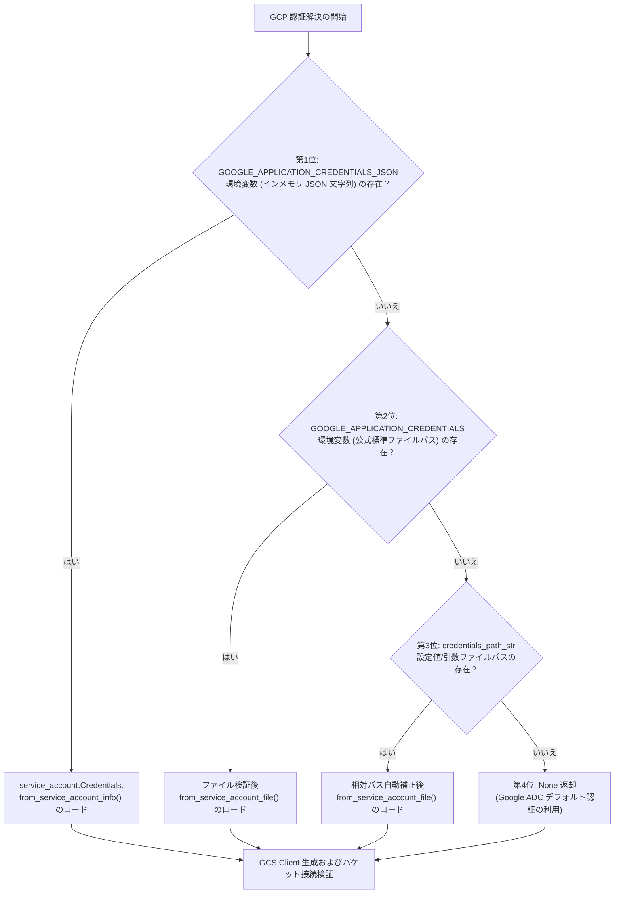

# 3.2. Google Cloud Storage ストリーミングクライアントおよび多階層認証 (`GcsClient`)

> **所属モジュール**: `agent_common.clients.GcsClient`  
> **中核メソッド**: `get_blob_size()`, `upload_stream()`, `GcpCredentialResolver.resolve()`  
> **依存パッケージ**: `google-cloud-storage>=2.10.0`, `google-auth`

---

## 1. 概要およびエンタープライズにおける背景

Google Cloud Storage (GCS) は、ビッグデータレイクおよび BigQuery 分析パイプラインにおける中核的なゲートウェイストレージです。

エンタープライズデータエンジニアリング環境では、様々な実行基盤（ローカル開発 PC、オンプレミス Airflow サーバー、Compute Engine、GKE コンテナ等）に応じて認証情報（Credentials）の注入方法が異なります。また、ギガバイト（GB）級の大容量ファイルをローカルディスクやメモリにバッファリングすると、メモリ不足（OOM）やディスク枯渇障害を引き起こします。

`agent_common.clients.GcsClient` は、**4段階の優先順位に基づく柔軟な GCP 認証体系**と**純粋なストリーミングアップロードパイプライン**を提供し、安定した転送処理を保証します。

---

## 2. 4段階のサービスアカウント認証優先順位アーキテクチャ

`GcsClient` および内部の `GcpCredentialResolver.resolve()` メソッドは、以下の4段階の優先順位に従って GCP 認証オブジェクト（`google.auth.credentials.Credentials`）を安全に解決します:



### 認証フェーズ別の詳細仕様:
1. **第1位 (`GOOGLE_APPLICATION_CREDENTIALS_JSON`)**:
   - セキュアなコンテナ環境や CI/CD パイプラインにおいて、物理キーファイルをディスクに保存せず、環境変数に注入された生の JSON 文字列から直接メモリ認証オブジェクトを生成します。
2. **第2位 (`GOOGLE_APPLICATION_CREDENTIALS`)**:
   - Google 公式標準環境変数で指定されたサービスアカウントキーファイル（`.json`）の絶対/相対パスを解決します。
3. **第3位 (`credentials_path_str`)**:
   - `config.yml` の設定値やコンストラクタ引数で明示的に渡されたキーファイルパスを使用します。相対パスの場合はプロジェクトルート基準で自動補正されます。
4. **第4位 (Google ADC - Application Default Credentials)**:
   - GKE Workload Identity、GCE メタデータサーバー、または `gcloud auth application-default login` セッションを介した自動デフォルト認証を利用します。

---

## 3. 主要メソッドおよび機能仕様

### 3.1. コンストラクタ (`__init__`)
```python
def __init__(
    self,
    bucket_name_str: str = "",
    credentials_path_str: str = "",
    timeout_seconds_int: int | None = None,
) -> None
```
- **引数**:
  - `bucket_name_str`: 接続先 GCS バケット名 (**必須**)
  - `credentials_path_str`: サービスアカウントキーファイルのパス（省略時は環境変数または ADC 自動探索）
  - `timeout_seconds_int`: タイムアウト秒数
- **動作**:
  - `_get_gcs()` によるライブラリ遅延読み込み
  - 4段階認証解決後の `storage.Client` 初期化
  - `client.get_bucket(bucket_name, timeout=...)` の呼び出しによるバケット存在および権限状態の即時検証 (Fail-Fast)

### 3.2. Blob 存在およびサイズ取得 (`get_blob_size`)
```python
def get_blob_size(self, destination_blob_name_str: str = "") -> int | None
```
- 指定パスの GCS Blob メタデータを取得し、ファイルサイズ（`int`）を返却します。存在しない場合は `None` を返却します。

### 3.3. ストリーム直接アップロード (`upload_stream`)
```python
def upload_stream(
    self,
    stream_any: Any = None,
    destination_blob_name_str: str = "",
    size_int: int = 0,
    timeout_int: int | None = None,
) -> None
```
- 転送元（S3, ECS, HTTP レスポンス, メモリバッファ等）から渡されたストリームを GCS Blob へ直接アップロードします。
- メモリ全体にデータを展開せず、指定サイズ単位で順次ストリーミング転送します。

---

## 4. 実践使用例

### 4.1. サービスアカウント認証ファイルに基づく初期化
```python
from agent_common.clients import GcsClient

gcs_client = GcsClient(
    bucket_name_str="my-enterprise-data-lake",
    credentials_path_str="config/secrets/gcp_sa_key.json",
    timeout_seconds_int=120,
)
```

### 4.2. 環境変数/インメモリ JSON に基づく初期化 (GKE 推奨)
```bash
export GOOGLE_APPLICATION_CREDENTIALS_JSON='{"type": "service_account", "project_id": "my-project", ...}'
```

```python
from agent_common.clients import GcsClient

# credentials_path_str を省略すると環境変数の JSON を自動パース
gcs_client = GcsClient(bucket_name_str="my-enterprise-data-lake")
```

### 4.3. メモリストリームの直接アップロード
```python
import io
from agent_common.clients import GcsClient

gcs_client = GcsClient(bucket_name_str="analytics-bucket")

raw_data_bytes = b'{"event_id": "EVT_1001", "status": "SUCCESS"}\n'
stream_obj = io.BytesIO(raw_data_bytes)
target_blob_str = "events/2026/08/24/event_1001.json"

gcs_client.upload_stream(
    stream_any=stream_obj,
    destination_blob_name_str=target_blob_str,
    size_int=len(raw_data_bytes),
)

uploaded_size_int = gcs_client.get_blob_size(target_blob_str)
print(f"アップロード完了確認: {target_blob_str} ({uploaded_size_int} bytes)")
```

---

## 5. 例外処理およびトラブルシューティングガイド

| 発生例外 | 主な原因 | 対処方法 |
| :--- | :--- | :--- |
| `ImportError: 'google-cloud-storage' 패키지가 필요합니다` | GCS SDK が未インストール | `pip install agent_common[clients]` または `pip install google-cloud-storage` |
| `ValueError: GCS 버킷명은 필수 입력 항목입니다` | `bucket_name_str` が未指定または空文字 | 有効なバケット名を明示 |
| `FileNotFoundError: 인증키 파일을 찾을 수 없습니다` | 指定パスにキーファイルが存在しない | ファイルパスおよびプロジェクトルート基準の相対パスを確認 |
| `ValueError: 인메모리 JSON 인증 객체 생성 실패` | `GOOGLE_APPLICATION_CREDENTIALS_JSON` の構文エラー | 環境変数の JSON 文字列およびエスケープ状態を確認 |
| `ConnectionError: connection_failed (403 Forbidden)` | サービスアカウントに Storage Object 権限がない | GCP IAM コンソールでバケットに対するロールを付与 |
| `RuntimeError: transfer_failed` | 大容量転送中のタイムアウトまたは回線遮断 | `timeout_seconds_int` の引き上げおよびプロキシ設定 (`NO_PROXY`) の点検 |
