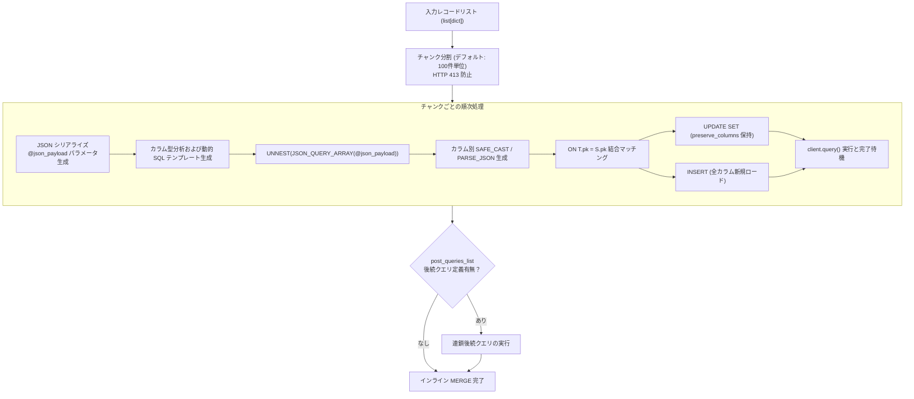

# 3.4. BigQuery 高性能インライン MERGE (Upsert) クエリエンジン (`merge_table_from_json_data`)

> **所属モジュール**: `agent_common.clients.BigQueryClient`  
> **中核メソッド**: `merge_table_from_json_data()`  
> **依存パッケージ**: `google-cloud-bigquery>=3.10.0`

---

## 1. 概要およびエンタープライズにおける背景

データウェアハウスへ変更データキャプチャ (CDC) イベントや最新状態レコードを投入する際、重複を防止し最新情報へ更新するために **MERGE INTO (Upsert)** 演算が不可欠です。

従来の一般的な BigQuery MERGE アプローチには以下の課題がありました:
1. **一時テーブル作成のオーバーヘッド**: 中間ステージングテーブルへ一度アップロードした後に MERGE 宛先クエリを実行するため、I/O とテーブル作成・削除のオーバーヘッドが発生。
2. **HTTP 413 およびパラメータサイズ制限**: 大容量 JSON を単一パラメータで送信すると API リクエスト上限（10MB/100MB）を超過して失敗。
3. **予約語および特殊文字カラム名の構文エラー**: BigQuery 予約語や特殊文字が含まれる場合のエスケープ漏れによる SQL コンパイルエラー。
4. **厳格な型不一致**: JSON 配列の UNNEST 時に型キャストが明示されない場合、BigQuery の型検証で拒絶される。

`BigQueryClient.merge_table_from_json_data` は、一時テーブルを作成せず単一 SQL クエリで直接インライン MERGE を実行する**高性能・純粋インライン MERGE エンジン**です。

---

## 2. インライン MERGE エンジンアーキテクチャ



---

## 3. 主要機能および引数仕様

### 3.1. メソッドシグネチャ
```python
def merge_table_from_json_data(
    self,
    json_data_any: Any,
    pk_key_str: str = "id",
    preserve_columns_list: list[str] | None = None,
    column_types_dict: dict[str, str] | None = None,
    matched_condition_str: str | None = None,
    not_matched_condition_str: str | None = None,
    post_queries_list: list[dict[str, Any]] | None = None,
    chunk_size_int: int = 100,
    timeout_int: int | None = None,
) -> None
```

### 3.2. 引数の詳細仕様
- `json_data_any`: Upsert 対象の単一 `dict` または `list[dict]`
- `pk_key_str`: レコード識別・結合キーとなる Primary Key カラム名（デフォルト: `'id'`）
- `preserve_columns_list`: 既存レコードが存在し UPDATE される際に、**上書きせず既存テーブルの値を保持すべきカラム一覧**（例: 初回作成日時 `created_at` 等）
- `column_types_dict`: カラムごとの明示的 SQL 型マッピング辞書（例: `{"price": "NUMERIC", "meta": "JSON"}`）。未指定カラムは Python データ型から自動推論され、適切な SQL 関数へキャストされます。
- `matched_condition_str`: `WHEN MATCHED` 句へ付加する追加条件式（例: `"AND S.updated_at > T.updated_at"`）
- `not_matched_condition_str`: `WHEN NOT MATCHED` 句へ付加する追加条件式
- `post_queries_list`: MERGE 直後に連鎖実行する後続クエリリスト
- `chunk_size_int`: リクエスト制限超過防止のチャンク分割単位（デフォルト: `100`件）

---

## 4. 実践使用例

### 4.1. 基本 Upsert (Primary Key 基準での挿入および更新)
```python
from agent_common.clients import BigQueryClient

bq_client = BigQueryClient(
    project_id_str="my-gcp-project",
    dataset_id_str="service_db",
    table_id_str="tb_member_profile",
)

members_data_list = [
    {
        "member_id": "M001",
        "name": "山田太郎",
        "login_count": 42,
        "is_vip": True,
        "created_at": "2026-01-01 00:00:00+09:00",
        "last_login_at": "2026-08-24 15:30:00+09:00",
    },
    {
        "member_id": "M002",
        "name": "佐藤花子",
        "login_count": 1,
        "is_vip": False,
        "created_at": "2026-08-24 15:35:00+09:00",
        "last_login_at": "2026-08-24 15:35:00+09:00",
    },
]

# created_at は UPDATE 時に上書きせず保持
bq_client.merge_table_from_json_data(
    json_data_any=members_data_list,
    pk_key_str="member_id",
    preserve_columns_list=["created_at"],
    chunk_size_int=100,
)
```

### 4.2. 明示的型指定および条件付き MERGE
```python
from agent_common.clients import BigQueryClient

bq_client = BigQueryClient(
    project_id_str="my-gcp-project",
    dataset_id_str="iot_lake",
    table_id_str="tb_device_telemetry",
)

telemetry_data_list = [
    {
        "device_id": "DEV-9901",
        "sensor_metrics": {"temp": 26.5, "humidity": 60},
        "event_time": "2026-08-24 16:00:00+09:00",
        "status": "NORMAL",
    }
]

bq_client.merge_table_from_json_data(
    json_data_any=telemetry_data_list,
    pk_key_str="device_id",
    column_types_dict={
        "sensor_metrics": "JSON",
        "event_time": "TIMESTAMP",
    },
    matched_condition_str="AND S.event_time > T.event_time",
)
```

---

## 5. 生成される MERGE SQL の内部構造

```sql
MERGE `my-gcp-project.service_db.tb_member_profile` T
USING (
    SELECT
      JSON_VALUE(item, '$."member_id"') AS `member_id`,
      JSON_VALUE(item, '$."name"') AS `name`,
      SAFE_CAST(JSON_VALUE(item, '$."login_count"') AS INT64) AS `login_count`,
      SAFE_CAST(JSON_VALUE(item, '$."is_vip"') AS BOOL) AS `is_vip`,
      TIMESTAMP(JSON_VALUE(item, '$."created_at"')) AS `created_at`,
      TIMESTAMP(JSON_VALUE(item, '$."last_login_at"')) AS `last_login_at`
    FROM UNNEST(JSON_QUERY_ARRAY(@json_payload)) AS item
) S
ON T.`member_id` = S.`member_id`
WHEN MATCHED THEN
  UPDATE SET
    T.`name` = S.`name`,
    T.`login_count` = S.`login_count`,
    T.`is_vip` = S.`is_vip`,
    T.`last_login_at` = S.`last_login_at`
WHEN NOT MATCHED THEN
  INSERT (`member_id`, `name`, `login_count`, `is_vip`, `created_at`, `last_login_at`)
  VALUES (S.`member_id`, S.`name`, S.`login_count`, S.`is_vip`, S.`created_at`, S.`last_login_at`)
```

- すべてのカラム名がバッククォート（`` ` ``）で囲まれ、予約語との衝突が防止されます。
- `preserve_columns_list` で指定されたカラムは `UPDATE SET` から除外され、`INSERT` にのみ反映されます。

---

## 6. 例外処理およびトラブルシューティングガイド

| 発生例外 | 主な原因 | 対処方法 |
| :--- | :--- | :--- |
| `ValueError: 지원하지 않는 JSON 데이터 포맷 구조입니다` | dict や list 以外の不正な型が渡された | 入力オブジェクトの型を確認 |
| `RuntimeError: db_table_merge_failed (Invalid JSON)` | JSON データ内のエスケープ不正 | 入力データの UTF-8 エンコードおよび構文を確認 |
| `RuntimeError: Type mismatch` | 推論された型と実際のテーブルカラム型の不一致 | `column_types_dict` で明示的に BigQuery 型を指定 |
| `RuntimeError: Payload too large (413)` | 1チャンクのサイズが過大 | `chunk_size_int` を 50 や 20 に縮小 |
