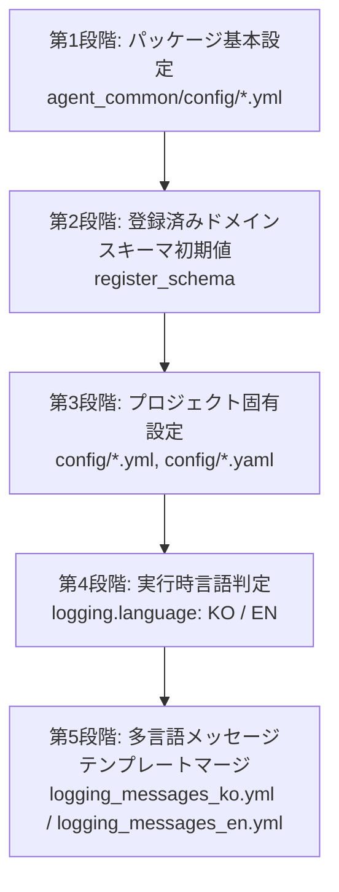

# 1.1. 階層型 YAML 設定解釈およびディープマージ (Deep Merge)

> **所属モジュール**: `agent_common.config_loader.ConfigLoader`  
> **関連主要メソッド**: `ConfigLoader.get_settings()`, `ConfigLoader._deep_merge()`

---

## 1. 概要および目的

`agent_common` パッケージは、大規模な分散データパイプラインおよびエージェントサービス環境において、共有ライブラリと各個別アプリケーション間の重複設定を排除し、全社共通の標準設定と個別プロジェクト固有の設定を柔軟に結合するための**階層型 YAML 解釈および再帰的ディープマージ（Deep Merge）**アーキテクチャを提供します。

標準の辞書 `update()` は第1階層のキーのみを上書きするため、下位のネストされた辞書（Nested Dict）構造が消失してしまう問題が生じます。`ConfigLoader` は下位階層まで再帰的に探索し、同一キーは上書きし、新規キーは保持するインプレース再帰マージを実行します。

---

## 2. 5段階の階層マージ優先順位

`ConfigLoader.get_settings()` 呼び出し時、設定は以下の5段階の順序で累積マージされ、後続ステージの設定が先行ステージの設定をオーバーライドします:



1. **第1段階 (基本パッケージ設定)**:
   - `agent_common/config/` ディレクトリ内の `default_agent_common.yml` や `llmpool.yml` などのパッケージ基本設定をファイル名のアルファベット順に読み込みます。
   - ただし、`logging_messages*.yml` ファイルは第4段階の言語判定後に読み込まれるよう除外されます。
2. **第2段階 (動的登録ドメインスキーマ)**:
   - アプリケーション起動時に `ConfigLoader.register_schema()` を通じて登録されたドメイン基本スキーマ辞書がマージされます。
3. **第3段階 (プロジェクト固有設定のオーバーライド)**:
   - プロジェクトルートの `config/` ディレクトリに存在するすべての `.yml` および `.yaml` ファイルをアルファベット順に読み込んでマージします。
   - プロジェクト固有の設定ファイル（`config.yml`）に定義された値がパッケージ基本値を上書きします。
4. **第4段階 (言語判定)**:
   - 環境変数（`AGENT_LOG_LANGUAGE`, `LOGGING_LANGUAGE`）、`logging.language` 設定値、または実行時強制指定値（`ConfigLoader.set_language()`）を基にログ言語（`KO` または `EN`）を決定します。
5. **第5段階 (メッセージテンプレートマージ)**:
   - 決定された言語に対応するパッケージ基本辞書（`logging_messages_ko.yml` または `logging_messages_en.yml`）を読み込み、プロジェクト `config/` ディレクトリにプロジェクト固有のメッセージファイルが存在する場合はその内容で最終オーバーライドします。

---

## 3. 再帰的ディープマージ (Deep Merge) アルゴリズム

`ConfigLoader._deep_merge` は以下のような原理で動作します:

```python
@staticmethod
def _deep_merge(target: dict[str, Any], incoming: dict[str, Any]) -> None:
    for key, value in incoming.items():
        if isinstance(value, dict) and isinstance(target.get(key), dict):
            ConfigLoader._deep_merge(target[key], value)
        else:
            target[key] = value
```

- **双方が辞書の場合**: サブキーへと再帰的に進入し、各詳細プロパティを個別にマージします。
- **単一値または型が異なる場合**: `incoming` の新しい値が `target` の既存の値を上書きします。
- **リスト (List) の場合**: 要素の追加・結合ではなく、全体置換（Replacement）方式で動作し、明確な意図を維持します。

---

## 4. 実践的な使用例

### 4.1. 設定ファイル構成

**パッケージ基本設定 (`agent_common/config/default_agent_common.yml`)**:
```yaml
ecs:
  endpoint_url: "https://storage.example.com"
  max_retries_int: 3
  timeout_int: 30

logging:
  level_str: "INFO"
  language: "KO"
```

**プロジェクト固有設定 (`config/config.yml`)**:
```yaml
ecs:
  # endpoint_url は基本値を維持し、max_retries_int のみ再定義
  max_retries_int: 5

# 新規プロジェクト固有設定の追加
transfer:
  max_workers_int: 8
```

### 4.2. Python コードからの参照

```python
from agent_common.config_loader import config

# 1) パッケージ基本値とプロジェクトオーバーライドが結合された最終設定の確認
print(config.ecs.endpoint_url)         # "https://storage.example.com" (基本値を維持)
print(config.ecs.max_retries_int)       # 5 (プロジェクト設定で上書き)
print(config.ecs.timeout_int)           # 30 (基本値を維持)
print(config.transfer.max_workers_int) # 8 (プロジェクトの新規設定を反映)
```

---

## 5. プロジェクトルートの自動検出 (`_find_project_root`)

`ConfigLoader` は個別のパス引数を指定しなくても、以下の3段階フォールバック戦略によって `config/config.yml` が存在する最上位プロジェクトルートを自動検出します:

1. **カレントワーキングディレクトリ (CWD)**: `os.getcwd()` およびその上位ディレクトリを探索
2. **エントリポイントスクリプトの位置**: `sys.argv[0]` の親ディレクトリおよび上位パスを探索
3. **agent_common パッケージの位置**: パッケージインストールパスの上位ディレクトリを探索

これにより、Airflow DAG の実行、単体テスト、CLI コマンド実行など、いかなる実行コンテキストにおいても常に安定して設定ファイルを検出し、ロードすることができます。
