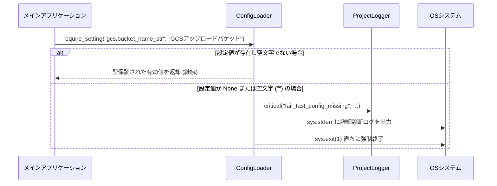

# 1.4. Fail-Fast 必須設定検証 (`require_setting`)

> **所属モジュール**: `agent_common.config_loader.ConfigLoader`  
> **中核メソッド**: `ConfigLoader.require_setting(path, message="", config_file=None)`  
> **連携原則**: `AGENTS.md` 第1.3条 (Fail-Fast & Program Stability)

---

## 1. 概要および設計原則

分散データパイプラインやバックグラウンドワーカーにおいて、データベース接続情報、ストレージバケットパス、暗号化キーのような**必須設定値が欠落したまま起動されると**、数時間データ処理を継続した後にエラーで停止したり、データの欠損・破損を引き起こします。

`ConfigLoader.require_setting()` は、システムアーキテクチャの原則である **"Fail-Fast (早期失敗)"** を徹底して実装します。必須設定値が空または欠落している場合、実行途中の処理段階ではなく**プログラム起動フェーズ (Startup Phase)** において即座にプロセスを終了（`sys.exit(1)`）させ、不完全な状態での業務処理を遮断します。

---

## 2. メソッドシグネチャおよび引数

```python
def require_setting(
    self, 
    path: str, 
    message: str = "", 
    config_file: str | Path | None = None
) -> Any:
```

- **`path` (str, 必須)**: ドット記法で指定された必須設定パス（例: `"ecs.endpoint_url"`, `"bigquery.dataset_id"`）
- **`message` (str, 任意)**: 設定欠落時に運用者が原因を迅速に特定できるよう出力する補足説明メッセージ
- **`config_file` (str | Path | None, 任意)**: 特定の設定ファイルに限定して検証する場合の該当ファイルパス（未指定時は全マージされた `config_dir` 設定を基準に検証）
- **返却値 (`Any`)**: 検証に合格した設定値（キー末尾の型サフィックス `_int`, `_str` 等に応じた自動型変換および型保証済み）

---

## 3. 動作メカニズムおよび検証フロー



### 判定基準 (欠落とみなされる条件):
1. 設定パスのキーが辞書内にそもそも存在しない場合
2. キーの値が `None` の場合
3. 文字列値で、空白除去（`.strip()`）後に空文字（`""`）となる場合

---

## 4. 診断ログ出力形式

設定の欠落が検出された場合、コンソールの標準エラー出力（`sys.stderr`）およびロガー（`logger.critical`）に以下の情報を含む明確な診断メッセージが1行で出力されます:

- **欠落した設定キーパス**: `path`
- **ユーザー追加メッセージ**: `message`
- **検査対象ファイルおよび存在有無**: `config_file` および `[ファイル存在]` / `[ファイルなし]`
- **実ファイル内で検出されたキー一覧**: `(検出キー一覧: ['ecs', 'logging'])`

これにより、運用者はタイポなのか、ファイル未配置なのか、スキーマの不整合なのかを即座に判別できます。

---

## 5. 実践的な使用例

### 5.1. CLI および起動初期のエントリポイント検証

```python
import sys
from agent_common.config_loader import ConfigLoader

loader = ConfigLoader()

# 1. 必須インフラ接続情報の検証 (欠落時は即座に終了)
ecs_endpoint: str = loader.require_setting(
    "ecs.endpoint_url", 
    message="Dell ECS ストレージ接続用の必須エンドポイント URL です。"
)

bq_table: str = loader.require_setting(
    "bigquery.table_id", 
    message="ロード対象の BigQuery テーブル ID です。"
)

# 2. 型サフィックス自動保証の活用
max_retry: int = loader.require_setting(
    "transfer.max_retries_int",
    message="転送失敗時の最大リトライ回数です。"
)

print(f"全必須設定の検証完了: ECS={ecs_endpoint}, BQ={bq_table}, Retry={max_retry}")
```

### 5.2. 特定設定ファイルを指定した検証

プロジェクト全体の統合設定ではなく、特定の専用設定ファイル（例: `table_rules.yml`）を直接検証する場合にも活用できます:

```python
# table_rules.yml 内の pk_columns_list の必須指定を検証
pk_cols: list = loader.require_setting(
    "schema.pk_columns_list",
    message="Upsert 処理に必要な Primary Key カラムリストが未指定です。",
    config_file="config/table_rules.yml"
)
```

---

## 6. AGENTS.md ガイドラインとの整合性

- **規則 1.3.1**: 必須設定値の欠落時にコード定数へ安易にフォールバックせず、即座に Fail-Fast 終了する。
- **規則 1.3.2**: プログラム起動初期（Startup Phase）にすべての設定を確実に検証し、データ転送ループの実行途中に異常終了することを未然に防止する。
