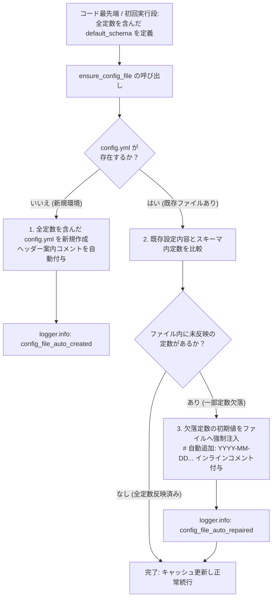

# 1.6. すべての定数の設定ファイル化およびテンプレート補正 (`ensure_config_file`)

> **所属モジュール**: `agent_common.config_loader.ConfigLoader`  
> **中核メソッド**: `ConfigLoader.ensure_config_file()`, `ConfigLoader.register_schema()`  
> **連携原則**: `AGENTS.md` 第1.1条 (No Hardcoding & 設定分離原則)

---

## 1. 中核となる設計思想: なぜこの機能が必要なのか？

> **「‘自己治癒 (Self-healing)’ は動作メカニズムに過ぎず、本質かつ主目的は ‘コード内のすべての定数の設定ファイル化（外部化）および可視化’ です。」**

多くのプログラムにおいて、開発者はソースコードの随所にデフォルト定数値（タイムアウト、バッチサイズ、リトライ回数、ワーカー数など）をハードコードし、設定ファイルに値がなければコード内部のデフォルト値（フォールバック）を暗黙的に使用するアプローチを取りがちです。  
しかし、この方式は深刻な問題を引き起こします:

- **設定項目のブラックボックス化**: ソースコードを直接開いて解析しない限り、開発者や運用者は **「このプログラムにどのような調整可能定数が存在するのか」**、**「デフォルト値として何秒、何個が指定されているのか」** を知る術がありません。
- **ハードコーディング分離原則への違反**: `AGENTS.md` 第1.1条 (No Hardcoding) に明記されている通り、システムの動作を制御するすべての定数やパラメータは設定ファイルへと完全に外部化されなければなりません。

### 本機能の主目的と実現原理

1. **すべての定数の設定ファイル化 (主目的)**:
   - コード内部に埋もれているすべての定数値を設定ファイル（`config.yml`）へと強制的に外部化し、運用者と開発者に100%透明に公開します。
2. **コードの最先端 / 初回実行段でのスキーマ宣言**:
   - すべての定数を config 化するため、**コードの最先端および初回実行段 (Entry Point)** において、システムに必要なすべての定数と初期デフォルト値を含めた**設定スキーマ (`default_schema`)** を宣言します。
3. **定数値の強制注入 (いわば「定数の強制注入」)**:
   - 設定ファイルに特定の設定が欠落している場合、コード内部で静かにデフォルト値で補う（Silent Fallback）のではなく、**設定ファイルに欠落した定数のデフォルト値を物理的に強制注入（書き込み）**します。
   - このように強制的に定数値をファイルに反映させることで、開発者や運用者が生成・補正された設定ファイルを開くだけで **「どのような定数が存在し、現在どのような値が設定されているか」** を即座に把握し、直感的に調整できるようになります。

> [!CAUTION]
> ### ⚠️ 重要な鉄則: 定数を個別に定義したりコード途中で作成すると、本機能は無意味になります！
> `ensure_config_file()` の存在理由は **「コード内のすべての定数を初回実行段のスキーマに集約し、設定ファイルへ強制的に引き出すこと」** です。  
> もしこの機能を使用しても、以下のようなコーディングを行えば**本機能の価値と目的は完全に失われます**:
> 
> - **コードの途中（関数やクラスの内部）で独自の定数をハードコードして使用する場合**
> - **`default_schema` に登録せず、別モジュールやファイルに定数を別途定義して使用する場合**
> 
> スキーマに登録されていない定数は `ensure_config_file()` が検知できず `config.yml` に自動注入されないため、**依然としてソースコードの中に埋もれた「ブラックボックス定数」として残ることになります**。  
> したがって、**「すべての定数は必ず初回実行段の `default_schema` ただ1箇所に宣言し、ビジネスロジックコードの内部ではグローバル `config` オブジェクト経由でのみ参照する」** という単一窓口化 (Single Source of Truth) の原則を徹底順守してください。

---

## 2. メソッドシグネチャおよび引数

```python
def ensure_config_file(
    self, 
    config_file_name: str = "config.yml", 
    default_schema: Optional[dict[str, Any]] = None
) -> Path:
```

- **`config_file_name` (str)**: 検証および定数の注入・補正対象となる設定ファイル名（デフォルト値: `"config.yml"`）
- **`default_schema` (dict | None)**: コード初回実行段で定義された基本定数辞書スキーマ（未指定時は `register_schema` で登録されたスキーマを使用）
- **返却値 (`Path`)**: すべての定数がファイル化・補正完了した設定ファイルの絶対パス `Path` オブジェクト

### 2.1. `agent_common` クラス既定設定の選択的な書き込み (`config_loader.config_file_auto_repair_dict`)

`ensure_config_file()` が設定ファイルに書き込む内容は 2 種類あります。

| 区分 | 書き込み条件 |
| :--- | :--- |
| 呼び出し側プログラムのスキーマ (`register_schema()` の登録分、`default_schema` 引数) | 常に書き込む (新規作成および欠落キーの補正) |
| `agent_common` クラスの既定設定 (各クラスの `DEFAULT_SCHEMA_DICT`) | `config_loader.config_file_auto_repair_dict` で `true` にしたクラスのみ書き込む |

`agent_common` のすべての機能を使うプログラムは多くありません。使わない機能の設定で `config.yml` が埋まらないよう、クラスごとの既定値はすべて `false` です。たとえば BigQuery だけを使うプログラムは 2 つのクラスだけを有効にします。

```yaml
config_loader:
  config_file_auto_repair_dict:
    GcpCredentialResolver_bool: true
    BigQueryClient_bool: true
```

| 辞書のキー (`<クラス名>_bool`) | 有効時に書き込まれる設定 |
| :--- | :--- |
| `ConfigLoader_bool` | `config_loader.*`、`templates.*` |
| `ProjectLogger_bool` | `logging.*` |
| `S3Client_bool` | `transfer.timeout_seconds_int` |
| `GcsClient_bool` | `transfer.timeout_seconds_int` |
| `GcpCredentialResolver_bool` | なし (環境変数のみ使用) |
| `BigQueryClient_bool` | `transfer.timeout_seconds_int`、`bigquery.ignore_unknown_values_bool`、`bigquery.timezone_offset_str` |
| `ProgressTracker_bool` | `progress_tracker.*` |
| `TableFormatter_bool` | `table_formatter.*` |
| `ToolParser_bool` | `transfer.tool_dir_str` |
| `LlmClient_bool` | `llm.*`、`llm_pool` |

- キーは `<クラス名>_bool` 形式です。値は `_bool` 接尾辞の規則に従って真偽値として解釈し (`true`/`false`、文字列 `"true"`/`"false"` を含む)、それ以外の値は設定エラーとして即時に失敗します。
- 有効にしたキーに対応するクラスが `agent_common` に見つからない場合 (綴りの誤り、`_bool` 接尾辞の欠落を含む) は、警告ログ `config_auto_repair_unknown_class` を出力してスキップします。
- 有効にしたクラスの既定設定は、`ensure_config_file()` の呼び出し時にグローバルスキーマとしても登録されます (`ConfigLoader.register_enabled_class_schemas_globally()`)。呼び出し側プログラムが登録済みの値は、クラスの既定値で上書きしません。
- 無効にしたクラスも、実行時にはパッケージ内蔵の既定設定値で正常に動作します。
- `config.yml` がまだ存在しない初回実行から適用するには、`register_schema()` で登録するプログラムのスキーマにこの設定を含めます。

```python
APP_DEFAULT_SCHEMA_DICT = {
    "config_loader": {
        "config_file_auto_repair_dict": {
            "GcpCredentialResolver_bool": True,
            "BigQueryClient_bool": True,
        },
    },
    # ...
}
loader.register_schema(APP_DEFAULT_SCHEMA_DICT)
loader.ensure_config_file("config.yml", default_schema=APP_DEFAULT_SCHEMA_DICT)
```

---

## 3. 定数の強制注入およびファイル補正フロー

以下のフローでいう「定数」は、呼び出し側プログラムのスキーマと、2.1 節で有効にした `agent_common` クラスの既定設定を合わせたものです。



### 3.1. Case 1: ファイルが一切存在しない場合 (新規自動生成と全定数の注入)
- `config/` ディレクトリが存在しなければ自動生成します。
- スキーマに定義されたすべての定数とガイドヘッダーコメントを含んだ `config.yml` ファイルを即時作成します。
- ユーザーはこのファイルを開いてシステムに存在するすべての定数を一目で把握し、すぐに値をカスタマイズできます。

### 3.2. Case 2: ファイルは存在するが新規定数が未反映の場合 (定数の強制注入とインラインコメント)
- ユーザーが既存設定した値やコメントは100%保持されます。
- ファイル内にまだ反映されていない欠落定数を検出し、デフォルト値をファイルの該当ブロックまたは末尾に**強制書き込み**します。
- 追加された行末に `# [自動追加: 2026-09-04 14:30:00+09:00]` のような**タイムスタンプインラインコメント**を付与し、運用者がどの定数が新規追加されたかを即座に認識できるようにします。

---

## 4. 実践的な活用例

### 4.1. アプリケーション初回起動段 (Entry Point) の記述パターン

```python
from agent_common.config_loader import ConfigLoader

loader = ConfigLoader()

# ==============================================================================
# [中核原則] コード最先端 / 初回実行段でシステムのすべての定数をスキーマとして定義
# ソースコード内部のハードコードを排除し、設定ファイルとして公開するすべての定数を宣言します。
# ==============================================================================
APP_DEFAULT_SCHEMA_DICT = {
    "transfer": {
        "max_workers_int": 4,          # 同時転送ワーカー数定数
        "batch_size_int": 500,         # 1バッチ処理行数定数
        "timeout_seconds_int": 30,     # ネットワークタイムアウト(秒)定数
        "enable_metrics_bool": True    # メトリクス収集の有効化有無
    },
    "logging": {
        "level_str": "INFO",           # デフォルトログレベル定数
        "language_str": "KO"           # ログ出力言語定数
    }
}

# 1. スキーマ登録 (実行時の基本骨格として常時保持)
loader.register_schema(APP_DEFAULT_SCHEMA_DICT)

# 2. すべての定数の設定ファイル化を実行 (欠落定数があれば config.yml に強制注入)
config_path = loader.ensure_config_file("config.yml", default_schema=APP_DEFAULT_SCHEMA_DICT)
print(f"全定数がファイル化・補正完了したパス: {config_path}")
```

### 4.2. 複数プログラム環境での設定値（定数）共有およびスキーマ合成パターン (`app_schema.py`)

実務プロジェクト（データパイプラインやマイクロサービスなど）では、単一プログラムではなく**同一のデータベースやストレージインフラを共有する複数の独立した実行プログラム（Web API サーバー、バッチワーカー、ストリーミングコンシューマー等）**で構成されることが多くあります。

> **一般的なマルチサービス構成例**:
> 1. `api_server.py`: クライアント要求を受信して処理するリアルタイム Web API サービス
> 2. `batch_worker.py`: 定期的に大量データを収集・加工するバックグラウンドバッチプログラム
> 3. `stream_consumer.py`: メッセージブローカー（Kafka 等）のイベントを購読してストレージへ同期するストリーミングコンシューマー

このとき、データベース接続情報（`database`）、ストレージパス（`storage`）、共通ロギング（`logging`）などのシステム定数は**すべてのプログラムで共通して共有**されるべきですが、ポート番号（`port_int`）、1回のバッチ処理量（`batch_size_int`）、バッファサイズ（`buffer_size_int`）などは**プログラム固有の値**を持ちます。

各プログラムごとにスキーマを個別に記述すると同一の定数が複数ファイルに重複定義され `DRY` 原則に反することになり、定数変更時に全スクリプトを修正するリスクが発生します。これを解決する標準設計パターンが**専用スキーマモジュール（`app/app_schema.py`）を通じたスキーマ合成 (Composition) パターン**です。

#### 1) 専用スキーマモジュールの定義 (`app/app_schema.py`)

```python
# app/app_schema.py
"""
アプリケーション共通およびプログラム別デフォルト設定スキーマ定義モジュール。
"""

from typing import Any, Dict


# ==============================================================================
# 1. 共通セクション別ベーススキーマ定義 (DRY 原則順守)
# ==============================================================================
_BASE_DATABASE_SCHEMA: Dict[str, Any] = {
    "host_str": "127.0.0.1",
    "port_int": 5432,
    "pool_size_int": 10,
    "timeout_seconds_int": 30,
    "auto_reconnect_bool": True,
}

_BASE_STORAGE_SCHEMA: Dict[str, Any] = {
    "base_path_str": "/var/data/app",
    "temp_dir_str": "temp",
    "chunk_size_int": 1048576,  # 1MB
    "max_retries_int": 3,
}

_BASE_LOGGING_SCHEMA: Dict[str, Any] = {
    "language": "KO",
    "file_logging": False,
    "level": {
        "api": "INFO",
        "batch": "WARNING",
        "consumer": "INFO",
    },
}


# ==============================================================================
# 2. プログラム別専用スキーマ (共通ベース継承 + 固有オプションのオーバーライド)
# ==============================================================================

# プログラム 1: Web API バックエンドサービス
API_SERVER_SCHEMA: Dict[str, Any] = {
    "database": _BASE_DATABASE_SCHEMA,
    "server": {
        "port_int": 8080,
        "max_connections_int": 500,
        "enable_cors_bool": True,
    },
    "logging": _BASE_LOGGING_SCHEMA,
}

# プログラム 2: バックグラウンドバッチ処理ワーカー
BATCH_WORKER_SCHEMA: Dict[str, Any] = {
    "database": _BASE_DATABASE_SCHEMA,
    "storage": _BASE_STORAGE_SCHEMA,
    "batch": {
        "batch_size_int": 500,
        "max_workers_int": 4,
        "cron_schedule_str": "0 2 * * *",
    },
    "logging": _BASE_LOGGING_SCHEMA,
}

# プログラム 3: メッセージストリームコンシューマー
STREAM_CONSUMER_SCHEMA: Dict[str, Any] = {
    "database": _BASE_DATABASE_SCHEMA,
    "storage": _BASE_STORAGE_SCHEMA,
    "consumer": {
        "group_id_str": "events-consumer-group",
        "buffer_limit_int": 100,
        "flush_interval_seconds_int": 5,
    },
    "logging": _BASE_LOGGING_SCHEMA,
}
```

#### 2) 個別プログラムエントリポイントでの活用

```python
# bin/run_api_server.py (API サーバーエントリポイント)
from agent_common.config_loader import ConfigLoader, config
from app.app_schema import API_SERVER_SCHEMA

loader = ConfigLoader()
loader.register_schema(API_SERVER_SCHEMA)
loader.ensure_config_file("config.yml", default_schema=API_SERVER_SCHEMA)

# グローバル config オブジェクトから型保証された定数を参照
port = config.server.port_int
db_host = config.database.host_str
```

```python
# bin/run_batch_worker.py (バッチワーカーエントリポイント)
from agent_common.config_loader import ConfigLoader, config
from app.app_schema import BATCH_WORKER_SCHEMA

loader = ConfigLoader()
loader.register_schema(BATCH_WORKER_SCHEMA)
loader.ensure_config_file("config.yml", default_schema=BATCH_WORKER_SCHEMA)

# グローバル config オブジェクトから型保証された定数を参照
batch_size = config.batch.batch_size_int
max_workers = config.batch.max_workers_int
```

#### 3) 複数プログラムにおけるスキーマ共有の核心的利点
- **段階的無損失自己治癒 (Progressive Reconciliation)**:
  `run_api_server.py` が先に起動されると共通 `database` 設定と `server` 関連定数が `config.yml` に生成され、その後 `run_batch_worker.py` が起動されると既存設定はそのまま維持された状態で `storage` および `batch` 関連の未反映キーのみがインラインコメントと共にファイルへ**追加自動補正（注入）**されます。
- **定数重複の徹底排除 (DRY)**: 共通の接続情報やタイムアウトなどの定数が `app_schema.py` の1箇所にのみ存在するため、デフォルト値調整時に複数ソースファイルを修正する必要がありません。
- **単一設定ファイル (`config.yml`) 内での調和のとれた共存**: 各サービス固有の設定が1つの `config.yml` 内で衝突することなくスマートに集中管理されます。

---

### 4.3. 補正結果ファイル例 (`config/config.yml`)

ユーザーが事前に `max_workers_int: 8` のみを手動で記述していた場合、実行直後に以下のようにすべての定数がファイルへ**強制注入**されます:

```yaml
transfer:
  max_workers_int: 8
  batch_size_int: 500  # [自動追加: 2026-09-04 14:35:10+09:00]
  timeout_seconds_int: 30  # [自動追加: 2026-09-04 14:35:10+09:00]
  enable_metrics_bool: true  # [自動追加: 2026-09-04 14:35:10+09:00]
logging:
  level_str: "INFO"  # [自動追加: 2026-09-04 14:35:10+09:00]
  language: "KO"  # [自動追加: 2026-09-04 14:35:10+09:00]
```

- ユーザーが定義した既存カスタム値（`max_workers_int: 8`）は安全に保持されます。
- 未知の定数や新たに追加された定数値がファイルに記録されるため、エディタで開いた際に **「このような定数があったのか！」** と即座に把握できます。

### 4.4. ⚠️ アンチパターン比較: コード途中で独自定数を定義して使う場合 (機能の形骸化)

```python
# ==============================================================================
# ❌ [致命的なアンチパターン] ensure_config_file を使いながらコード途中に定数を置く場合
# ==============================================================================
def process_batches():
    # スキーマに宣言せず関数内部やコード途中に独自定数を定義すると、
    # config.yml に強制注入されないため、運用者がこの定数の存在を知ることができません。
    DEFAULT_TIMEOUT_SECONDS = 60    # ❌ コード内に隠蔽されたブラックボックス定数！
    MAX_BATCH_ROWS = 1000           # ❌ 設定ファイル(config.yml)を開いても調整不可！
    ...


# ==============================================================================
# ⭕ [正しいパターン] 全定数をエントリポイントスキーマに集約し、実行時は config のみで参照
# ==============================================================================
# 1) 初回実行段(app_schema.py 等)の default_schema に全定数を登録
APP_DEFAULT_SCHEMA = {
    "transfer": {
        "timeout_seconds_int": 60,  # ⭕ 初回1回のみ宣言
        "batch_rows_int": 1000,     # ⭕ 未反映時に config.yml へ自動強制注入
    }
}
loader.ensure_config_file("config.yml", default_schema=APP_DEFAULT_SCHEMA)

# 2) ビジネスロジック(関数/クラス)では config プロパティ経由でのみ参照
def process_batches():
    timeout = config.transfer.timeout_seconds_int  # ⭕ config.yml と完全に同期
    batch_rows = config.transfer.batch_rows_int    # ⭕ コード修正なしで設定ファイルのみで即座に調整可能
    ...
```

---

## 5. 期待される効果およびアーキテクチャ上の意義

1. **すべての定数の完全な設定ファイル化 (ハードコードの排除)**:
   - コードの各所に散在するマジックナンバーを完全排除し、設定ファイルという単一窓口に定数を一元化します。
2. **開発者および運用者の設定可視性 (Visibility) の最大化**:
   - ソースコードを追跡しなくても、`config.yml` ファイルを開くだけでプログラムに存在するすべての制御定数とデフォルト値を一目で把握できます。
3. **沈黙するデフォルト値 (Silent Fallback) の防止**:
   - 設定がないからといってコード内部で静かにデフォルト値で済ませるのではなく、設定ファイルに明示的に定数値を記録し、設定と実行時の動作の一致性を保証します。
4. **デプロイ安定性およびバージョン移行の自動化**:
   - 新バージョン配布時に新設された設定定数が既存環境の `config.yml` に自動反映されるため、配布事故や手動マイグレーションの負担が解消されます。
5. **定数定義の単一窓口化 (Single Source of Truth)**:
   - コード随所に分散していた定数を初回実行段スキーマと `config.yml` に一元化し、コード途中での恣意的な定数生成を根本から防止します。
