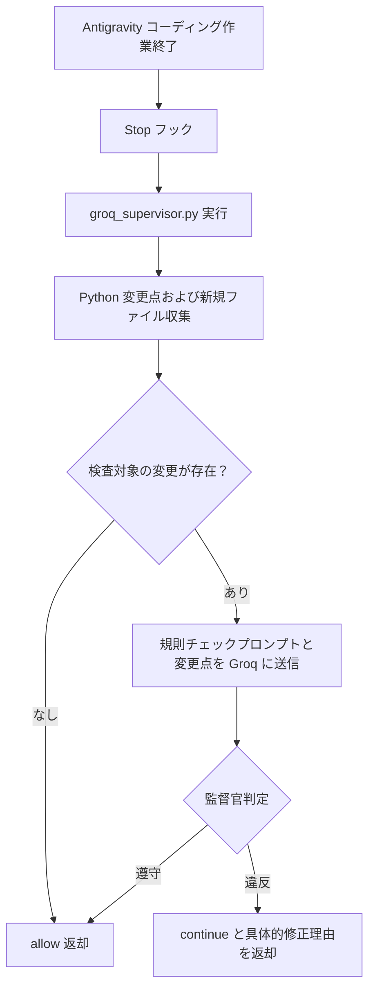

# 7.6. Groq 監督官 AI および Antigravity Stop フック

[LLM マニュアル一覧](01_unified_llm_client_ja.md)

> 設定の準備と最小限の呼び出しについては、まず [7.1 モデルプロファイル管理およびテキスト生成](01_model_profiles_and_generation_ja.md) を参照してください。

## 1. 活用事例: コーディング AI をレビューする Groq 監督官 AI

### 実際の使用目的と連携アーキテクチャ

Antigravity において、コーディング AI が作成したコードのケアレスミスや `AGENTS.md` 規則違反を別の監督官 AI で検証する事例です。作成 AI が作業を完了した際、Groq の `openai/gpt-oss-120b` モデルへ Python の変更内容を送信し、規則を遵守していれば承認（allow）、違反があれば具体的な修正理由（continue）を返します。

参照しているワークスペースファイルは `.agents/hooks.json` と `scripts/groq_supervisor.py` です。これらは利用プロジェクト固有の構成であり、`agent-common` パッケージ自体の構成ファイルではありません。



### プロジェクトの Stop フック構成例

使用中の `.agents/hooks.json` 構成例は以下の通りです:

```json
{
  "groq-agents-supervisor": {
    "enabled": true,
    "Stop": [
      {
        "type": "command",
        "command": "cmd /c \"if exist .\\venv313\\Scripts\\python.exe ( .\\venv313\\Scripts\\python.exe scripts\\groq_supervisor.py ) else ( cd .. && .\\venv313\\Scripts\\python.exe scripts\\groq_supervisor.py )\"",
        "timeout": 60
      }
    ]
  }
}
```

### 監督官が検査する内容

スクリプトは `git diff HEAD -- *.py` により未コミットの Python 変更点を収集します。システムプロンプトには `AGENTS.md` の以下の項目を含めます:

- 変数・引数・ロギングキーの型サフィックス規則
- 新規 Python ファイルの標準ヘッダーコメントとモジュール説明
- クラスおよび関数の docstring（引数、戻り値、例外）
- `print()` を排した共通ロガーの使用
- 設定値・URL・認証情報のハードコーディング排除
- 入れ子関数の使用禁止
- HTTP 通信における標準ライブラリの優先

### 判定結果形式

```json
{"decision": "allow", "reason": "AGENTS.md 規則検証を通過しました"}
```

```json
{"decision": "continue", "reason": "修正されたファイルの関数引数に型サフィックスが欠落しています。該当引数および呼び出し箇所を修正してください。"}
```

### `agent_common.llm` で実装する場合

同様の監督官スクリプトを `agent_common.llm` を用いて再構築する場合のコード例です:

```yaml
llm:
  router_model_str: groq_gpt_oss

supervisor:
  purpose_str: router
```

```python
from agent_common.config_loader import config
from agent_common.llm import LlmClient

supervisor_client_obj = LlmClient(purpose_str=config.supervisor.purpose_str)
review_response_str = supervisor_client_obj.generate(
    prompt_str=review_prompt_str,
    system_prompt_str=review_system_prompt_str,
)
```

## 2. AI に開発を依頼する際のプロンプト例

```text
コーディング AI が作成した Python の変更点が AGENTS.md 規則を遵守しているか検査する Groq 監督官 AI を作成してください。
https://pypi.org/project/agent-common/
https://github.com/kampores/agent_common

README 7.1, 7.2, 7.5, 7.6 と各項目の詳細マニュアルを参照してください。
本マニュアルの Antigravity Stop フックの活用事例を参照してください。
まず単一の Groq モデルで小さな diff と規則を送信し、判定 JSON を受信する最小機能から実装してください。
判定 JSON の decision と reason を検証し、検査失敗時のポリシーをあらかじめ確認してください。
最小機能を確認後、Stop フックへの接続や追加機能を段階的に拡張してください。
```
