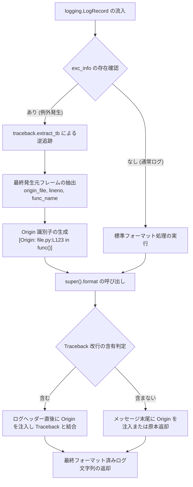

# 2.1. 単一行平坦化フォーマッターおよび例外発生元追跡 (`SingleLineFlattenFormatter`)

> **所属モジュール**: `agent_common.logger.SingleLineFlattenFormatter`  
> **基底クラス**: `logging.Formatter`  
> **中核メソッド**: `SingleLineFlattenFormatter.format(record)`, `SingleLineFlattenFormatter.flatten_to_single_line(text)`

---

## 1. 概要および企業システムにおける背景

クラウド、Kubernetes (K8s)、分散データパイプライン (Airflow, Kafka, Spark 等) の環境では、膨大な数のコンテナやサーバーからログを集約するため、**Logstash**, **Fluentd**, **AWS CloudWatch**, **GCP Cloud Logging** などの集中型ログ収集基盤が利用されます。

一般的なログ収集エージェントは、標準入力 (stdout) やログファイルの**改行 (Newline, `\n`) を基準に個別ログレコードを分割**します。そのため、Python の複数行例外スタックトレース (Traceback) が発生すると、以下のような深刻な課題が生じます:

1. **ログの断片化 (Log Fragmentation)**: 1つのエラートレースバックが数十個の無意味なログ断片に分断され、ログ検索やアラート条件式の作成が極めて困難になります。
2. **原因特定の遅延**: 実際にエラーを引き起こしたビジネスコードのファイル名と行番号（`Origin`）が数十行下のトレースバック末尾に埋もれ、初動対応が遅延します。
3. **インデックスコストの増大**: 分割された行ごとに個別のタイムスタンプやメタデータが付与され、ストレージ容量およびインデックス作成コストが跳ね上がります。

`SingleLineFlattenFormatter` は、このような分散環境の制約を克服するために設計されたカスタムロギングフォーマッターです。

---

## 2. 中核アーキテクチャおよび動作メカニズム



### 主要な処理ステップ:

1. **例外発生元地点 (Origin) の逆追跡とタグ付け**:
   - `record.exc_info` が存在する場合、`traceback.extract_tb()` を介してコールスタックの最終フレーム（実際にエラーを発生させたファイル名、行番号、関数名）を即座に抽出します。
   - これを `[Origin: {origin_file}:L{lineno} in {func_name}()]` 形式でフォーマットし、メインメッセージの先頭／ヘッダー直後に配置します。
2. **原本保持と安全な結合**:
   - 複数行ログおよび Traceback 構造を保持しつつ、ログ監視システムの1行要約ビューでも即座にエラー発生箇所を特定できるよう結合します。
3. **平坦化ユーティリティのサポート**:
   - 必要に応じて `flatten_to_single_line(text)` を介して改行文字（`\n`, `\r`）を空白に置換し、完全な単一行ストリームへの変換が可能です。

---

## 3. 中核コードおよび実装解析

```python
class SingleLineFlattenFormatter(logging.Formatter):
    """
    ログレコードおよび例外追跡 (Traceback) データをフォーマットする共通カスタムフォーマッタークラス。
    """

    def flatten_to_single_line(self, text: str) -> str:
        """テキスト内部の改行文字(\n, \r)を空白に変換します。"""
        return text.replace("\n", " ").replace("\r", " ")

    def format(self, record: logging.LogRecord) -> str:
        # 0. 例外発生元地点の情報 ([Origin: filename:Llineno in funcName()]) の抽出
        origin_prefix = ""
        if record.exc_info and len(record.exc_info) >= 3 and record.exc_info[2]:
            try:
                import traceback
                tb_list = traceback.extract_tb(record.exc_info[2])
                if tb_list:
                    last_frame = tb_list[-1]
                    origin_file = Path(last_frame.filename).name
                    origin_prefix = f"[Origin: {origin_file}:L{last_frame.lineno} in {last_frame.name}()] "
            except Exception:
                pass

        # 1. 親クラスの基本フォーマット処理 (複数行ログおよび Traceback の原本保持)
        s = super().format(record)

        # 2. Origin 情報が存在する場合、メインログメッセージの冒頭/末尾に結合
        if origin_prefix:
            if "\nTraceback" in s:
                head, tail = s.split("\nTraceback", 1)
                s = f"{head} {origin_prefix}\nTraceback{tail}"
            elif "\n" in s:
                head, tail = s.split("\n", 1)
                s = f"{head} {origin_prefix}\n{tail}"
            else:
                s = f"{s} {origin_prefix}"

        return s
```

---

## 4. 実践的な使用例

### 4.1. ハンドラーに直接組み込んで使用する

```python
import logging
from agent_common.logger import SingleLineFlattenFormatter

# 1. フォーマッターインスタンスの生成
log_format = "[%(asctime)s][%(levelname)s][%(filename)s:%(lineno)d %(funcName)s()] %(message)s"
date_fmt = "%Y-%m-%d %H:%M:%S"
formatter = SingleLineFlattenFormatter(fmt=log_format, datefmt=date_fmt)

# 2. コンソールハンドラーの作成とフォーマッターの指定
console_handler = logging.StreamHandler()
console_handler.setFormatter(formatter)

# 3. ロガーへの登録
logger = logging.getLogger("MyService")
logger.setLevel(logging.INFO)
logger.addHandler(console_handler)

# 4. 例外発生テスト
def process_data(data_dict: dict) -> None:
    try:
        val = data_dict["missing_key"]
    except KeyError as e:
        logger.exception("データ処理中に例外が発生しました")

process_data({})
```

**出力結果例**:
```text
[2026-09-04 22:30:00][ERROR][data_service.py:45 process_data()] データ処理中に例外が発生しました [Origin: data_service.py:43 in process_data()] 
Traceback (most recent call last):
  File "data_service.py", line 43, in process_data
    val = data_dict["missing_key"]
KeyError: 'missing_key'
```

> 💡 **特徴**: ログメッセージの1行目に `[Origin: data_service.py:43 in process_data()]` が表示されるため、監視ダッシュボード（Kibana, Datadog 等）の1行要約ビューでも障害発生箇所を一目で把握できます。

---

## 5. 運用ベストプラクティス

1. **`ProjectLogger.configure()` の利用推奨**:
   - `SingleLineFlattenFormatter` を手動設定するよりも、`ProjectLogger.configure()` を使用することで `config.yml` の `logging.format` および `logging.datefmt` と自動連動し、全社統一のフォーマットを維持できます。
2. **JSON ログ収集基盤との連携時**:
   - ELK スタックや Loki などで完全な単一行フォーマットが求められる場合は、`formatter.flatten_to_single_line()` を利用するか、Fluentd などの multiline パーサーと組み合わせて構成してください。
