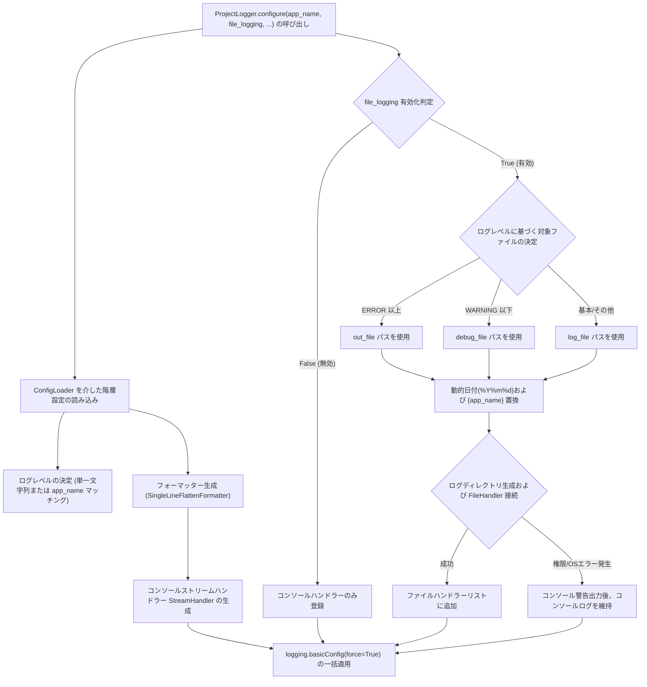

# 2.2. ロギング環境一括構成およびハンドラー制御 (`ProjectLogger.configure`)

> **所属モジュール**: `agent_common.logger.ProjectLogger`  
> **中核メソッド**: `ProjectLogger.configure(config_dir=None, default_log_file_str="logs/app.log", app_name_str=None, file_logging_bool=None)`

---

## 1. 概要およびエンタープライズにおける背景

Python 標準の `logging` モジュールは、分散サービスやエンタープライズ環境において以下のような慢性的な課題を抱えています:

1. **重複ハンドラーによるログの多重出力**: モジュールごとに `addHandler()` が無秩序に呼び出され、同一ログが2重、3重に出力される現象
2. **コンソール／ファイルロギング設定の断片化**: 開発環境ではコンソール出力が必要であり、本番環境（バッチサーバー、K8s Pod、Airflow Worker）ではファイル保存または stdout パイプライン出力の柔軟な切り替えが不可欠
3. **サードパーティライブラリの過度なデバッグログノイズ**: `urllib3`, `httpx`, `botocore` など外部パッケージの大量の DEBUG ログにより実際の業務エラーが埋没
4. **権限およびパス起因による起動失敗**: コンテナや共有ストレージ環境でログディレクトリの書き込み権限がない場合、プロセス全体が異常終了するリスク

`ProjectLogger.configure()` は、これらの課題を1回の呼び出しで解消する**グローバルロギング標準化ファクトリ (Factory)** メソッドです。

---

## 2. 中核アーキテクチャおよび動作パイプライン



---

## 3. 主要機能および詳細動作

### 3.1. アプリケーション名 (`app_name`) に基づくログレベル動的分岐
設定ファイルの `logging.level` に単一文字列（`"INFO"`）ではなくプログラム別辞書を宣言すると、実行中のスクリプト名や `app_name` に合致した最適なログレベルが自動適用されます:

```yaml
logging:
  level:
    default: "INFO"
    migration_worker: "DEBUG"
    api_gateway: "WARNING"
```

### 3.2. ログレベルに応じたディレクトリ自動分離 (`{log_level}` に基づく `log_file` 単一化)

`ProjectLogger.configure()` は、曖昧な分岐パス（`out_file` vs `debug_file`）の代わりに単一標準パスである `logging.log_file` テンプレート内で **`{log_level}` (小文字) または `{LOG_LEVEL}` (大文字)** タグをサポートし、プロセスの実行ログレベルに応じた専用ディレクトリを自動生成・分離保存します:

- **ログレベル自動ディレクトリ生成 (`{log_level}`)**:
  - `logging.level` が `WARNING` の場合、`logs/pipeline/2026/09/08/warning/` 配下へ自動保存。
  - `logging.level` が `ERROR` の場合、`logs/pipeline/2026/09/08/error/` 配下へ自動保存。
  - 個別の設定キーを分けることなく、統一テンプレートで全ログレベルフォルダを自動管理します。
- **下位互換性 (Fallback) の保証**:
  - 既存設定で `log_file` の代わりに `out_file` や `debug_file` を使用している環境では、`log_file` 未指定時にレベル条件（`ERROR` 以上 -> `out_file`、`WARNING` 以下 -> `debug_file`）に従って自動代替読み込みが行われます。

#### 実践的なエンタープライズパイプライン設定例:
```yaml
logging:
  level:
    data_extractor: "WARNING"
    stream_processor: "WARNING"
    db_loader: "ERROR"
    
  # {log_level} タグを活用した標準ファイル保存パス (レベル別フォルダ自動生成)
  log_file: "logs/pipeline/%Y/%m/%d/{log_level}/{app_name}_out_%Y%m%dT%H%M%S.log"
```

### 3.3. 動的日付フォーマットおよびパス自動生成

`log_file` テンプレートには動的置換タグと日付フォーマットを柔軟に組み込むことができます:

1. **`{app_name}` 置換タグ**:
   - `ProjectLogger.configure(app_name="data_extractor")` で渡されたアプリケーション名（またはスクリプト名）に自動置換されます。
2. **`{log_level}` / `{LOG_LEVEL}` 置換タグ**:
   - 決定されたログレベル名（小文字 `warning`, `error` / 大文字 `WARNING`, `ERROR`）に置換され、レベル別フォルダが自動生成されます。
3. **`%Y/%m/%d` 階層型ディレクトリフォーマット**:
   - 年・月・日単位のサブディレクトリを自動計算します。
4. **`%Y%m%dT%H%M%S` ISO Compact タイムスタンプ**:
   - 起動時の固有タイムスタンプ（例: `20260908T183000`）が付与され、同一日に複数回実行されても過去のログを上書きせず独立保存されます。
5. **多階層親ディレクトリの自動生成 (`mkdir(parents=True, exist_ok=True)`)**:
   - 対象ディレクトリが未作成であっても、例外なく安全にディレクトリを作成してファイルハンドラーを接続します。

### 3.4. 無中断フェイルセーフ (Graceful Degradation)
Docker コンテナマウントボリュームの権限問題（`PermissionError`）やディスク I/O エラー（`OSError`）が発生した場合でも、プロセスを異常終了させず、`sys.stderr` に警告を出力した上で**コンソール出力モードへと安全にフォールバック**します。

---

## 4. 設定ファイルの記述例 (`config/config.yml`)

```yaml
logging:
  level:
    data_extractor: "WARNING"
    stream_processor: "WARNING"
    db_loader: "WARNING"
    default: "INFO"
  
  language: "KO"
  
  format: "[%(asctime)s][%(levelname)s][%(name)s][%(filename)s:%(lineno)d %(caller)s] %(message)s"
  datefmt: "%Y-%m-%d %H:%M:%S"
  
  file_logging: true
  
  log_file: "logs/pipeline/out/%Y/%m/%d/{log_level}/{app_name}_out_%Y%m%dT%H%M%S.log"
```

---

## 5. 実践使用コード

### 5.1. 標準エントリポイント初期化パターン

```python
import sys
from agent_common.logger import ProjectLogger

def main():
    # 1. アプリケーション起動時に1回のみロギング構成を初期化
    ProjectLogger.configure(
        app_name_str="data_migrator",
        file_logging_bool=True,
        default_log_file_str="logs/migrator.log"
    )

    # 2. 個別モジュール/クラスでロガーインスタンスを取得
    logger = ProjectLogger("DataMigrator")
    logger.info("データ移行パイプラインの初期化完了")
    
    # 3. ビジネスロジックの実行
    try:
        logger.info("処理を正常に実行中...")
    except Exception as e:
        logger.exception("致命的な障害が発生しました")

if __name__ == "__main__":
    main()
```

### 5.2. Airflow DAG および CLI オプション連携 (`--file-log` / `--no-file-log`)

```python
import argparse
from agent_common.logger import ProjectLogger

parser = argparse.ArgumentParser(description="バッチジョブランナー")
group = parser.add_mutually_exclusive_group()
group.add_argument("--file-log", "-fl", dest="file_log", action="store_true", default=None)
group.add_argument("--no-file-log", "-nfl", dest="file_log", action="store_false")
args = parser.parse_args()

# CLI オプションを file_logging_bool 引数に直接渡す (None の場合は config.yml を準用)
ProjectLogger.configure(app_name_str="batch_job", file_logging_bool=args.file_log)
```

---

## 6. 運用ベストプラクティス

1. **`configure()` の呼び出し位置**:
   - 必ずメインスクリプトのエントリポイント（`if __name__ == '__main__':` ブロック冒頭または CLI `main()` 関数の最上段）で呼び出してください。
2. **コンテナ環境での推奨設定**:
   - Docker/Kubernetes 環境では `file_logging: false` または `--no-file-log` の運用を推奨します。コンテナ内部のディスク枯渇を防ぎ、Pod ログドライバに stdout 収集を委譲します。
3. **`force=True` による確実なリセット**:
   - `ProjectLogger.configure()` は内部で `logging.basicConfig(..., force=True)` を実行するため、外部モジュールのインポート時に自動登録された余計なハンドラーを一掃し単一化します。
