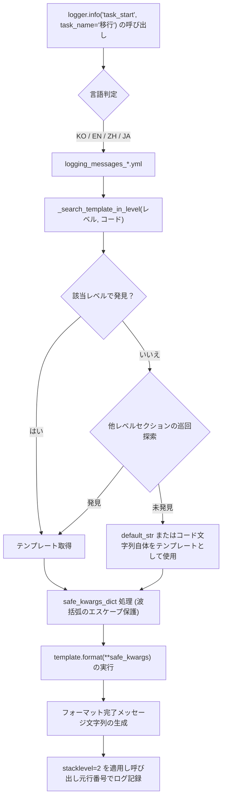

# 2.3. 多言語ログメッセージテンプレート辞書およびコードベースロギング (`logging_messages_*.yml`, `log_msg`)

> **所属モジュール**: `agent_common.logger.ProjectLogger`  
> **関連関数/メソッド**: `ProjectLogger.get_log_msg()`, `ProjectLogger.log_msg()`, `ProjectLogger.set_language()`, `get_log_msg()`  
> **メッセージ辞書ファイル**: `agent_common/config/logging_messages_ko.yml`, `logging_messages_en.yml`, `logging_messages_zh.yml`, `logging_messages_ja.yml`

---

## 1. 概要およびエンタープライズにおける背景

エンタープライズサービスの開発において、ソースコード内部に直接ハードコードされたログメッセージは以下のような重大な問題を引き起こします:

1. **規律違反および保守コストの増大**: AGENTS.md 第1原則（ハードコーディング禁止）に反し、文言修正のたびにコードの再ビルド・再デプロイが必要となる非効率
2. **グローバル運用支援の限界**: 海外運用拠点（NOC）や多国籍エンジニアとの協業時に、特定言語ログによる障害初動の遅延
3. **ログ分析およびメトリクス標準化の欠如**: ログが非定型テキストで記述されるため、同一障害の集計やアラートルールの標準化が困難

`ProjectLogger` は、これらの問題を抜本的に解決するため、**メッセージコードに基づく外部テンプレート辞書連携システム**と**実行時の動的多言語切り替え (KO ⇄ EN)** 機能を備えています。

---

## 2. 中核アーキテクチャおよびテンプレート解析パイプライン



---

## 3. メッセージ辞書 YAML 構造

### 3.1. 韓国語辞書 (`agent_common/config/logging_messages_ko.yml`)

```yaml
logging_messages:
  INFO:
    task_start: "🚀 [{task_name}] 작업이 시작되었습니다. (대상: {target_count:,}건)"
    task_completed: "✅ [{task_name}] 작업이 성공적으로 완료되었습니다."
    data_transfer_progress: "[{task_name}] 처리 진행 중: {processed_count:,}/{total_count:,}건 ({percent:.1f}%)"
  
  WARNING:
    record_skipped: "⚠️ [{task_name}] 제외 조건에 의해 데이터 처리를 건너뜁니다: {reason}"
    retry_attempt: "⚠️ 일시적 연결 실패로 재시도합니다. (시도 횟수: {attempt_count}/{max_retries})"
  
  ERROR:
    connection_failed: "❌ {service_name} 서비스 연결에 실패하였습니다. (사유: {error_msg})"
    schema_validation_failed: "❌ 필수 필드 누락 또는 스키마 검증 실패: {detail}"
```

### 3.2. 英語辞書 (`agent_common/config/logging_messages_en.yml`)

```yaml
logging_messages:
  INFO:
    task_start: "🚀 [{task_name}] task has started. (Targets: {target_count:,} items)"
    task_completed: "✅ [{task_name}] task has completed successfully."
    data_transfer_progress: "[{task_name}] Transfer progress: {processed_count:,}/{total_count:,} items ({percent:.1f}%)"
  
  WARNING:
    record_skipped: "⚠️ [{task_name}] Record skipped due to exclusion policy: {reason}"
    retry_attempt: "⚠️ Temporary connection failure. Retrying (Attempt: {attempt_count}/{max_retries})"
  
  ERROR:
    connection_failed: "❌ Failed to connect to {service_name}. (Reason: {error_msg})"
    schema_validation_failed: "❌ Required fields missing or schema validation failed: {detail}"
```

---

## 4. 主要機能および実装特徴

### 4.1. 安全な引数置換 (`safe_kwargs_dict`)
ログパラメータとして渡された文字列に波括弧（`{`, `}`）が含まれていても（例: JSON 文字列、正規表現等）、`format()` パース時に `KeyError` や `ValueError` が発生しないようエスケープ処理（`{{`, `}}`）を自動適用します。

```python
safe_kwargs_dict = {
    k: str(v).replace("{", "{{").replace("}", "}}") if isinstance(v, str) else v
    for k, v in kwargs.items()
}
```

### 4.2. 正確な呼び出し元追跡 (`stacklevel=2`)
`logger.info()`, `logger.error()` などのラッパーメソッドを経由しても、ラッパー内部ではなく**実際にこのメソッドを呼び出したビジネスコードのファイル名と行番号**がログヘッダーに正確に記録されるよう `stacklevel=2` を適用しています。

### 4.3. 実行時の動的言語切り替え
プロセスを再起動することなく、設定やロガーインスタンスを介して即座に出力言語を変更できます:

- クラスメソッド: `ProjectLogger.set_language("EN")` または `ProjectLogger.set_language("KO")`
- インスタンスメソッド (Setter): `logger.language_set("EN")`
- 現在の言語確認 (Getter): `logger.language` (➔ `"EN"` または `"KO"`)

対応する言語コードは `KO`、`EN`、`ZH`、`JA` で、ログ言語は次の優先順位で決定されます:

1. `ProjectLogger.set_language()` または `ConfigLoader.set_language()` で指定した値
2. 環境変数 `AGENT_LOG_LANGUAGE`、`LOGGING_LANGUAGE`、`AGENT_LANGUAGE` のうち、先頭から最初に値があるもの
3. `config.yml` の `logging.language_str`
4. デフォルト言語 `KO`

言語コードの正規化ルールと言語別ファイルの探索方法は、[8.1. 言語コードの正規化と言語別リソースファイル探索 (`Localizer`)](../localizer/01_language_codes_and_resource_lookup_ja.md) を参照してください。

---

## 5. 実践使用コード

### 5.1. コードベースのメッセージロギング

```python
from agent_common.logger import ProjectLogger

logger = ProjectLogger("MigrationService")

# 1. メッセージコードとキーワード引数を用いたロギング
logger.info("task_start", task_name="Cloud_Data_Sync", target_count=50000)

# 2. 進捗ロギング
logger.info(
    "data_transfer_progress",
    task_name="Cloud_Data_Sync",
    processed_count=25000,
    total_count=50000,
    percent=50.0,
)

# 3. エラー発生時のコードベースロギング (エラーカウントの自動集計および Traceback 保持)
try:
    raise ConnectionTimeoutError("Connection timed out after 30s")
except Exception as e:
    logger.exception("connection_failed", service_name="Cloud_Storage", error_msg=str(e))
```

### 5.2. 実行時多言語動的切り替えの例

```python
from agent_common.logger import ProjectLogger

logger = ProjectLogger("InternationalBatch")

# デフォルト言語 (KO) での出力
logger.info("task_start", task_name="SyncJob", target_count=100)
# ➔ [INFO] 🚀 [SyncJob] 작업이 시작되었습니다. (대상: 100건)

# 英語モードへの切り替え
ProjectLogger.set_language("EN")

logger.info("task_start", task_name="SyncJob", target_count=100)
# ➔ [INFO] 🚀 [SyncJob] task has started. (Targets: 100 items)
```

### 5.3. 文字列テンプレートフォーマット専用関数 (`get_log_msg`)

直接ログを出力せず、フォーマットされたメッセージ文字列のみを取得して外部通知（Slack, Email 等）に利用したい場合は `get_log_msg()` を活用します:

```python
from agent_common.logger import get_log_msg

alert_text = get_log_msg("ERROR", "connection_failed", service_name="Kafka", error_msg="Broker unreachable")
print(alert_text)
# ➔ "❌ Kafka 서비스 연결에 실패하였습니다. (사유: Broker unreachable)"
```

---

## 6. 運用ベストプラクティス

### 6.1. プロジェクト固有メッセージ辞書の拡張例

パッケージ標準辞書に加え、個別プロジェクト独自のビジネスメッセージが必要な場合は、プロジェクトルートの `config/logging_messages_ko.yml` に記述します。  
`ConfigLoader` は **5段階階層マージ (Deep Merge)** により、パッケージ標準辞書を維持したままプロジェクト固有の辞書をスマートにマージします。

```yaml
# <プロジェクトルート>/config/logging_messages_ko.yml
logging_messages:
  INFO:
    task_start: "🔥 [パイプライン開始] {task_name} バッチ起動 (対象予定: {target_count:,}件)"
    medallion_step_completed: "🏅 [{stage_name}] 処理完了: 成功 {success_count:,}件, 除外 {excluded_count:,}件"

  ERROR:
    auth_token_expired: "🚫 認証トークンの失効または更新失敗 ({auth_url}, HTTPステータス: {status_code})"
```

### 6.2. エラーコード命名規約
メッセージコードはスネークケース（`snake_case`）で一貫して記述し、目的と対象を明確に命名してください（例: `db_query_failed`, `file_not_found`, `invalid_payload`）。
