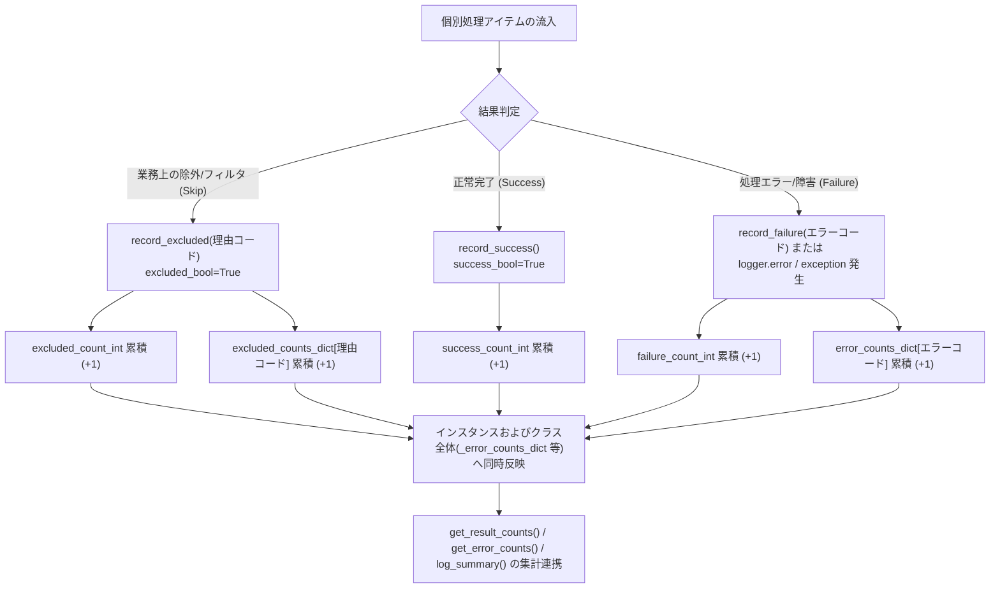

# 2.4. 処理進捗統計および例外/除外理由別リアルタイム集計 (`record_result`, `record_error`, `record_exclusion`)

> **所属モジュール**: `agent_common.logger.ProjectLogger`  
> **中核メソッド**: `update()`, `record_result()`, `record_success()`, `record_failure()`, `record_excluded()`, `record_error()`, `record_exclusion()`  
> **参照/初期化メソッド**: `get_result_counts()`, `get_error_counts()`, `get_excluded_counts()`, `reset_result_counts()`

---

## 1. 概要およびエンタープライズにおける背景

大容量バッチデータ移行や分散 ETL パイプラインでは、数十万〜数百万件のレコードをマルチスレッドや分散ワーカーで並行処理します。

この際、結果を単に「成功」と「失敗」の2値だけで管理すると、以下のような深刻な運用上の問題が生じます:

1. **正当な業務除外とシステム障害の混同**:
   - データ論理削除フラグ（`del_yn == 'Y'`）、期限切れ資産コード、既存重複 PK など、ビジネス要件上**意図的にスキップ（Skip/Exclude）した正常データ**が「失敗」としてカウントされ、不要な障害アラートを誘発する。
2. **原因別エラー内訳の欠落**:
   - 数千件のエラーが発生した際、それが一時的なネットワークタイムアウトなのか、特定スキーマの不整合なのか原因別の件数を即座に把握できない。
3. **マルチスレッド／複数モジュール間でのメトリクス分散**:
   - 複数サブルーチンやワーカースレッドで発生した集計値が個別インスタンス内に閉じ込められ、ジョブ終了時に全体統計を算出できない。

`ProjectLogger` は、**成功 (Success)、失敗 (Failure)、除外 (Excluded)** の明確な3段階ステータス分類モデルと、**クラス全体 (Global) およびインスタンス (Instance) の二元化集計メカニズム**を提供し、これらの課題を解消します。

---

## 2. 3段階ステータス分類および集計アーキテクチャ



---

## 3. 中核メソッド仕様および動作原理

### 3.1. 統合更新メソッド (`update`, `record_result`)

```python
def update(
    self,
    success_bool: bool = True,
    excluded_bool: bool = False,
    count_int: int = 1,
    log_id_str: str = "",
) -> None:
    inc_int: int = max(1, count_int)
    if excluded_bool:
        self.excluded_count_int += inc_int
        ProjectLogger._excluded_count_int += inc_int
        if log_id_str:
            self.record_exclusion(log_id_str, count_int=inc_int)
    elif success_bool:
        self.success_count_int += inc_int
        ProjectLogger._success_count_int += inc_int
    else:
        self.failure_count_int += inc_int
        ProjectLogger._failure_count_int += inc_int
        if log_id_str:
            self.record_error(log_id_str, count_int=inc_int)
```

- `record_result(...)` は可読性のための明示的エイリアスメソッドです。
- インスタンスメンバー（`self.*`）とクラス全体変数（`ProjectLogger.*`）へ同時に加算されるため、複数のロガーインスタンスを併用する複合モジュール環境でも全体の総合メトリクスが安全に集約されます。

### 3.2. 状態別専用メソッド

- `record_success(count_int=1)`: 成功件数の加算
- `record_failure(count_int=1, log_id_str="")`: 失敗件数および発生原因（エラーコード/識別子）の加算
- `record_excluded(log_id_or_count="", count_int=1)`: 除外件数および除外理由識別子の加算

### 3.3. 自動エラー集計連携
`logger.error(...)`, `logger.critical(...)`, `logger.exception(...)` が呼び出されると、明示的に `record_failure` を呼ばなくても、内部で**自動的に失敗件数とエラー識別コード（`log_id_str` または例外クラス名）を累積記録**します。

---

## 4. 実践使用コード

```python
from agent_common.logger import ProjectLogger

logger = ProjectLogger("DataPipeline")

records = [
    {"id": "A101", "status": "ACTIVE", "score": 95},
    {"id": "A102", "status": "DELETED", "score": 80},     # 除外対象
    {"id": "A103", "status": "ACTIVE", "score": "INVALID"}, # エラー対象
    {"id": "A104", "status": "EXPIRED", "score": 70},     # 除外対象
    {"id": "A105", "status": "ACTIVE", "score": 100},
]

for item in records:
    # 1. 業務ポリシーに基づく除外条件チェック
    if item["status"] == "DELETED":
        logger.record_excluded("deleted_record_skipped")
        continue
    if item["status"] == "EXPIRED":
        logger.record_excluded("db_deleted_status_skipped")
        continue

    # 2. データ処理およびバリデーション
    try:
        score_int = int(item["score"])
        logger.record_success()
    except (ValueError, TypeError) as e:
        logger.record_failure(log_id_str="invalid_data_type")
        logger.exception("invalid_data_format", record_id=item["id"], error=str(e))

# 3. 累積集計結果の取得
result_counts = logger.get_result_counts()
print(f"処理結果: {result_counts}")
# ➔ {'success': 2, 'failure': 1, 'excluded': 2}

# 4. エラーおよび除外の詳細内訳
error_breakdown = logger.get_error_counts()
print(f"エラー内訳: {error_breakdown}")

excluded_breakdown = logger.get_excluded_counts()
print(f"除外内訳: {excluded_breakdown}")
```

---

## 5. マルチスレッドおよびモジュール間での統合統計

複数のワーカースレッドやモジュールで個別に `ProjectLogger` を生成して作業しても、クラス共通統計を介して一括参照が可能です:

```python
from agent_common.logger import ProjectLogger

logger_a = ProjectLogger("Worker-1")
logger_a.record_success(10)
logger_a.record_error("network_timeout", 2)

logger_b = ProjectLogger("Worker-2")
logger_b.record_success(15)
logger_b.record_error("network_timeout", 1)
logger_b.record_error("auth_failed", 1)

# グローバル集計の取得
global_errors = ProjectLogger.get_global_error_counts()
print(f"全体エラー集計: {global_errors}")
# ➔ {'network_timeout': 3, 'auth_failed': 1}

# ジョブ完了時の初期化
logger_a.reset_result_counts()
```

---

## 6. 運用ベストプラクティス

1. **識別コード (`log_id_str`) の小文字スネークケース規格順守**:
   - エラーおよび除外理由コードは必ず**小文字スネークケース (`snake_case`)**（例: `db_deleted_status_skipped`, `db_duplicate_pk_skipped`, `network_timeout`）で命名してください。
   - メッセージ辞書（`logging_messages_*.yml`）に登録されたテンプレートキーと小文字一致することで、`log_summary()` 時に分かりやすい説明文が自動解決されます。
2. **`log_summary()` との連携**:
   - `record_error` および `record_exclusion` で集計された内訳は、`logger.log_summary()` 実行時に**件数順に自動ソートされて最終レポートに出力**されます。
