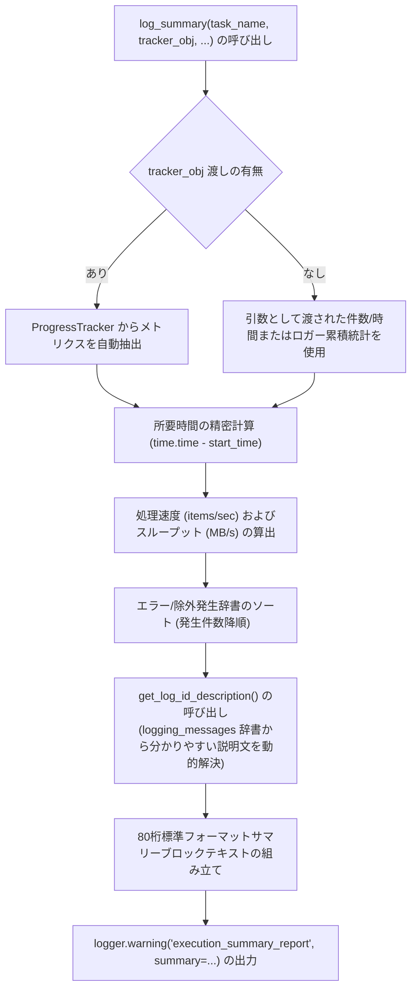

# 2.5. 処理結果サマリーレポート自動生成 (`log_summary`)

> **所属モジュール**: `agent_common.logger.ProjectLogger`  
> **中核メソッド**: `ProjectLogger.log_summary()`, `ProjectLogger.get_log_id_description()`  
> **連携モジュール**: `agent_common.progress_tracker.ProgressTracker`

---

## 1. 概要およびエンタープライズにおける背景

エンタープライズデータパイプライン（Airflow DAG, バッチプロセス）や大規模データ移行が完了した際、エンジニアおよび運用チームは以下の重要事項を即座に確認できる必要があります:

1. **全体の所要時間およびスループット（処理速度）はどれくらいか？**
2. **成功／失敗／除外（Skip）件数はそれぞれ何件か？**
3. **失敗が発生した場合、具体的にどのエラーコードが何件発生したか？**
4. **転送・ロードされた総データ容量（MB）と平均ネットワークスループット（MB/s）は適正か？**

従来は各スクリプトで個別にログ出力していたため書式が不統一で、暗号のようなエラーコードだけが出力されて原因究明に時間を要していました。

`ProjectLogger.log_summary()` は、これらの課題を解決するため**視認性に優れた80桁標準サマリーレポートブロック**を生成し、`WARNING` レベルで出力します。

---

## 2. サマリーレポート生成アーキテクチャ



---

## 3. 主要機能および詳細動作

### 3.1. エラーおよび除外理由の動的解決 (`get_log_id_description`)
エラーや除外の識別コード（例: `db_deleted_status_skipped`, `network_timeout`）に基づき、多言語メッセージテンプレート（`logging_messages_*.yml`）から該当定義を動的に逆引きし、未置換変数をクレンジングした上で**直感的な説明文を自動付与**します:

- コード: `db_deleted_status_skipped`
- 出力: `* db_deleted_status_skipped (삭제 상태코드로 인한 적재 대상 제외): 120 건`

### 3.2. 精密な処理速度および転送帯域幅の分析
- **総所要時間**: `分 秒 (秒)` 単位で精密算出
- **平均処理速度**: `items/sec` 単位で自動計算
- **転送データ量**: バイト（`bytes`）をメガバイト（`MB`）に自動換算し、1秒あたりのスループット（`MB/s`）を算出

### 3.3. `ProgressTracker` とのシームレス連携
`ProgressTracker` インスタンスを `tracker_obj` 引数に渡すだけで、総件数、成功/失敗/除外件数、開始時刻、転送バイト数などを自動抽出し、記述コードを最小化できます。

---

## 4. 標準サマリーレポート出力例

```text
================================================================================
                    [데이터 파이프라인 동기화 작업 결과 요약]
================================================================================
- 작업 시작 / 종료 시간 : 2026-09-04 22:00:00 ~ 2026-09-04 22:05:30
- 총 소요 시간          : 5분 30.0초 (330.00초)
--------------------------------------------------------------------------------
- 총 처리 대상 건수     : 100,000 건
- 처리 성공 / 실패      : 99,500 건 / 300 건
- 처리 제외 (Skip)      : 200 건
- 예외/오류 발생 세부 내역 (총 300건):
  * network_timeout (네트워크 연결 시간 초과): 250 건
  * schema_mismatch (필수 컬럼 누락 또는 타입 불일치): 50 건
- 처리 제외 세부 내역 (총 200건):
  * db_deleted_status_skipped (삭제 상태코드로 인한 적재 대상 제외): 150 건
  * db_duplicate_pk_skipped (이미 존재하거나 중복된 기본키 제외): 50 건
- 총 전송 데이터 용량   : 1,024.50 MB (평균 3.10 MB/s)
- 평균 처리 속도        : 303.03 items/sec
- [사용자 추가 정보] 파이프라인 배치 실행자: Airflow_Worker_03
================================================================================
```

---

## 5. 実践使用コード

### 5.1. メトリクスを直接渡してサマリーレポートを出力する

```python
import time
from agent_common.logger import ProjectLogger

logger = ProjectLogger("BatchMigrator")
start_ts = time.time()

# 業務ロジックの実行
logger.record_success(count_int=950)
logger.record_failure(count_int=30, log_id_str="network_timeout")
logger.record_failure(count_int=20, log_id_str="schema_mismatch")
logger.record_excluded("db_deleted_status_skipped", count_int=50)

# 最終サマリーレポートの出力
logger.log_summary(
    task_name_str="顧客データ同期",
    total_items_int=1050,
    start_time_float=start_ts,
    total_bytes_int=1024 * 1024 * 150,  # 150 MB
    extra_lines_list=[
        "対象データセット: customer_dw.activity_logs",
        "ターゲット分析テーブル: analytics_dw.daily_snapshot",
    ]
)
```

### 5.2. `ProgressTracker` と連携した自動サマリー出力

```python
from agent_common.logger import ProjectLogger
from agent_common import ProgressTracker

logger = ProjectLogger("DataPipeline")
tracker = ProgressTracker(total_items_int=50000, logger_obj=logger, item_name_str="レコード")

for item in data_items:
    try:
        tracker.increment_success(bytes_int=len(item))
    except Exception as e:
        tracker.increment_failure(error_msg_str=str(e))

# 処理終了後、ProgressTracker が内部で自動的に logger.log_summary() を呼び出す
tracker.log_summary(extra_lines_list=["バッチバージョン: v1.2.0"])
```

---

## 6. 運用ベストプラクティス

1. **`WARNING` レベルでの出力意図**:
   - `log_summary()` は意図的に `WARNING` レベルで出力されます。情報ログ（`INFO`）が無効化されている本番環境（`logging.level: WARNING`）でも、ジョブ完了サマリーを確実に運用ログに残すためです。
2. **`extra_lines_list` の積極的活用**:
   - 実行ホスト、パーティション日付、データソース URI など、事後分析に必要なビジネスメタデータを `extra_lines_list` に渡してレポートに出力してください。
