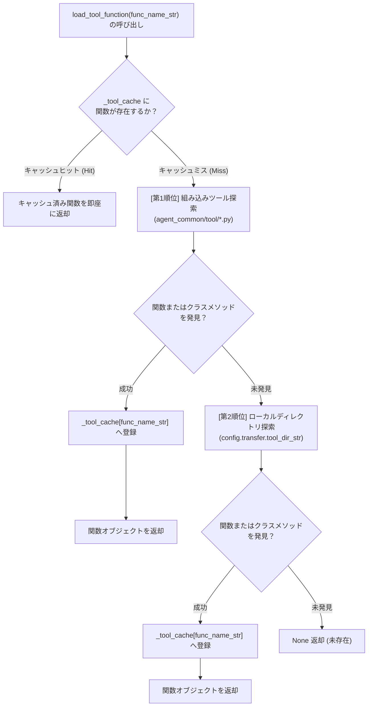

# 4.1. 二元化された Tool ディレクトリ階層探索および動的ロード (`ToolParser`)

> **所属モジュール**: `agent_common.tool_parser.ToolParser`  
> **中核メソッド**: `load_tool_function()`, `scan_rules_for_tool_functions()`  
> **依存モジュール**: `importlib`, `inspect`, `pathlib`, `agent_common.logger.ProjectLogger`, `agent_common.config_loader.ConfigLoader`

---

## 1. 概要およびエンタープライズにおける背景

エンタープライズデータ移行およびメダリオンアーキテクチャパイプラインでは、ソースシステム（Dell ECS, データベース, 外部 API 等）の生データを標準化されたビジネス形式へ変換するために多様なツール関数（Tool）を適用します。

しかし、ツール関数を単一リポジトリやディレクトリに強結合させると以下の問題が生じます:
1. **全社標準ロジックとドメイン特化ロジックの衝突**: 全社共通の日時生成（`DateTimeUtils`）やフォーマッターと、特定ドメイン専用の業務コードが混在し、共通ライブラリの独立性と再利用性が低下。
2. **デプロイの摩擦**: ドメイン専用関数を1つ修正するために全社共通パッケージ（`agent_common`）全体を再リリースしなければならない非効率。

`ToolParser` はこれを解決するため、**二元化された2段階 Tool 階層探索構造**を採用しています:
- **第1順位 (全社標準組み込みツール)**: `agent_common` パッケージ自体に含まれる標準ツール（`agent_common/tool/`）を最優先で探索。
- **第2順位 (プロジェクトローカルツール)**: `config.yml` の `transfer.tool_dir_str` に設定されたローカルディレクトリ（例: `medallion/tool/`）を探索。

また、1度ロードされた関数はインメモリキャッシュ（`_tool_cache`）に登録され、数百万件の大容量バッチ処理でもモジュールインポートのオーバーヘッドなくナノ秒単位で即時実行されます。

---

## 2. 階層探索アーキテクチャおよび動作原理



---

## 3. 詳細探索アルゴリズム

`ToolParser` は単一の関数名（`func_name_str`）を受け取ると、モジュール内部を3段階で探索します:

1. **モジュールレベル関数の探索**: モジュール直下の `def my_tool_func(...)` 宣言を探索
2. **`クラス名.メソッド名` の明示的探索**: ドットを含む場合（`DateTimeUtils.get_now_compact` 等）、対象クラス内のメソッドを抽出
3. **モジュール内クラスメソッドの自動探索**: 関数名のみ（`get_now_compact`）が指定されても、モジュール内の全クラスを走査して合致するメソッドを自動探索

---

## 4. 主要メソッド仕様

### 4.1. ツール関数の動的ロード (`load_tool_function`)
```python
def load_tool_function(self, func_name_str: str) -> Optional[Callable]
```
- 引数: ロードする関数名（例: `'get_now_compact'`, `'DateTimeUtils.get_now_compact'`）
- 返却値: 呼び出し可能な関数オブジェクト（`Callable`）、未存在時は `None`

### 4.2. 事前ルール Fail-Fast 検証 (`scan_rules_for_tool_functions`)
```python
def scan_rules_for_tool_functions(self, rule_node_any: Any, found_funcs_set: Set[str]) -> None
```
- ジョブ起動前に YAML ルールセット（`table_rules.yml` 等）を再帰スキャンし、記述されたすべての Tool 関数名を抽出。未定義の関数による実行中の中断を防止し、起動初期フェーズで事前検証（Fail-Fast）します。

---

## 5. 実践コード例

### 5.1. 組み込みおよびローカルツールの動的ロード
```python
from agent_common.tool_parser import ToolParser

tool_parser = ToolParser()

# 1. 組み込みツールのロード (DateTimeUtils)
now_func = tool_parser.load_tool_function("DateTimeUtils.get_now_compact")
print(now_func())  # 例: '20260918203000'

# 2. メソッド名単独での自動解決
today_func = tool_parser.load_tool_function("get_today_yyyymmdd")
print(today_func())  # 例: '20260918'

# 3. プロジェクトローカルツールのロード (medallion/tool/ 配下)
custom_func = tool_parser.load_tool_function("custom_code_converter")
if custom_func:
    result = custom_func("AB01")
```

### 5.2. パイプライン起動時のルール事前検証 (Fail-Fast)
```python
from agent_common.tool_parser import ToolParser
from agent_common.logger import ProjectLogger

logger = ProjectLogger("PipelineValidator")
tool_parser = ToolParser()

pipeline_rules = {
    "target_table": "dw_users",
    "columns": {
        "created_at": "{DateTimeUtils.get_now_timestamp()}",
        "user_code": "{custom_hasher(user_id)}",
    }
}

used_funcs_set: set[str] = set()
tool_parser.scan_rules_for_tool_functions(pipeline_rules, used_funcs_set)

missing_funcs = [fn for fn in used_funcs_set if tool_parser.load_tool_function(fn) is None]
if missing_funcs:
    raise RuntimeError(f"必須 Tool 関数が存在しません: {missing_funcs}")
```

---

## 6. 注意事項およびベストプラクティス

1. **組み込みツールの優先権**: 同名関数が存在する場合、全社標準を優先するため組み込みツールが優先ロードされます。個別特化関数には固有プレフィックス（`biz_` 等）の付与を推奨します。
2. **設定ディレクトリの同期**: ローカルツールのパスは `config.yml` の `transfer.tool_dir_str`（デフォルト: `"medallion/tool"`）に従います。
