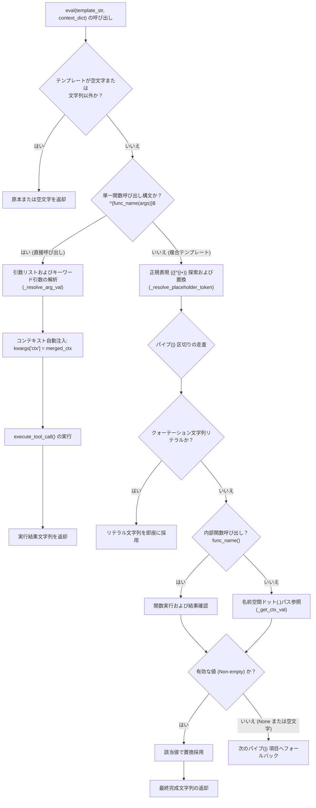

# 4.2. 宣言的テンプレート置換および式評価 (`ToolParser.eval`)

> **所属モジュール**: `agent_common.tool_parser.ToolParser`  
> **中核メソッド**: `eval()`, `execute_tool_call()`  
> **依存モジュール**: `re`, `inspect`, `agent_common.logger.ProjectLogger`, `agent_common.config_loader.ConfigLoader`

---

## 1. 概要およびエンタープライズにおける背景

データパイプラインにおいて、入力元データ（S3/ECS オブジェクトキー、メタデータ、JSON 本文等）を投入先データベース（BigQuery 等）のスキーマへマッピングする際、ハードコードされた変換ロジックの代わりに**宣言的テンプレート (Declarative Template)** を使用することで、ビジネスルールの変更に YAML 設定の変更のみで柔軟に対応できます。

`ToolParser.eval()` は、以下の多様な構文を統合解析・評価する高性能エンジンを提供します:
1. **単一ツール関数の直接呼び出し**: `"{DateTimeUtils.get_now_compact()}"`, `"{calc_age(json.birth_year)}"`
2. **名前空間ドット記法変数の置換**: `"{ecs.key}"`, `"{sys.today}"`, `"{json.user.name}"`
3. **パイプ (`|`) 優先順位フォールバック**: `"{meta.title|json.header.title|'UNTITLED'}"`
4. **インテリジェント引数マッピングとコンテキスト自動注入**: 対象関数の引数シグネチャ（`inspect.signature`）を解析し、必要な引数のみを正確にバインドするとともにコンテキスト（`ctx=merged_ctx`）を自動提供。

---

## 2. テンプレート評価エンジンアーキテクチャ



---

## 3. 主要構文およびサポート式一覧

| 構文形式 | 記述例 | 動作説明 |
| :--- | :--- | :--- |
| **単一関数呼び出し** | `"{get_today_yyyymmdd()}"`<br/>`"{DateTimeUtils.get_now_timestamp()}"` | ツール関数を直接呼び出し、返却値を文字列へ変換。 |
| **引数付き関数** | `"{code_lookup('STATUS', json.status_cd)}"` | リテラル引数およびコンテキスト変数を関数へ渡して実行。 |
| **名前空間変数** | `"{ecs.key}"`<br/>`"{json.user.address.city}"` | ドット記法でネストされた辞書から値を抽出。 |
| **パイプフォールバック** | `"{ecs.title\|json.title\|'無題'}"` | 左から順に評価し、空でない最初の有効値を返却。 |
| **複合テンプレート** | `"events/{sys.today}/{ecs.filename}.json"` | 固定文字列と複数の波括弧 `{}` 変数を自然に合成。 |

---

## 4. 主要メソッド仕様

### 4.1. テンプレート評価 (`eval`)
```python
def eval(
    self,
    template_str: Optional[str],
    context_dict: Optional[Dict[str, Any]] = None,
) -> Optional[str]
```
- 引数: 評価対象テンプレート文字列、探索用コンテキスト辞書
- 返却値: 評価・置換された最終文字列（入力が `None` の場合は `None`）

### 4.2. ツール関数の安全実行 (`execute_tool_call`)
```python
def execute_tool_call(
    self,
    func_name_str: str,
    args_list: list[Any],
    kwargs_dict: Dict[str, Any],
) -> Any
```
- `inspect.signature` を通じて関数のパラメータ一覧を事前検査し、宣言されたパラメータに合致する引数のみをフィルタリングして渡すことで `TypeError: unexpected keyword argument` を防止します。

---

## 5. 実践コード例

```python
from agent_common.tool_parser import ToolParser

tool_parser = ToolParser()

context = {
    "ecs": {
        "key": "raw/media/2026/sample_video.mp4",
        "size": 1048576,
    },
    "meta": {
        "category": "broadcast",
    },
    "json": {
        "title": "イブニングニュース",
    },
    "sys": {
        "today": "20260918",
    }
}

# 1. 組み込みツールの直接呼び出し
res1 = tool_parser.eval("{DateTimeUtils.get_now_compact()}", context)
print(res1)  # '20260918203000'

# 2. パイプフォールバック (meta.title がないため json.title を採用)
res2 = tool_parser.eval("{meta.title|json.title|'無題'}", context)
print(res2)  # 'イブニングニュース'

# 3. 複合パスの合成
res3 = tool_parser.eval("archive/{sys.today}/{ecs.key}", context)
print(res3)  # 'archive/20260918/raw/media/2026/sample_video.mp4'

# 4. リテラルフォールバック
res4 = tool_parser.eval("{meta.author|'管理者'}", context)
print(res4)  # '管理者'
```

---

## 6. 注意事項およびベストプラクティス

1. **パイプのデフォルト文字列リテラル**: フォールバックの固定文字列には必ずシングルクォート（`'...'`）またはダブルクォート（`"..."`）を付与してください。クォーテーションがないとコンテキスト内の変数キーとみなされ空文字になる場合があります。
2. **Fail-Fast 例外伝播**: 関数内部で未処理の例外が発生した場合、`execute_tool_call` はログを記録して即座に例外を上位へ送出します。
