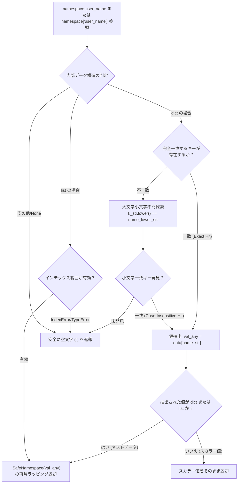

# 4.3. 安全な名前空間探索 (`_SafeNamespace`)

> **所属モジュール**: `agent_common.tool_parser._SafeNamespace`  
> **中核メソッド**: `__getattr__()`, `__getitem__()`, `__str__()`, `__bool__()`  
> **依存モジュール**: Python 標準ライブラリ (Zero-dependency)

---

## 1. 概要およびエンタープライズにおける背景

外部データソース（Dell ECS メタデータ、レガシー RDBMS 抽出データ、サードパーティ REST API レスポンス）では、キーの大文字・小文字表記（`userId` vs `USERID` vs `userid`）が不統一であったり、特定レコードで特定キーが丸ごと欠落する事態が頻発します。

通常の Python 辞書（`dict`）やオブジェクト属性アクセス（`data['user']['name']` や `data.user.name`）をそのまま使用すると、以下の深刻な問題が発生します:
1. **`KeyError` や `AttributeError` によるパイプラインの途中停止**: 100万件のバッチ処理の途中で任意フィールドの欠落によりジョブ全体が異常終了する。
2. **防御コードの乱立**: `data.get('user', {}).get('name', '')` のような多重防御コードがコード全体に広がり可読性を著しく損なう。

`_SafeNamespace` は、ドット記法とブラケット（`[]`）インデックスアクセスを統合サポートし、**大文字・小文字を無視した探索**と**キー欠落時の安全な空文字 (`""`) 返却**を保証する高性能ラッパーです。

---

## 2. 安全探索アーキテクチャおよびラッピング機構



---

## 3. 中核仕様および特徴

### 3.1. ドット属性と辞書インデックスの統合
`_SafeNamespace` でラップされたオブジェクトは、`ns.user.name` と `ns['user']['name']` を自由に併用できます。

### 3.2. 大文字小文字不問 (Case-Insensitive) の柔軟な探索
データが `{"CreatedAt": "2026-09-18"}` であっても、`ns.createdat`, `ns.CREATED_AT`, `ns.createdAt` のいずれでも安全に値を取得できます。

### 3.3. 欠落時の安全な空文字返却
存在しないキーを深層参照（`ns.non_existing.deep.nested.field`）しても `AttributeError` や `KeyError` は発生せず、安全に `""` を返却します。

---

## 4. 実践コード例

```python
from agent_common.tool_parser import _SafeNamespace

raw_data = {
    "Header": {
        "TRANSACTION_ID": "TX-998823",
        "Sender": "System-A"
    },
    "Payload": {
        "items": [
            {"ItemCode": "P001", "Qty": 10},
            {"ItemCode": "P002", "Qty": 5}
        ]
    }
}

ns = _SafeNamespace(raw_data)

# 1. 大文字小文字混在のドット記法アクセス
tx_id = ns.header.transaction_id
print(tx_id)  # 'TX-998823'

sender = ns.Header.sender
print(sender)  # 'System-A'

# 2. リストおよび辞書の混在探索
first_item = ns.payload.items[0].itemcode
print(first_item)  # 'P001'

# 3. 未存在キーの深層参照でもエラーなし
missing_val = ns.payload.metadata.author.email
print(f"結果: '{missing_val}'")  # 結果: ''

# 4. 範囲外インデックス参照
out_of_bounds = ns.payload.items[999].itemcode
print(f"結果: '{out_of_bounds}'")  # 結果: ''
```

---

## 5. 注意事項およびベストプラクティス

1. **テンプレートエンジンとの連携**: `_SafeNamespace` は `ToolParser.eval()` 内部の名前空間バインディングにおける中核機構として動作します。
2. **値の有無判定**: 欠落キーは `""` を返すため、`if ns.target_key:` のようにシンプルに真偽判定が可能です。
3. **不要な防御コードの排除**: 煩雑な `try-except KeyError` や `dict.get()` の連鎖を完全に排除し、ビジネスロジックの可読性を大幅に向上させます。
