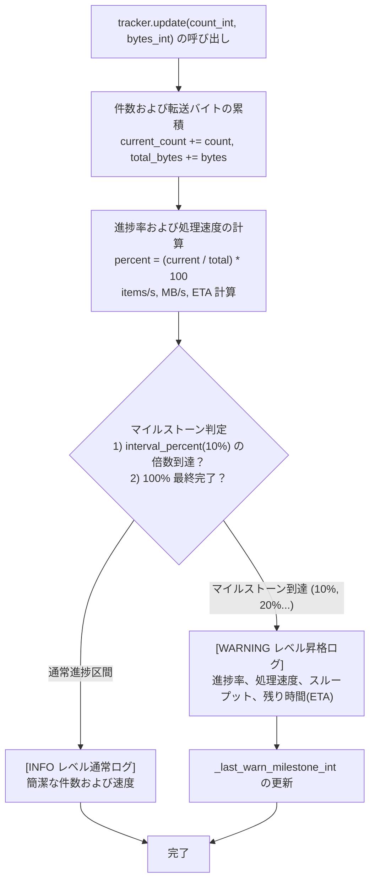

# 5.2. マルチスレッドリアルタイム進捗追跡およびマイルストーン警告 (`ProgressTracker`)

> **所属モジュール**: `agent_common.progress_tracker.ProgressTracker`  
> **中核メソッド**: `update()`  
> **連動モジュール**: `agent_common.logger.ProjectLogger`, `agent_common.config_loader.config`

---

## 1. 概要およびエンタープライズにおける背景

大容量ファイル（S3/ECS）の移行や BigQuery への大量投入を行うバッチパイプラインでは、**リアルタイムの処理進捗モニタリング**と**予測残り時間 (ETA)** の把握が不可欠です。

しかし、単純なループカウント方式では以下の問題が生じます:
1. **ログの洪水 (Log Flooding)**: 100万件処理で毎件ログを出力するとログ容量が爆発し可読性が失われる。
2. **進捗の不透明性**: 10分間ログが出力されないとプロセスがハングしているのか判定不能。
3. **視認性不足**: 大量のログの中から10%, 20%, 50% 等の主要マイルストーンを判別するのが困難。

`ProgressTracker` は、処理件数と転送バイト数をリアルタイム追跡し、**通常処理は `INFO` レベル**で出力し、**設定された % 倍数（例: 10% 刻みのマイルストーン）および最終完了時は `WARNING` レベルへ自動昇格**して記録します。

---

## 2. 進捗追跡およびマイルストーン昇格メカニズム



---

## 3. 主要設定スキーマおよび仕様

```yaml
progress_tracker:
  interval_percent_int: 10       # 進捗マイルストーン警告間隔 (%)
  default_task_name_str: "タスク" # デフォルトタスク名
```

### 3.1. コンストラクタ (`__init__`)
```python
def __init__(
    self,
    total_items_int: int,
    logger_obj: Any = None,
    task_name_str: Optional[str] = None,
    start_time_float: Optional[float] = None,
) -> None
```

### 3.2. 状態更新とログ出力 (`update`)
```python
def update(
    self,
    count_int: int = 1,
    bytes_int: int = 0,
    details_str: str = "",
) -> None
```
- **マイルストーン (`WARNING`)**:  
  `[タスク名 進捗マイルストーン] 進捗: 500/1,000 (50%) | 速度: 25.4件/s 12.30 MB/s | 残り時間(ETA): 0m 19s`
- **通常進捗 (`INFO`)**:  
  `[タスク名] 123/1,000 (12%) | 24.8件/s (11.80 MB/s)`

---

## 4. 実践コード例

### 4.1. 大容量ファイル転送ループでの進捗追跡
```python
from agent_common import ProgressTracker
from agent_common.logger import ProjectLogger
import time

logger = ProjectLogger("MigrationService")
file_list = [{"name": f"file_{i}.dat", "size": 1024 * 512} for i in range(100)]

tracker = ProgressTracker(
    total_items_int=len(file_list),
    logger_obj=logger,
    task_name_str="GCSファイル転送"
)

for file_info in file_list:
    time.sleep(0.05)
    tracker.update(
        count_int=1,
        bytes_int=file_info["size"],
        details_str=file_info["name"]
    )
```

### 4.2. マルチスレッド環境でのバッチチャンク追跡
```python
from concurrent.futures import ThreadPoolExecutor
from agent_common import ProgressTracker
from agent_common.logger import ProjectLogger

logger = ProjectLogger("BatchWorker")
chunks = [range(i, i + 50) for i in range(0, 1000, 50)]

tracker = ProgressTracker(
    total_items_int=1000,
    logger_obj=logger,
    task_name_str="並列チャンク処理"
)

def process_chunk(chunk_items):
    tracker.update(count_int=len(chunk_items))

with ThreadPoolExecutor(max_workers=4) as executor:
    executor.map(process_chunk, chunks)
```

---

## 5. 運用ベストプラクティス

1. **マイルストーン昇格の運用メリット**:
   - 監視基盤（Datadog, CloudWatch 等）で `WARNING` のみをフィルタリングすることで、10%ごとの進捗と ETA をノイズなしで監視できます。
2. **転送量 (`bytes_int`) の活用**:
   - バイト数を渡すことで秒あたり転送量（`MB/s`）が自動計算され、ネットワークボトルネックを即座に診断できます。
