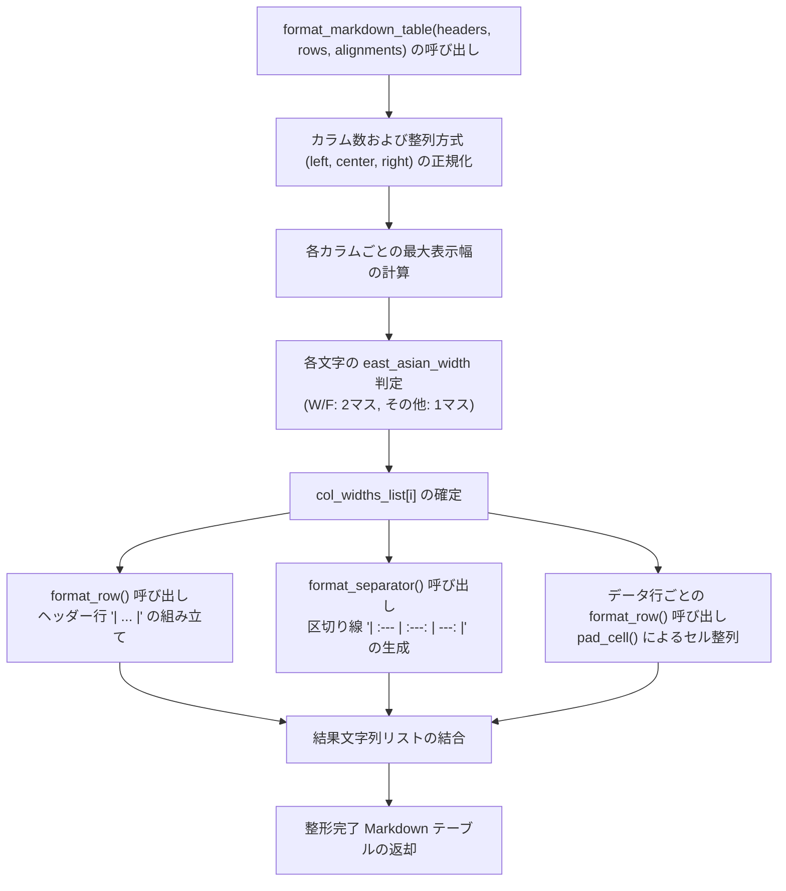

# 5.3. Unicode全角文字幅計算およびマークダウン/コンソールテーブル整形フォーマッター (`TableFormatter`)

> **所属モジュール**: `agent_common.table_formatter.TableFormatter`  
> **中核メソッド**: `calculate_display_width()`, `format_markdown_table()`, `format_row()`, `format_separator()`, `pad_cell()`  
> **依存モジュール**: `unicodedata` (Python 標準ライブラリ), `agent_common.config_loader.config`  
> **導入バージョン**: `v0.4.63`

---

## 1. 概要およびエンタープライズにおける背景

バッチ処理完了後にコンソールターミナルや GitHub/Slack の Markdown レポートへ処理結果一覧表（Summary Table）を出力する際、以下のような表示崩れが頻発します:

```text
# 単純な len() 基準の空白パディングで発生する枠線ずれ
| ファイル名 | 状態 | 処理時間 |
| sample_file.json | 成功 | 1.2s |
| 日本語データファイル.json | 成功 | 2.5s |   <-- 全角文字が2マスを占有するため右側の縦線(|)が大幅にずれる
```

Python 標準の `len("日本語")` は文字数である `3` を返しますが、等幅（Monospace）フォント環境では**全角文字（漢字、ひらがな、カタカナ、全角記号等）は半角英数の2倍（Display Width = 2）の幅**を占有します。

`TableFormatter` は、標準ライブラリ `unicodedata.east_asian_width` を活用してテキストの実際の表示幅（Display Width）を精密計算し、カラム別アライメント（左揃え、中央揃え、右揃え）に応じて**すべての行の縦線（`|`）を寸分の狂いもなく揃える専門フォーマッターユーティリティ**です。

---

## 2. 東アジア文字幅判定およびフォーマットパイプライン



---

## 3. 東アジア文字分類基準 (`unicodedata.east_asian_width`)

| 分類コード | カテゴリ名称 | 文字例 | 表示幅 (Display Width) |
| :---: | :--- | :--- | :---: |
| **`W`** | **Wide (全角文字)** | 漢字 (`漢`, `字`), ひらがな・カタカナ, ハングル | **2マス** |
| **`F`** | **Fullwidth (全角英数・記号)** | 全角英字 (`Ａ`, `Ｂ`), 全角記号 (`！`, `？`) | **2マス** |
| **`Na`** | Narrow (半角文字) | ASCII 英数 (`A`, `b`, `0`〜`9`), 基本記号 | 1マス |
| **`H`** | Halfwidth (半角カナ) | 半角カタカナ (`ｱ`, `ｲ`) | 1マス |
| **`N`** | Neutral (中立文字) | アラビア文字、制御文字等 | 1マス |
| **`A`** | Ambiguous (曖昧文字) | 一部ギリシャ文字、キリル文字 | 1マス |

---

## 4. 主要メソッド仕様

### 4.1. 表示カラム幅の計算 (`calculate_display_width`)
- `unicodedata.east_asian_width(c) in ("W", "F")` 条件により全角文字を2マスとして積算します。

### 4.2. Markdown テーブル生成 (`format_markdown_table`)
- ヘッダー、データ行、整列指定（`'left'`, `'center'`, `'right'`）を受け取り、縦線が整列された Markdown 行のリストを返却します。

### 4.3. セルパディング (`pad_cell`)
- 左揃え、右揃え、中央揃えに応じて、不足分の空白を適切にパディングします。

---

## 5. 実践コード例

```python
from agent_common import TableFormatter

headers = ["処理ステップ", "ファイル名", "転送件数", "所要時間", "状態"]
rows = [
    ["元データ抽出", "ecs_export_20260918.csv", "12,500", "1.4s", "完了"],
    ["データクレンジング", "cleaned_dataset.parquet", "12,498", "3.8s", "成功"],
    ["BigQueryロード", "analytics.tb_sales_log", "12,498", "2.1s", "成功"],
]
alignments = ["left", "left", "right", "right", "center"]

table_lines = TableFormatter.format_markdown_table(
    headers_list=headers,
    rows_list=rows,
    alignments_list=alignments
)

print("\n".join(table_lines))
```

**出力結果 (等幅フォント環境で完全一致)**:
```text
| 処理ステップ       | ファイル名              | 転送件数 | 所要時間 | 状態 |
| :----------------- | :---------------------- | -------: | -------: | :--: |
| 元データ抽出       | ecs_export_20260918.csv |   12,500 |     1.4s | 完了 |
| データクレンジング | cleaned_dataset.parquet |   12,498 |     3.8s | 成功 |
| BigQueryロード     | analytics.tb_sales_log  |   12,498 |     2.1s | 成功 |
```

---

## 6. ベストプラクティス

1. **`ProjectLogger.log_summary()` との連携**:
   - `ProjectLogger.log_summary()` も内部で `TableFormatter` を使用して集計結果を出力しているため、運用ログ全体で美しいレイアウトが維持されます。
