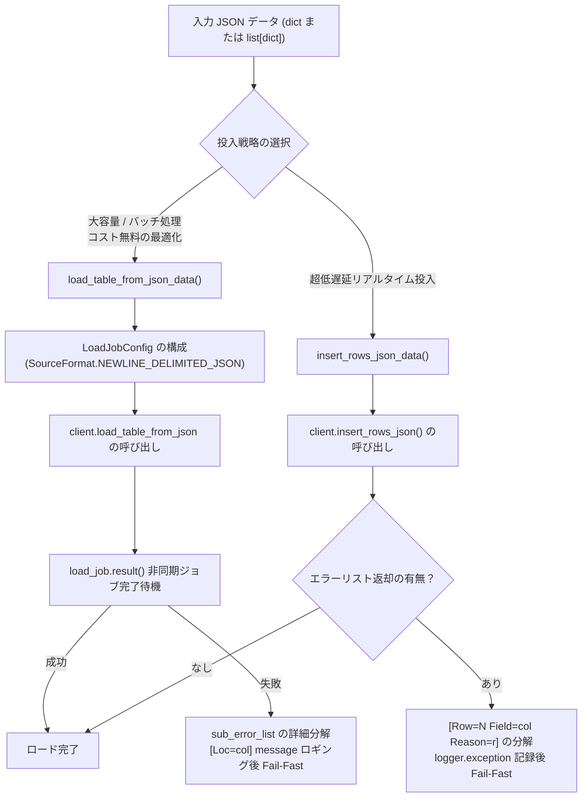

# 3.3. BigQuery バッチおよびストリーミングロードクライアント (`BigQueryClient`)

> **所属モジュール**: `agent_common.clients.BigQueryClient`  
> **中核メソッド**: `load_table_from_json_data()`, `insert_rows_json_data()`, `query()`, `get_existing_keys()`  
> **依存パッケージ**: `google-cloud-bigquery>=3.10.0`, `google-auth`

---

## 1. 概要およびエンタープライズにおける背景

Google Cloud BigQuery は、ペタバイト級の構造化・半構造化データをリアルタイム分析できるサーバーレスデータウェアハウス (DW) です。

パイプラインの要件に応じて、BigQuery へのデータ投入戦略は主に以下の2系統に分かれます:
1. **バッチロード (Batch Load - `load_table_from_json_data`)**: 大容量 JSON レコード群をファイル/一括形式で無料（BigQuery の無料ロードクォータ）で高速投入する方式。
2. **ストリーミングインサート (Streaming Ingestion - `insert_rows_json_data`)**: 単件または数十件単位のイベントを即座にクエリ可能とするリアルタイム投入方式。

`agent_common.clients.BigQueryClient` は、これら双方のロード方式をサポートし、失敗時には原因特定が困難な BigQuery のネストされたエラー（`errors` 配列、カラム位置 `location`、理由 `reason`）を完全に分解して単一行の構造化ログとして記録します。また、重複投入を防止するため、既存キーを Set として高速取得するユーティリティメソッドを提供します。

---

## 2. バッチロード vs ストリーミングインサートの比較



| 項目 | バッチロード (`load_table_from_json_data`) | ストリーミングインサート (`insert_rows_json_data`) |
| :--- | :--- | :--- |
| **基盤 BigQuery API** | `client.load_table_from_json()` (Job ベース) | `client.insert_rows_json()` (Streaming API) |
| **コスト** | 無料ロードクォータを利用 | MB あたりのストリーミング課金 |
| **データの可視性** | ジョブ完了直後に参照可能 (数秒) | 数ミリ秒以内で即時検索可能 |
| **上書き制御** | `WRITE_TRUNCATE`, `WRITE_APPEND` 対応 | `WRITE_APPEND` のみ |
| **推奨用途** | 日次/時間単位バッチ ETL、大量移行 | リアルタイムイベント収集、センサーログ |

---

## 3. 主要メソッドおよび機能仕様

### 3.1. コンストラクタ (`__init__`)
```python
def __init__(
    self,
    project_id_str: str = "",
    dataset_id_str: str = "",
    table_id_str: str = "",
    credentials_path_str: str = "",
    timeout_seconds_int: int | None = None,
    ignore_unknown_values_bool: bool | None = None,
) -> None
```
- **初期化とスキーマの事前検証 (Fail-Fast)**:
  - `_resolve_gcp_credentials()` による4段階認証解決。
  - 初期化時に `client.get_table()` を呼び出し、対象データセットおよびテーブルの存在有無とスキーマを事前キャッシュ（`self.table_obj`）。

### 3.2. JSON バッチテーブルロード (`load_table_from_json_data`)
```python
def load_table_from_json_data(
    self,
    json_data_any: Any,
    timeout_int: int | None = None,
    ignore_unknown_values_bool: bool | None = None,
    write_disposition_str: str | None = None,
) -> None
```
- **引数**:
  - `json_data_any`: 単一 `dict` または `list[dict]`
  - `write_disposition_str`: `'WRITE_APPEND'` (追記) または `'WRITE_TRUNCATE'` (上書き)
- **エラー分解**: 失敗時に `load_exc.errors` をパースし `[Loc=カラム名] 詳細原因` 形式で単一行ログ出力後に `RuntimeError` を送出。

### 3.3. リアルタイムストリーミングインサート (`insert_rows_json_data`)
```python
def insert_rows_json_data(
    self,
    json_data_any: Any,
    timeout_int: int | None = None,
    ignore_unknown_values_bool: bool | None = None,
) -> None
```
- BigQuery Streaming API を介して行データを即時挿入します。

### 3.4. 汎用 SQL クエリ実行 (`query`)
```python
def query(self, query_str: str, timeout_int: int | None = None) -> list[dict[str, Any]]
```
- 任意の BigQuery SQL クエリを同期実行し、結果レコードを辞書リスト（`list[dict]`）として返却します。

### 3.5. 重複防止キー集合の取得 (`get_existing_keys`)
```python
def get_existing_keys(self, field_name_str: str = "recvPath") -> set[str]
```
- 対象テーブルの特定カラム（元ファイルパス等）の一意な値一覧を取得し、Python `set[str]` として返却します。バッチ処理ループでの `O(1)` 重複判定に最適です。

---

## 4. 実践使用例

### 4.1. BigQueryClient の初期化とバッチロード
```python
from agent_common.clients import BigQueryClient

bq_client = BigQueryClient(
    project_id_str="my-gcp-project",
    dataset_id_str="analytics_dw",
    table_id_str="tb_daily_active_users",
    credentials_path_str="config/secrets/gcp_sa_key.json",
)

user_events_list = [
    {"user_id": "U1001", "event_type": "LOGIN", "event_time": "2026-08-24 09:00:00+09:00"},
    {"user_id": "U1002", "event_type": "PURCHASE", "event_time": "2026-08-24 09:05:00+09:00"},
]

bq_client.load_table_from_json_data(
    json_data_any=user_events_list,
    write_disposition_str="WRITE_APPEND",
)
print("バッチロード完了")
```

### 4.2. 重複ロード防止 (`get_existing_keys`) とストリーミング投入
```python
from agent_common.clients import BigQueryClient

bq_client = BigQueryClient(
    project_id_str="my-gcp-project",
    dataset_id_str="lake_raw",
    table_id_str="tb_s3_transferred_files",
)

existing_keys_set = bq_client.get_existing_keys(field_name_str="s3_key")

incoming_file_str = "raw/events/20260824/data_01.json"
if incoming_file_str not in existing_keys_set:
    bq_client.insert_rows_json_data([
        {
            "s3_key": incoming_file_str,
            "transferred_at": "2026-08-24 10:00:00+09:00",
            "status": "SUCCESS",
        }
    ])
```

---

## 5. 例外処理およびトラブルシューティングガイド

| 発生例外 | 主な原因 | 対処方法 |
| :--- | :--- | :--- |
| `ConnectionError: connection_failed` | テーブルが存在しない、プロジェクト権限不足 | テーブル ID およびサービスアカウントの IAM ロールを確認 |
| `RuntimeError: load_table_from_json_failed` | カラム型不一致、必須カラムの欠落 | ログの `[Loc=field_name]` を確認して入力データをクレンジング |
| `RuntimeError: BigQuery API insert 반환 상세 에러` | スキーマ検証失敗 | ログの `[Row=N Field=col Reason=r]` を確認 |
| `RuntimeError: query_execution_failed` | SQL 構文エラー、クエリタイムアウト | SQL 文の検証、バッククォート（`` ` ``）の保護、タイムアウト設定見直し |
