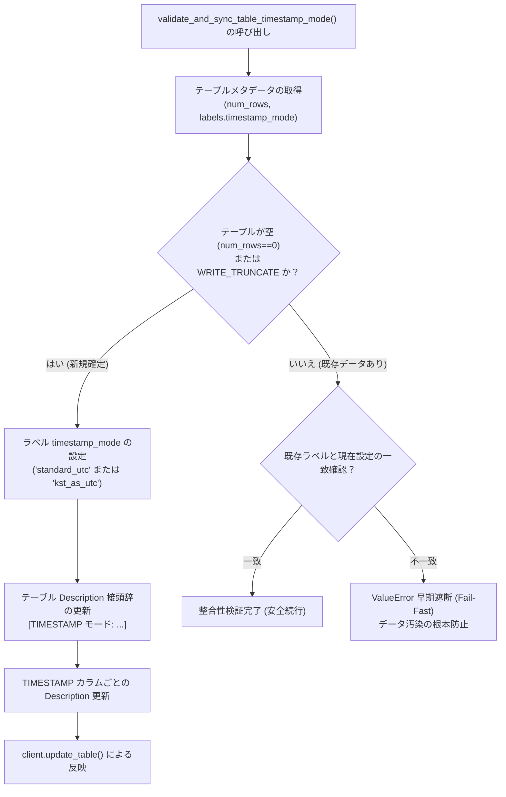

# 3.5. BigQuery タイムゾーンオフセット変換およびテーブルタイムゾーンモード検証・同期

> **所属モジュール**: `agent_common.clients.BigQueryClient`  
> **中核メソッド**: `convert_to_bigquery_timestamp()`, `validate_and_sync_table_timestamp_mode()`  
> **関連設定**: `config.bigquery.timezone_offset_str`, `config.bigquery.kst_as_utc_timestamp_bool`

---

## 1. 概要およびエンタープライズにおける背景

Google Cloud BigQuery の `TIMESTAMP` 型は、内部的には**常にマイクロ秒精度の UTC (+00:00)** として保存されます。しかし、アジア圏のエンタープライズ現場では、運用およびデータ分析の観点から2つの相反する要件が存在します:

1. **標準 UTC モード (`Standard-UTC`)**:
   - グローバル標準に従って正確な日時を保持し、クエリ参照時に `DATETIME(timestamp_col, 'Asia/Tokyo')` 等の関数で現地時刻を計算する方式。
2. **画面表示用モード (`KST-as-UTC` / `JST-as-UTC`)**:
   - BigQuery コンソール UI や BI ツール（Looker Studio 等）で関数変換を行わずに現地時刻の数字をそのまま画面表示させるため、現地時刻の日時に強制的に `+00:00` オフセットを付与して保存する方式。

同一テーブルにこれら2つのモードのデータが混在すると、時差による致命的な歪みが生じます。

`BigQueryClient` は、**各種の日時文字列を標準タイムスタンプへ安全に正規化**し、**テーブルメタデータ（ラベルおよびカラム説明）を同期して不一致時に処理を即座に遮断（Fail-Fast）**する安全機構を提供します。

---

## 2. タイムゾーンモード検証および同期アーキテクチャ



---

## 3. 主要機能およびメソッド仕様

### 3.1. 日時文字列の正規化 (`convert_to_bigquery_timestamp`)
```python
def convert_to_bigquery_timestamp(
    self,
    val_any: Any,
    default_tz_offset_str: Optional[str] = None,
) -> Optional[str]
```
- **サポート入力形式**:
  - `ISO 8601` 形式 (`2026-08-24T15:30:00+09:00`, `2026-08-24 15:30:00Z` 等)
  - 空白/スラッシュ区切りの日時 (`2026/08/24 15:30:00`)
  - 14桁コンパクト形式 (`20260824153000`)
  - 8桁日付 (`20260824` -> `2026-08-24 00:00:00`)
- **タイムゾーンオフセット解決の優先順位**:
  1. 元文字列自体のオフセット (`Z`, `+09:00` 等)
  2. 引数 `default_tz_offset_str`
  3. 設定ファイル `config.bigquery.timezone_offset_str`
  4. ホストシステムのローカルタイムゾーン

### 3.2. テーブルタイムゾーンモード検証およびメタ同期 (`validate_and_sync_table_timestamp_mode`)
```python
def validate_and_sync_table_timestamp_mode(
    self,
    write_disposition_str: str = "WRITE_APPEND",
) -> None
```
- テーブル行数とラベルを検証し、空テーブルまたは `WRITE_TRUNCATE` の場合はラベルと説明文を更新します。
- 既存データが存在する場合に設定とラベルが不一致であれば `ValueError` を送出して即座に停止（Fail-Fast）します。

---

## 4. 実践使用例

### 4.1. 日時文字列の正規化例
```python
from agent_common.clients import BigQueryClient

bq_client = BigQueryClient(
    project_id_str="my-project",
    dataset_id_str="analytics",
    table_id_str="tb_events",
)

# 1) 14桁文字列の変換 -> "2026-08-24 15:30:00+09:00"
ts_1 = bq_client.convert_to_bigquery_timestamp("20260824153000")

# 2) 8桁日付の変換 -> "2026-08-24 00:00:00+09:00"
ts_2 = bq_client.convert_to_bigquery_timestamp("20260824")

print(ts_1, ts_2)
```

### 4.2. パイプライン起動時のテーブル整合性検証
```python
from agent_common.clients import BigQueryClient

bq_client = BigQueryClient(
    project_id_str="my-project",
    dataset_id_str="analytics",
    table_id_str="tb_daily_settlement",
)

# ロード前のタイムゾーンモード整合性検証
bq_client.validate_and_sync_table_timestamp_mode(write_disposition_str="WRITE_APPEND")

# 検証合格後に安全にロード実行
bq_client.load_table_from_json_data(
    json_data_any=[{"settle_id": "S100", "settle_time": "2026-08-24 18:00:00+09:00"}],
    write_disposition_str="WRITE_APPEND",
)
```

---

## 5. 例外処理およびトラブルシューティングガイド

| 発生例外 | 主な原因 | 対処方法 |
| :--- | :--- | :--- |
| `ValueError: 데이터 혼란 방지(Fail-Fast)` | 対象テーブルの既存データと現在のタイムゾーンモード設定が不一致 | 1) テーブルを TRUNCATE するか、<br/>2) `config.yml` の設定を既存テーブルのモードと一致させる |
| `RuntimeError: BigQuery 테이블 메타데이터 갱신 실패` | サービスアカウントの更新権限不足 | IAM コンソールで BigQuery Admin または Data Editor 権限を付与 |
