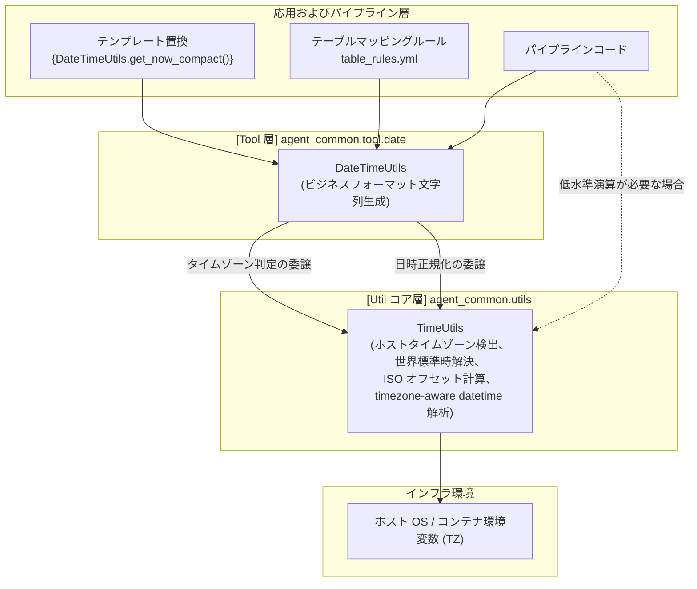

# 4.4. 組み込み共通日時ツール (`DateTimeUtils`)

> **所属モジュール**: `agent_common.tool.date.DateTimeUtils`  
> **中核メソッド**: `get_today_yyyymmdd()`, `get_now_timestamp()`, `get_now_no_tz()`, `get_now_compact()`, `parse_datetime()`  
> **基底コアユーティリティ**: `agent_common.utils.TimeUtils` (システムタイムゾーン判定および日時解析担当)

---

## 1. 概要およびエンタープライズにおける背景

データパイプラインおよびメダリオン (Medallion) アーキテクチャでは、ルールファイル（`table_rules.yml`）や GCS/BigQuery 格納パスのテンプレートにおいて、現在の日付や時刻を標準形式で表現する要求が頻繁に発生します。

- **BigQuery TIMESTAMP カラムロード**: タイムゾーンオフセット付き標準 ISO 8601 文字列（`YYYY-MM-DD HH:MM:SS+09:00`）が必要
- **パーティションフォルダ分岐**: 深夜バッチでも日付が前日に巻き戻らない正確な `YYYYMMDD` 8桁日付が必要
- **ログおよびサマリーレポート**: 視認性に優れたタイムゾーンなしの `YYYY-MM-DD HH:MM:SS` が必要
- **一意なファイル名/トランザクション ID**: 14桁コンパクト形式（`YYYYMMDDHHMMSS`）が必要

`DateTimeUtils` は、`agent_common` パッケージの**第1順位組み込みツール (Built-in Tool)** として、テンプレート（`{DateTimeUtils.get_today_yyyymmdd}`）および Python コードから即座に利用できる標準日時生成機能を提供します。

---

## 2. 日時モジュールの二元化アーキテクチャ: `DateTimeUtils` vs `TimeUtils`

`agent_common` パッケージは、時間関連ロジックを**コアインフラ層 (`TimeUtils`)** と **ツール/表現層 (`DateTimeUtils`)** に明確に分離して設計されています:



---

## 3. 主要メソッド仕様

### 3.1. 当日8桁日付 (`get_today_yyyymmdd`)
- **形式**: `YYYYMMDD` (例: `'20260918'`)
- **特徴**: `tz_obj` 未指定時はシステムタイムゾーンを自動反映し、深夜バッチ時の日付巻き戻りを防止。

### 3.2. 標準 ISO 8601 タイムスタンプ (`get_now_timestamp`)
- **形式**: `YYYY-MM-DD HH:MM:SS+09:00` または `+00:00` (例: `'2026-09-18 20:30:15+09:00'`)
- **用途**: BigQuery `TIMESTAMP` カラムへの格納標準。

### 3.3. タイムゾーンなし日時文字列 (`get_now_no_tz`)
- **形式**: `YYYY-MM-DD HH:MM:SS` (例: `'2026-09-18 20:30:15'`)
- **用途**: コンソールログ、レポート出力など画面表示用。

### 3.4. 14桁コンパクト日時 (`get_now_compact`)
- **形式**: `YYYYMMDDHHMMSS` (例: `'20260918203015'`)
- **用途**: ファイル名プレフィックス、バッチ実行 Transaction ID。

### 3.5. timezone-aware 日時オブジェクト正規化 (`parse_datetime`)
- 様々な入力日時（ISO 文字列等）を timezone-aware `datetime` オブジェクトへ正規化変換（`TimeUtils.parse_datetime` に委譲）。

---

## 4. 実践コード例

### 4.1. Python コードでの直接呼び出し
```python
from agent_common.tool.date import DateTimeUtils
from agent_common.utils import TimeUtils

today_str = DateTimeUtils.get_today_yyyymmdd()
print(f"今日の日付: {today_str}")  # 例: '20260918'

ts_str = DateTimeUtils.get_now_timestamp()
print(f"BigQuery用タイムスタンプ: {ts_str}")  # 例: '2026-09-18 20:30:15+09:00'

compact_str = DateTimeUtils.get_now_compact()
print(f"コンパクト日時: {compact_str}")  # 例: '20260918203015'
```

### 4.2. ToolParser テンプレートとの連携
```python
from agent_common.tool_parser import ToolParser

tool_parser = ToolParser()

template_path = "lake/events/{DateTimeUtils.get_today_yyyymmdd()}/{DateTimeUtils.get_now_compact()}_event.json"
evaluated_path = tool_parser.eval(template_path)
print(evaluated_path)
# 出力: lake/events/20260918/20260918203015_event.json
```

---

## 5. ベストプラクティス

1. **責務の分離**: 数学的な日時演算や低水準タイムゾーン計算は `TimeUtils` を直接使い、ファイルパス生成や DB 格納フォーマット文字列の組み立てには `DateTimeUtils` を使用してください。
2. **クラウド環境での日付ずれ防止**: コンテナ環境（UTC）での実行時でも、`TimeUtils` が正しくタイムゾーンを解決するため、意図しない日付のずれを防ぎます。
