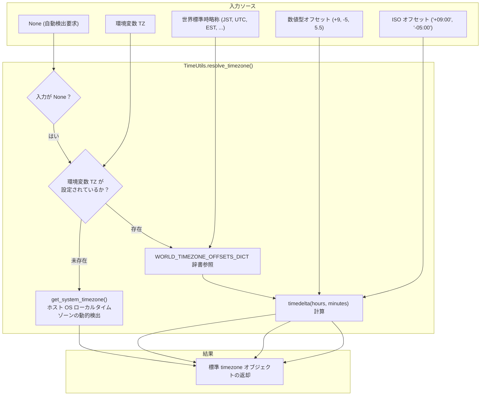

# 5.1. ホストシステムタイムゾーン検出、世界標準時解決および日時正規化 (`TimeUtils`)

> **所属モジュール**: `agent_common.utils.TimeUtils`  
> **中核メソッド**: `get_system_timezone()`, `get_system_timezone_offset_str()`, `resolve_timezone()`, `format_timezone_offset()`, `parse_datetime()`  
> **中核データ**: `WORLD_TIMEZONE_OFFSETS_DICT` (世界主要標準タイムゾーンオフセット辞書)  
> **導入バージョン**: `v0.4.69` (コアユーティリティ分離), `v0.4.74` (`parse_datetime` サポート)

---

## 1. 概要およびエンタープライズにおける背景

エンタープライズハイブリッドクラウド環境では、同一のデータパイプラインが複数の異なるインフラ環境で実行されます:
- **オンプレミスレガシーバッチサーバー**: ホスト OS が現地時間（JST/KST, UTC+9）で構成されている
- **Kubernetes ベースの Airflow / クラウド Pod**: コンテナの標準タイムゾーンが協定世界時（UTC, UTC+0）で稼働している

時間処理ロジックが特定タイムゾーンを静的に前提としたり、安易に `datetime.now()`（naive datetime）を使用すると以下の障害が発生します:
1. **深夜バッチの日付巻き戻り**: 深夜帯に実行された Pod が UTC 基準の前日日付でパーティションフォルダを作成し、データが誤ったフォルダへ格納される。
2. **BigQuery TIMESTAMP 誤差**: タイムゾーンオフセットが欠落したまま投入され、9時間の時差歪みが発生する。
3. **グローバルデータ収集の混乱**: 各地域（EST, CET, JST 等）から流入する日時データを単一基準で整合性をもって正規化できない。

`TimeUtils` は、ホスト OS の実際のタイムゾーンを実行時に自動検出し、世界標準タイムゾーン略称および任意のオフセットを標準 `timezone` オブジェクトへ変換し、すべての形式の日時データを **`timezone-aware datetime` へと正規化するコア時間インフラユーティリティ**です。

---

## 2. 時間インフラアーキテクチャおよび正規化パイプライン



---

## 3. 世界主要標準タイムゾーン辞書 (`WORLD_TIMEZONE_OFFSETS_DICT`)

`TimeUtils` はサマータイム (DST) を含む主要な標準タイムゾーン略称を内蔵しています:

| 地域 / エリア | サポート略称 | UTC オフセット | 代表都市 / 備考 |
| :--- | :--- | :---: | :--- |
| **標準時** | `UTC`, `GMT`, `Z` | UTC+0 | 協定世界時、グリニッジ標準時 |
| **アジア / オセアニア** | `JST`, `KST` | UTC+9 | 東京、ソウル (日本/韓国標準時) |
| | `CST_ASIA`, `HKT`, `SGT` | UTC+8 | 北京、香港、シンガポール |
| | `IST` | UTC+5:30 | ニューデリー (インド標準時) |
| | `ICT` | UTC+7 | バンコク、ハノイ |
| | `AEST` / `AEDT` | UTC+10 / UTC+11 | シドニー (豪州東部標準時 / 夏時間) |
| **ヨーロッパ** | `CET` / `CEST` | UTC+1 / UTC+2 | パリ、ベルリン (中央欧州標準時 / 夏時間) |
| | `WET` / `WEST` | UTC+0 / UTC+1 | ロンドン (西欧標準時 / 夏時間) |
| **北米** | `EST` / `EDT` | UTC-5 / UTC-4 | ニューヨーク (東部標準時 / 夏時間) |
| | `CST` / `CDT` | UTC-6 / UTC-5 | シカゴ (中部標準時 / 夏時間) |
| | `PST` / `PDT` | UTC-8 / UTC-7 | ロサンゼルス (太平洋標準時 / 夏時間) |

---

## 4. 主要メソッド仕様

### 4.1. ホストシステムタイムゾーン動的検出 (`get_system_timezone`)
- 現在の Python プロセスが実行されている OS カーネル/コンテナの実際のローカルタイムゾーンを動的に取得します。

### 4.2. システムタイムゾーンオフセット文字列 (`get_system_timezone_offset_str`)
- 現在環境の ISO 8601 コロン区切りオフセット文字列（`'+09:00'`, `'+00:00'` 等）を返却します。

### 4.3. 汎用タイムゾーンリゾルバー (`resolve_timezone`)
- 文字列（略称、数値文字列）、数値、`None` などを解釈し、標準 `timezone` オブジェクトへ変換します。

### 4.4. 日時正規化 (`parse_datetime`)
- 各種日時（naive/aware datetime, ISO 8601 文字列）を timezone-aware な `datetime` オブジェクトへ一貫して正規化します。

---

## 5. 実践コード例

```python
from agent_common.utils import TimeUtils
from datetime import datetime

# 1. 自動検出
sys_tz = TimeUtils.resolve_timezone()
print(f"システムタイムゾーン: {sys_tz}")
print(f"オフセット文字列: {TimeUtils.get_system_timezone_offset_str()}")

# 2. 世界標準時略称の解決
jst_tz = TimeUtils.resolve_timezone("JST")
est_tz = TimeUtils.resolve_timezone("EST")
print(f"JST: {jst_tz}")  # UTC+09:00
print(f"EST: {est_tz}")  # UTC-05:00

# 3. 日時の timezone-aware 正規化
inputs = [
    "2026-09-18T20:30:00Z",
    "2026-09-18 20:30:00+09:00",
    datetime(2026, 9, 18, 20, 30, 0),
]

for item in inputs:
    normalized_dt = TimeUtils.parse_datetime(item)
    print(f"正規化結果: {normalized_dt}")
```

---

## 6. `DateTimeUtils` との協調およびベストプラクティス

1. **レイヤーの分離**:
   - `TimeUtils`: タイムゾーン演算と解析を担う**中核基盤エンジン**。
   - `DateTimeUtils`: `TimeUtils` を利用してテンプレートや DB 格納に必要な**書式文字列（`YYYYMMDD` 等）を生成するツール**。
2. **コンテナ環境の推奨設定**:
   - Dockerfile や Pod 定義に `ENV TZ=Asia/Tokyo` を設定することで、深夜帯の集計時における日付の不整合を完全に防止できます。
