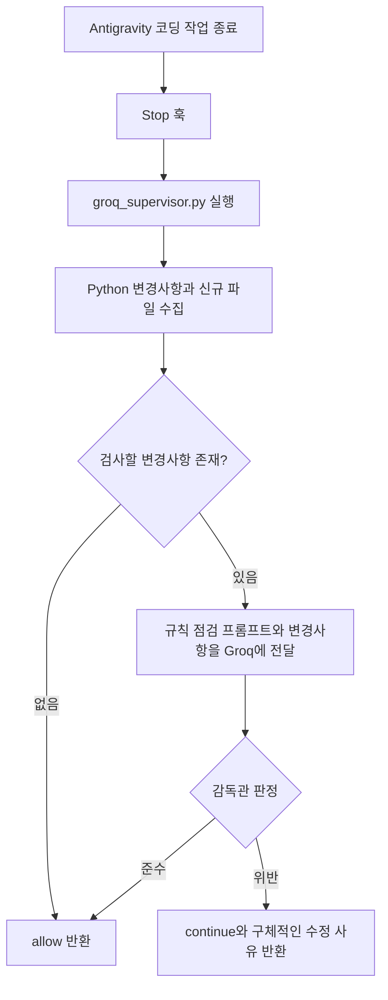

# 7.6. Groq 감독관 AI 및 Antigravity Stop 훅

[LLM 매뉴얼 전체 목록](01_unified_llm_client_ko.md)

> 설정 준비와 최소 호출은 [7.1 모델 프로필 관리 및 텍스트 생성](01_model_profiles_and_generation_ko.md)을 먼저 참고하세요.

## 1. 활용 사례: 코딩 AI를 검토하는 Groq 감독관 AI

### 실제 사용 목적과 연결 구조

Antigravity에서 코딩 AI가 작성한 코드의 실수와 `AGENTS.md` 규칙 위반을 별도의 감독관 AI로 검토하는 사례입니다. 작성 AI가 작업을 마칠 때 Groq의 `openai/gpt-oss-120b` 모델에 Python 변경사항을 전달하고, 규칙을 지켰으면 승인, 위반이 있으면 구체적인 수정 사유를 반환합니다. 작성 모델과 검토 모델의 역할을 나누는 방식이며, 작성 모델 종류에 종속되지 않습니다.

참조한 워크스페이스 파일은 `.agents/hooks.json`과 `scripts/groq_supervisor.py`입니다. 이 파일들은 사용 프로젝트의 구성으로, `agent-common` 설치 시 제공되는 파일은 아닙니다. 현재 감독관 스크립트는 `urllib.request`로 Groq API를 직접 호출하며 `LlmClient`를 사용하지 않습니다. 아래에서는 실제 사례와 공통 클라이언트로 구현할 때의 적용 범위를 구분합니다.



### 프로젝트의 Stop 훅 예시

사용 중인 `.agents/hooks.json` 구성은 다음과 같습니다. `venv313`과 `scripts/groq_supervisor.py` 경로는 이 프로젝트의 배치 구조에 맞춘 값입니다. 다른 프로젝트에서는 가상환경, 스크립트 위치, 훅의 작업 디렉터리를 확인해 조정해야 합니다. 이 예시는 해당 프로젝트 구성이며 모든 편집기가 같은 훅 형식을 지원한다는 의미는 아닙니다.

```json
{
  "groq-agents-supervisor": {
    "enabled": true,
    "Stop": [
      {
        "type": "command",
        "command": "cmd /c \"if exist .\\venv313\\Scripts\\python.exe ( .\\venv313\\Scripts\\python.exe scripts\\groq_supervisor.py ) else ( cd .. && .\\venv313\\Scripts\\python.exe scripts\\groq_supervisor.py )\"",
        "timeout": 60
      }
    ]
  }
}
```

### 감독관이 검사하는 내용

현재 스크립트는 `git diff HEAD -- *.py`로 추적 중인 Python 변경사항을 가져오고, 추적되지 않은 Python 파일 내용도 추가합니다. 따라서 입력은 현재 턴만의 변경사항으로 제한되지 않고 **HEAD 이후 아직 커밋하지 않은 변경사항 전체**입니다. 신규 파일 수집에서는 감독관 스크립트 자체를 제외합니다.

시스템 프롬프트에는 `AGENTS.md`에서 정리한 다음 점검 항목을 담습니다.

- 변수·인자·로깅 키의 타입 접미사
- 신규 Python 파일의 표준 헤더와 한글 모듈 설명
- 클래스·함수의 한글 docstring과 인자·반환값·예외 설명
- `print()` 대신 공통 로거 사용
- 설정값·경로·URL·인증정보의 코드 하드코딩 여부
- 중첩 함수 사용 여부
- HTTP 호출에서 표준 라이브러리 우선 사용

부분 diff에 보이지 않는 기존 헤더를 누락으로 판정하지 않도록 하고, 공식 특수 변수·허용된 객체 참조·기본 설정 스키마를 잘못 지적하지 않도록 예외 기준도 전달합니다. 현재 구현은 `AGENTS.md` 원문을 매번 읽는 방식이 아니라 **코드에 작성된 핵심 규칙 프롬프트**를 사용합니다. 규칙이 변경되면 이 프롬프트도 함께 갱신해야 합니다.

### 반환 결과와 실제 검사 범위

```json
{"decision": "allow", "reason": "AGENTS.md 규칙 검증 통과"}
```

```json
{"decision": "continue", "reason": "수정한 파일의 함수 인자에 타입 접미사가 누락되었습니다. 해당 인자와 호출부를 수정하세요."}
```

`continue`는 수정 요청을 전달하는 판정이며 스크립트가 직접 파일을 수정하지는 않습니다. 훅의 stdout에는 판정 JSON을 출력합니다. 이는 일반 실행 로그와 구분되는 훅 결과 전달 통로입니다.

현재 스크립트는 API 키 누락·통신 실패·응답 처리 실패 시에도 `allow`와 검사 생략 사유를 반환합니다. 따라서 `allow`만으로 실제 검토를 통과했다고 해석하지 말고 `reason`도 확인해야 합니다. 입력 메시지는 4,000자를 넘으면 잘리므로 대규모 변경 전체를 검사하지 못할 수 있습니다. Markdown·YAML 등 Python 이외의 파일도 검사 대상에 포함되지 않습니다.

일부 API 오류에는 다른 외부 모델로 재시도합니다. 이는 감독관 스크립트가 별도로 구현한 동작이며 `LlmClient`의 `auto` 모드와는 다릅니다. 훅 제한 시간은 60초이고 API 호출별 제한도 60초이므로, 여러 모델 재시도가 훅 제한 안에 끝난다고 보장할 수 없습니다.

### `agent_common.llm`으로 구현할 때

같은 감독관을 새로 만들 때는 **변경사항 수집 → 규칙 프롬프트 구성 → `LlmClient.generate()` 호출 → 판정 JSON 검증 → 훅 결과 반환**으로 역할을 나눌 수 있습니다. 패키지의 `groq_gpt_oss` 프로필은 Groq API, `GROQ_API_KEY`, `openai/gpt-oss-120b`를 지정하고 있습니다. 사용 프로젝트 설정으로 해당 프로필을 조정할 수 있습니다.

```yaml
llm:
  router_model_str: groq_gpt_oss

supervisor:
  purpose_str: router
```

다음은 감독관에서 LLM 호출을 담당하는 부분입니다. `review_prompt_str`과 `review_system_prompt_str`은 앞 단계에서 변경사항과 규칙으로 구성한 문자열입니다.

```python
from agent_common.config_loader import config
from agent_common.llm import LlmClient

supervisor_client_obj = LlmClient(purpose_str=config.supervisor.purpose_str)
review_response_str = supervisor_client_obj.generate(
    prompt_str=review_prompt_str,
    system_prompt_str=review_system_prompt_str,
)
```

`LlmClient`가 반환하는 것은 문자열입니다. 현재 클라이언트에는 감독관의 `response_format: {"type": "json_object"}` 옵션이나 외부 후보 모델 재시도 기능이 없습니다. JSON 응답 지시만으로 형식이 보장되지는 않으므로, 호출 애플리케이션에서 JSON 해석과 `decision`·`reason`의 타입 및 허용값 검증을 수행해야 합니다. `None`, 잘못된 JSON, API 실패를 승인으로 볼지 재검토로 볼지도 명시적으로 정합니다.

먼저 단일 모델로 작은 diff 한 건의 판정을 확인한 다음 훅 연결, 전체 규칙 반영, 큰 변경사항 분할, 재시도 등을 단계적으로 추가하세요. 현재 감독관의 직접 호출 코드를 그대로 대체하면 모든 동작이 같아진다고 가정하지 마세요. 현재 스크립트의 인증서 검증 비활성화 설정도 `LlmClient`가 제공하는 기능이 아닙니다.

## 2. AI에게 개발을 요청하는 예시

```text
코딩 AI의 Python 변경사항이 AGENTS.md를 지키는지 검사하는 Groq 감독관 AI를 만들어줘.
https://pypi.org/project/agent-common/
https://github.com/kampores/agent_common

README 7.1, 7.2, 7.5, 7.6과 각 항목의 상세 매뉴얼을 참고해줘.
이 매뉴얼의 Antigravity Stop 훅 활용 사례를 참고해줘.
먼저 Groq 모델 하나로 작은 diff와 규칙을 보내고 판정 응답을 받는 최소 기능부터 구현해줘.
상세 매뉴얼과 실제 API 사용법을 확인하고, 빠진 요구사항은 질문해줘.
판정 JSON의 decision과 reason을 검증하고, 검사 실패 시 처리 정책은 먼저 확인해줘.
최소 기능을 확인한 뒤 Stop 훅 연결과 필요한 부가기능을 단계적으로 추가해줘.
```
