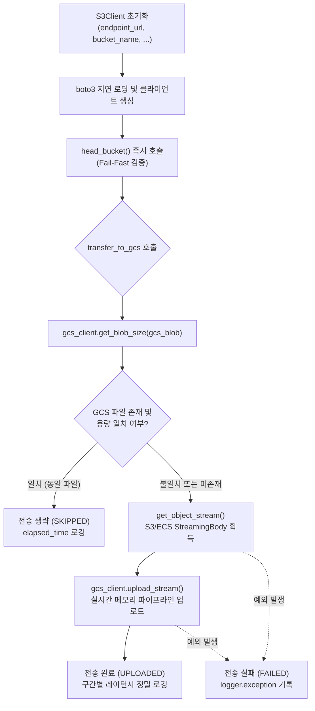

# 3.1. AWS S3 및 Dell ECS 오브젝트 스토리지 클라이언트 (`S3Client`)

> **소속 모듈**: `agent_common.clients.S3Client`  
> **핵심 메서드**: `list_objects()`, `get_object_stream()`, `get_object_size()`, `transfer_to_gcs()`  
> **의존 패키지**: `boto3>=1.26.0`, `botocore`

---

## 1. 개요 및 엔터프라이즈 배경

엔터프라이즈 하이브리드 클라우드 환경에서는 퍼블릭 클라우드인 **AWS S3**뿐만 아니라 온프레미스 오브젝트 스토리지인 **Dell ECS(Elastic Cloud Storage)**를 함께 활용하여 대용량 데이터를 저장 및 이관합니다. 

`agent_common.clients.S3Client`는 AWS S3 표준 API 규격을 준수하는 모든 오브젝트 스토리지 시스템을 단일 인터페이스로 제어하는 통합 클라이언트입니다.

특히 다음과 같은 엔터프라이즈 요구사항을 완벽히 충족하도록 설계되었습니다:
1. **서드파티 SDK 지연 로딩(Lazy Loading)**: `boto3` 모듈을 전역이 아닌 사용 시점에 임포트하여 불필요한 메모리 점유를 방지하고 경량 환경 기동을 보장합니다.
2. **연결 및 권한 조기 검증 (Fail-Fast)**: 초기화 즉시 `head_bucket()`을 호출하여 네트워크 장애나 버킷 권한 문제를 사전에 감지하고 즉시 차단합니다.
3. **대용량 페이징 제너레이터**: 수백만 건의 오브젝트를 메모리 고갈(OOM) 없이 안전하게 스트리밍 순회(`yield`)합니다.
4. **GCS 무복사 파이프라인 전송 및 스마트 스킵**: 로컬 디스크 I/O 없이 S3/ECS에서 GCS로 메모리 파이프라인 스트리밍 업로드를 수행하며, 목적지에 동일 크기의 파일이 이미 존재하는 경우 네트워크 대역폭 낭비를 방지하기 위해 스마트 스킵(Skip)합니다.

---

## 2. 핵심 아키텍처 및 전송 파이프라인



---

## 3. 주요 메서드 및 기능 규격

### 3.1. 생성자 (`__init__`)
```python
def __init__(
    self,
    endpoint_url_str: str | None = None,
    access_key_str: str | None = None,
    secret_key_str: str | None = None,
    bucket_name_str: str = "",
    timeout_seconds_int: int | None = None,
    region_name_str: str | None = None,
) -> None
```
- **파라미터 설명**:
  - `endpoint_url_str`: Dell ECS 등 온프레미스 엔드포인트 URL (AWS S3 기본 사용 시 `None` 또는 생략)
  - `access_key_str`: S3 Access Key ID (AWS IAM Role 환경 시 생략 가능)
  - `secret_key_str`: S3 Secret Access Key (AWS IAM Role 환경 시 생략 가능)
  - `bucket_name_str`: 조회 및 전송 대상 버킷명 (**필수**)
  - `timeout_seconds_int`: 네트워크 소켓 연결 및 읽기 제한 시간 (미지정 시 `config.transfer.timeout_seconds_int` 참조)
  - `region_name_str`: AWS 리전명 (예: `'ap-northeast-2'`)
- **Fail-Fast 검증**: 초기화 시 `head_bucket` 검사를 수행하여 버킷 미존재 또는 인증 실패 시 `ConnectionError`를 발생시킵니다.

### 3.2. 오브젝트 페이징 목록 조회 (`list_objects`)
```python
def list_objects(self, prefix_str: str = "") -> Generator[Dict[str, Any], None, None]
```
- `boto3`의 `list_objects_v2` Paginator를 기반으로 동작하며, 대량의 객체 메타데이터를 메모리에 일괄 적재하지 않고 `yield` 제너레이터로 안전하게 반환합니다.

### 3.3. 오브젝트 스트림 획득 (`get_object_stream`)
```python
def get_object_stream(self, key_str: str = "") -> Any
```
- 대상 키의 S3/ECS `StreamingBody` 스트림 객체를 반환합니다. 디스크에 임시 파일을 쓰지 않고 곧바로 후속 파이프라인(GCS 전송, 압축 해제 등)에 연결할 수 있습니다.

### 3.4. 오브젝트 크기 조회 (`get_object_size`)
```python
def get_object_size(self, key_str: str = "") -> int | None
```
- `head_object` 호출을 통해 본문을 다운로드하지 않고 객체의 메타데이터 헤더(`ContentLength`)만 초고속으로 조회합니다.

### 3.5. GCS 파이프라인 전송 및 스마트 스킵 (`transfer_to_gcs`)
```python
def transfer_to_gcs(
    self,
    gcs_client_obj: GcsClient,
    s3_key_str: str = "",
    gcs_blob_name_str: str = "",
    size_int: int = 0,
) -> str
```
- **동작 절차**:
  1. GCS 목적지의 기존 블롭 크기를 조회합니다.
  2. 크기가 일치하면 네트워크 복사를 건너뛰고 `"SKIPPED"`를 반환합니다.
  3. 신규 또는 크기 불일치 파일은 S3 `StreamingBody` 스트림을 열어 GCS로 즉시 스트리밍 업로드하고 `"UPLOADED"`를 반환합니다.
  4. 실패 시 예외를 로깅하고 `"FAILED"`를 반환합니다.
- **성능 로깅**: `CheckTime`, `S3StreamTime`, `GCSUploadTime`, `TotalElapsed` 등 각 전송 단계별 소요 시간을 단일 행 구조화 로그로 자동 기록합니다.

---

## 4. 실전 사용 예시

### 4.1. Dell ECS 및 AWS S3 클라이언트 초기화
```python
from agent_common.clients import S3Client

# 1) 온프레미스 Dell ECS 클라이언트 구성
ecs_client = S3Client(
    endpoint_url_str="https://ecs.mycorp.internal:9021",
    access_key_str="MY_ECS_ACCESS_KEY",
    secret_key_str="MY_ECS_SECRET_KEY",
    bucket_name_str="raw-lake-bucket",
    timeout_seconds_int=60,
)

# 2) AWS S3 클라이언트 구성 (IAM Role 환경)
s3_client = S3Client(
    bucket_name_str="my-aws-s3-bucket",
    region_name_str="ap-northeast-2",
)
```

### 4.2. 대용량 오브젝트 목록 순회 및 GCS 실시간 전송
```python
from agent_common.clients import S3Client, GcsClient

s3_client = S3Client(
    endpoint_url_str="https://ecs.company.com:9021",
    access_key_str="ACCESS_KEY",
    secret_key_str="SECRET_KEY",
    bucket_name_str="source-bucket",
)

gcs_client = GcsClient(
    bucket_name_str="target-gcs-bucket",
    credentials_path_str="secrets/gcp_sa_key.json",
)

# 특정 일자 디렉터리 하위 객체 목록 순회 및 전송
target_prefix_str = "raw/events/2026/08/24/"

for obj_dict in s3_client.list_objects(prefix_str=target_prefix_str):
    s3_key_str: str = obj_dict["Key"]
    size_int: int = obj_dict["Size"]
    gcs_blob_str: str = f"lake/{s3_key_str.lstrip('/')}"
    
    # GCS 스마트 전송 (기존 동일 파일 스킵 및 메모리 스트리밍 전송)
    result_status_str = s3_client.transfer_to_gcs(
        gcs_client_obj=gcs_client,
        s3_key_str=s3_key_str,
        gcs_blob_name_str=gcs_blob_str,
        size_int=size_int,
    )
    print(f"[{result_status_str}] {s3_key_str} -> {gcs_blob_str} ({size_int:,} bytes)")
```

---

## 5. 예외 처리 및 장애 대응 가이드

| 발생 예외 | 주요 발생 원인 | 조치 방안 |
| :--- | :--- | :--- |
| `ImportError: 'boto3' 패키지가 필요합니다` | 실행 환경에 `boto3` 라이브러리가 미설치됨 | `pip install agent_common[clients]` 또는 `pip install boto3` 설치 |
| `ValueError: S3/ECS 버킷명은 필수 입력 항목입니다` | `bucket_name_str`이 누락되었거나 빈 문자열임 | 올바른 버킷명을 필수 인자로 전달 |
| `ConnectionError: connection_failed` | 엔드포인트 URL 오기입, 네트워크 차단, 버킷 권한(403) 없음 | 엔드포인트 도달 가능 여부(`curl -k`) 및 IAM Access/Secret Key 권한 확인 |
| `RuntimeError: list_failed` | 객체 목록 조회 도중 네트워크 타임아웃 또는 세션 만료 | `timeout_seconds_int` 증가 및 네트워크 프록시/방화벽 설정 확인 |
| `RuntimeError: transfer_failed` | 객체 스트림 획득 또는 GCS 전송 중 소켓 연결 끊김 | 자동 재시도 로직 적용 및 원천 스토리지의 객체 무결성 점검 |
