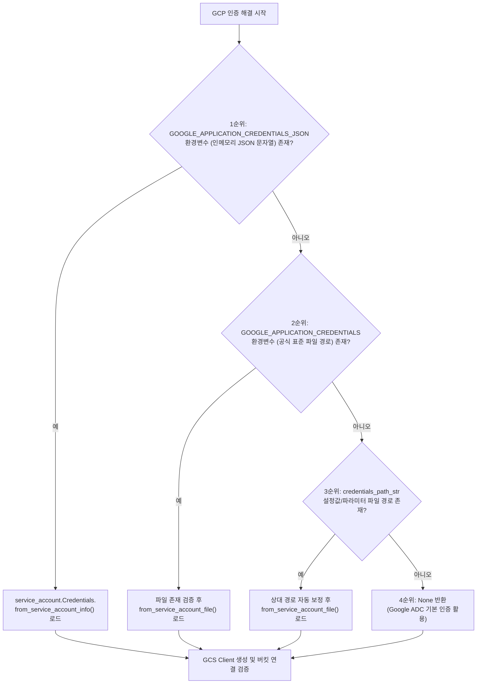

# 3.2. Google Cloud Storage 스트리밍 클라이언트 및 멀티 계층 인증 (`GcsClient`)

> **소속 모듈**: `agent_common.clients.GcsClient`  
> **핵심 메서드**: `get_blob_size()`, `upload_stream()`, `_resolve_gcp_credentials()`  
> **의존 패키지**: `google-cloud-storage>=2.10.0`, `google-auth`

---

## 1. 개요 및 엔터프라이즈 배경

Google Cloud Storage(GCS)는 빅데이터 레이크 및 BigQuery 분석 파이프라인의 핵심 관문 저장소입니다. 

엔터프라이즈 데이터 엔지니어링 및 자율 에이전트 환경에서는 다양한 실행 인프라(로컬 개발 PC, 사내 온프레미스 Airflow 서버, Google Cloud Compute Engine, GKE 컨테이너 등)에 따라 인증 자격 증명(Credentials)을 주입하는 방식이 서로 상이합니다. 또한 기가바이트(GB) 단위 이상의 대용량 파일을 처리할 때 로컬 디스크나 메모리에 전체 파일을 버퍼링하면 메모리 부족(OOM)이나 디스크 풀(Disk Full) 장애가 발생합니다.

`agent_common.clients.GcsClient`는 **4단계 우선순위 기반 유연한 GCP 인증 체계**와 **순수 스트리밍 업로드 파이프라인**을 제공하여 안정적인 클라우드 스토리지 전송을 보장합니다.

---

## 2. 4단계 서비스 계정 인증 우선순위 아키텍처

`GcsClient` 및 내부 `_resolve_gcp_credentials()` 함수는 다음의 4단계 우선순위에 따라 GCP 인증 객체(`google.auth.credentials.Credentials`)를 안전하게 해결합니다:



### 인증 단계별 세부 규칙:
1. **1순위 (`GOOGLE_APPLICATION_CREDENTIALS_JSON`)**:
   - 보안 컨테이너 환경이나 CI/CD 파이프라인에서 물리적인 키 파일을 디스크에 저장하지 않고, 환경변수에 주입된 원시 JSON 문자열로부터 직접 메모리 인증 객체를 생성합니다.
2. **2순위 (`GOOGLE_APPLICATION_CREDENTIALS`)**:
   - Google 공식 표준 환경변수로 지정된 서비스 계정 키 파일(`.json`)의 절대/상대 경로를 해석합니다.
3. **3순위 (`credentials_path_str`)**:
   - `config.yml`의 설정값이나 생성자 파라미터로 명시 전달된 키 파일 경로를 사용합니다. 상대 경로일 경우 프로젝트 루트(`ConfigLoader.project_path`)를 기준으로 자동 보정됩니다.
4. **4순위 (Google ADC - Application Default Credentials)**:
   - GKE Workload Identity, GCE 메타데이터 서버, 또는 `gcloud auth application-default login` 세션을 통한 자동 기본 인증을 사용합니다.

---

## 3. 주요 메서드 및 기능 규격

### 3.1. 생성자 (`__init__`)
```python
def __init__(
    self,
    bucket_name_str: str = "",
    credentials_path_str: str = "",
    timeout_seconds_int: int | None = None,
) -> None
```
- **파라미터**:
  - `bucket_name_str`: 연결할 GCS 버킷 이름 (**필수**)
  - `credentials_path_str`: 서비스 계정 키 파일 경로 (생략 시 환경변수 또는 ADC 자동 탐색)
  - `timeout_seconds_int`: GCS 소켓 연결 및 업로드 제한 시간 (미지정 시 `config.transfer.timeout_seconds_int` 참조)
- **동작**:
  - `_get_gcs()`를 통한 라이브러리 지연 로딩
  - 4단계 인증 해결 후 `storage.Client` 초기화
  - `client.get_bucket(bucket_name, timeout=...)`을 호출하여 버킷 존재 및 권한 상태 즉시 검증 (Fail-Fast)

### 3.2. 블롭 존재 및 크기 조회 (`get_blob_size`)
```python
def get_blob_size(self, destination_blob_name_str: str = "") -> int | None
```
- 지정된 경로의 GCS Blob 객체 메타데이터를 조회하여 파일의 바이트 크기(`int`)를 반환합니다.
- 대상 Blob이 존재하지 않는 경우 `None`을 반환합니다.

### 3.3. 스트림 직접 업로드 (`upload_stream`)
```python
def upload_stream(
    self,
    stream_any: Any = None,
    destination_blob_name_str: str = "",
    size_int: int = 0,
    timeout_int: int | None = None,
) -> None
```
- 원천 스토리지(S3, ECS, HTTP 응답, 메모리 버퍼 등)로부터 전달받은 스트림 객체를 GCS Blob으로 직접 업로드합니다.
- `blob.upload_from_file(stream, size=size_int, timeout=...)` 방식을 채택하여, 메모리에 전체 데이터를 적재하지 않고 지정된 크기만큼 순차 전송합니다.
- 전송 실패 시 원천 예외를 상세 로깅하고 `RuntimeError`를 발생시킵니다.

---

## 4. 실전 사용 예시

### 4.1. 서비스 계정 인증 파일 기반 초기화
```python
from agent_common.clients import GcsClient

# 명시적 서비스 계정 키 파일을 이용한 초기화
gcs_client = GcsClient(
    bucket_name_str="my-enterprise-data-lake",
    credentials_path_str="config/secrets/gcp_sa_key.json",
    timeout_seconds_int=120,
)
```

### 4.2. 환경변수/인메모리 JSON 기반 초기화 (GKE/Kubernetes 권장)
```bash
# 컨테이너 구동 시 인메모리 환경변수 주입
export GOOGLE_APPLICATION_CREDENTIALS_JSON='{"type": "service_account", "project_id": "my-project", ...}'
```

```python
from agent_common.clients import GcsClient

# credentials_path_str를 비워두면 자동으로 환경변수의 JSON을 파싱하여 인증
gcs_client = GcsClient(bucket_name_str="my-enterprise-data-lake")
```

### 4.3. 메모리 스트림 또는 파일 객체 직접 업로드
```python
import io
from agent_common.clients import GcsClient

gcs_client = GcsClient(bucket_name_str="analytics-bucket")

# 1) 메모리 바이트 스트림 업로드
raw_data_bytes = b'{"event_id": "EVT_1001", "status": "SUCCESS"}\n'
stream_obj = io.BytesIO(raw_data_bytes)
target_blob_str = "events/2026/08/24/event_1001.json"

gcs_client.upload_stream(
    stream_any=stream_obj,
    destination_blob_name_str=target_blob_str,
    size_int=len(raw_data_bytes),
)

# 2) 업로드된 파일 크기 확인
uploaded_size_int = gcs_client.get_blob_size(target_blob_str)
print(f"업로드 완료 확인: {target_blob_str} ({uploaded_size_int} bytes)")
```

---

## 5. 예외 처리 및 장애 대응 가이드

| 발생 예외 | 주요 발생 원인 | 조치 방안 |
| :--- | :--- | :--- |
| `ImportError: 'google-cloud-storage' 패키지가 필요합니다` | GCS SDK 미설치 상태 | `pip install agent_common[clients]` 또는 `pip install google-cloud-storage` 실행 |
| `ValueError: GCS 버킷명은 필수 입력 항목입니다` | `bucket_name_str`이 누락되었거나 공백임 | 유효한 버킷 이름을 필수로 입력 |
| `FileNotFoundError: 인증키 파일을 찾을 수 없습니다` | `credentials_path_str` 경로에 파일이 존재하지 않음 | 파일 경로 확인 및 프로젝트 루트 상대 경로 정합성 점검 |
| `ValueError: 인메모리 JSON 인증 객체 생성 실패` | `GOOGLE_APPLICATION_CREDENTIALS_JSON` JSON 파싱 실패 | 환경변수에 주입된 JSON 문자열의 문법 및 이스케이프 상태 점검 |
| `ConnectionError: connection_failed (403 Forbidden)` | 서비스 계정에 Storage Object Admin 권한 부재 | GCP IAM 콘솔에서 해당 버킷에 대한 읽기/쓰기 역할 부여 |
| `RuntimeError: transfer_failed` | 대용량 전송 중 타임아웃 초과 또는 네트워크 차단 | `timeout_seconds_int` 값 상향 조정 및 프록시(`NO_PROXY`) 설정 점검 |
