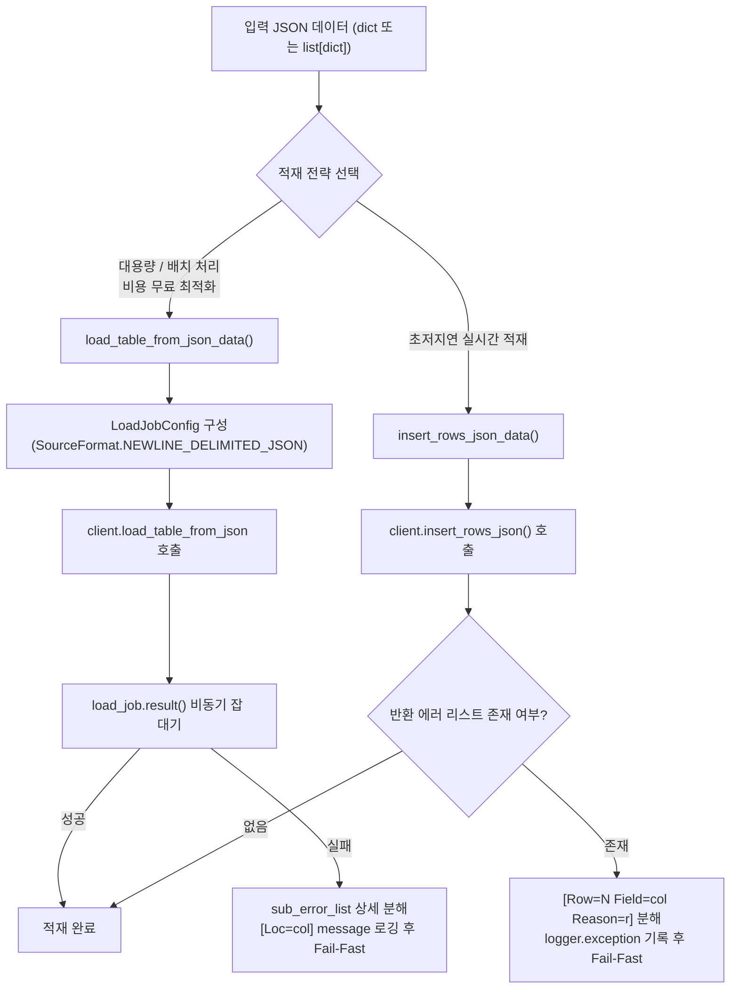

# 3.3. BigQuery 배치 및 스트리밍 적재 클라이언트 (`BigQueryClient`)

> **소속 모듈**: `agent_common.clients.BigQueryClient`  
> **핵심 메서드**: `load_table_from_json_data()`, `insert_rows_json_data()`, `query()`, `get_existing_keys()`  
> **의존 패키지**: `google-cloud-bigquery>=3.10.0`, `google-auth`

---

## 1. 개요 및 엔터프라이즈 배경

Google Cloud BigQuery는 페타바이트급 정형/반정형 데이터를 실시간으로 분석할 수 있는 서버리스 데이터 웨어하우스(DW)입니다.

파이프라인의 성격에 따라 BigQuery에 데이터를 적재하는 전략은 크게 두 가지로 나뉩니다:
1. **배치 로드 (Batch Load - `load_table_from_json_data`)**: 대용량 JSON 레코드 세트를 파일/벌크 형태로 무료(BigQuery 적재 무료 슬롯)로 고속 적재하는 방식.
2. **스트리밍 인서트 (Streaming Ingestion - `insert_rows_json_data`)**: 단건 또는 수십 건 단위의 이벤트를 실시간으로 즉시 조회 가능하도록 적재하는 방식.

`agent_common.clients.BigQueryClient`는 두 가지 적재 방식을 모두 지원하며, 적재 실패 시 원인을 규명하기 어려운 BigQuery의 중첩 에러(`errors` 배열, 컬럼 위치 `location`, 사유 `reason`)를 완벽하게 분해하여 단일 행 구조화 로그로 기록합니다. 또한 데이터 중복 적재를 방지하기 위해 기존 키 목록을 Set으로 빠르게 조회하는 유틸리티 메서드를 제공합니다.

---

## 2. 배치 로드 vs 스트리밍 인서트 비교



| 항목 | 배치 로드 (`load_table_from_json_data`) | 스트리밍 인서트 (`insert_rows_json_data`) |
| :--- | :--- | :--- |
| **기반 BigQuery API** | `client.load_table_from_json()` (Job 기반) | `client.insert_rows_json()` (Streaming API) |
| **비용** | BigQuery 무료 적재 할당량 사용 | MB당 스트리밍 과금 발생 |
| **데이터 가시성** | 잡 완료 즉시 가시화 (수 초 소요) | 수 밀리초 내 실시간 조회 가능 |
| **테이블 덮어쓰기** | `WRITE_TRUNCATE`, `WRITE_APPEND` 지원 | `WRITE_APPEND`만 지원 |
| **권장 사용처** | 일/시간 단위 배치 ETL, 대량 마이그레이션 | 실시간 이벤트 수집, 센서 데이터 수집 |

---

## 3. 주요 메서드 및 기능 규격

### 3.1. 생성자 (`__init__`)
```python
def __init__(
    self,
    project_id_str: str = "",
    dataset_id_str: str = "",
    table_id_str: str = "",
    credentials_path_str: str = "",
    timeout_seconds_int: int | None = None,
    ignore_unknown_values_bool: bool | None = None,
) -> None
```
- **초기화 및 스키마 사전 검증 (Fail-Fast)**:
  - `_resolve_gcp_credentials()`를 통한 4단계 인증 해결.
  - `GOOGLE_CLOUD_PROJECT` 환경변수가 설정되어 있는 경우 프로젝트 ID 자동 오버라이드.
  - 초기화 시점에 `client.get_table()`을 호출하여 대상 데이터셋 및 테이블의 존재 여부와 컬럼 스키마를 사전 캐싱(`self.table_obj`).

### 3.2. JSON 배치 테이블 적재 (`load_table_from_json_data`)
```python
def load_table_from_json_data(
    self,
    json_data_any: Any,
    timeout_int: int | None = None,
    ignore_unknown_values_bool: bool | None = None,
    write_disposition_str: str | None = None,
) -> None
```
- **파라미터**:
  - `json_data_any`: 적재할 단일 `dict` 또는 `list[dict]`
  - `timeout_int`: 적재 작업 제한 시간(초)
  - `ignore_unknown_values_bool`: 테이블 스키마에 정의되지 않은 필드 무시 여부 (기본값: `config.bigquery.ignore_unknown_values_bool` -> `True`)
  - `write_disposition_str`: `'WRITE_APPEND'`(추가) 또는 `'WRITE_TRUNCATE'`(덮어쓰기)
- **에러 분해**: 실패 시 `load_exc.errors` 리스트를 파싱하여 `[Loc=컬럼명] 상세원인` 형태로 조립, 단일 행 로그로 출력 후 `RuntimeError` 발생.

### 3.3. 실시간 스트리밍 인서트 (`insert_rows_json_data`)
```python
def insert_rows_json_data(
    self,
    json_data_any: Any,
    timeout_int: int | None = None,
    ignore_unknown_values_bool: bool | None = None,
) -> None
```
- BigQuery Streaming API를 통해 행 데이터를 즉시 삽입합니다.
- API 응답 내 에러가 반환될 경우 행 인덱스, 필드명, 원인 사유(`[Row=N Field=col Reason=r]`)를 추출하여 상세 진단 에러를 발생시킵니다.

### 3.4. 범용 SQL 쿼리 실행 (`query`)
```python
def query(self, query_str: str, timeout_int: int | None = None) -> list[dict[str, Any]]
```
- 임의의 BigQuery SQL 쿼리를 동기 실행하고, 결과 레코드를 딕셔너리 리스트(`list[dict]`)로 직렬화하여 반환합니다.

### 3.5. 중복 방지 키 집합 조회 (`get_existing_keys`)
```python
def get_existing_keys(self, field_name_str: str = "recvPath") -> set[str]
```
- 대상 테이블에서 특정 컬럼(예: 원천 파일 경로 `recvPath` 또는 S3 키 `ecs_key`)의 고유 값 목록을 조회하여 파이썬 `set[str]` 구조로 반환합니다.
- 배치 전송 루프에서 이미 처리된 파일인지 `O(1)` 속도로 사전 검사하는 데 최적화되어 있습니다.

---

## 4. 실전 사용 예시

### 4.1. BigQueryClient 초기화 및 배치 적재
```python
from agent_common.clients import BigQueryClient

# 1) 클라이언트 초기화 (초기화 시점에 테이블 스키마 캐싱 및 연결 검증)
bq_client = BigQueryClient(
    project_id_str="my-gcp-project",
    dataset_id_str="analytics_dw",
    table_id_str="tb_daily_active_users",
    credentials_path_str="config/secrets/gcp_sa_key.json",
)

# 2) 배치 데이터 준비
user_events_list = [
    {"user_id": "U1001", "event_type": "LOGIN", "event_time": "2026-08-24 09:00:00+09:00"},
    {"user_id": "U1002", "event_type": "PURCHASE", "event_time": "2026-08-24 09:05:00+09:00"},
]

# 3) 배치 적재 실행 (WRITE_APPEND)
bq_client.load_table_from_json_data(
    json_data_any=user_events_list,
    write_disposition_str="WRITE_APPEND",
)
print("배치 적재 완료")
```

### 4.2. 중복 적재 방지 (`get_existing_keys`) 및 실시간 적재
```python
from agent_common.clients import BigQueryClient

bq_client = BigQueryClient(
    project_id_str="my-gcp-project",
    dataset_id_str="lake_raw",
    table_id_str="tb_s3_transferred_files",
)

# 1) 이미 적재된 원천 S3 키 목록 조회
existing_keys_set = bq_client.get_existing_keys(field_name_str="s3_key")
print(f"이미 처리된 파일 건수: {len(existing_keys_set):,}건")

# 2) 신규 파일만 필터링하여 스트리밍 적재
incoming_file_str = "raw/events/20260824/data_01.json"
if incoming_file_str not in existing_keys_set:
    bq_client.insert_rows_json_data([
        {
            "s3_key": incoming_file_str,
            "transferred_at": "2026-08-24 10:00:00+09:00",
            "status": "SUCCESS",
        }
    ])
    print(f"신규 파일 메타데이터 적재 완료: {incoming_file_str}")
```

### 4.3. 범용 SQL 쿼리 조회
```python
from agent_common.clients import BigQueryClient

bq_client = BigQueryClient(
    project_id_str="my-gcp-project",
    dataset_id_str="master_code",
    table_id_str="tb_codes",
)

# 공통 코드 매핑 테이블 조회
query_sql_str = """
SELECT code_id, code_name, category
FROM `my-gcp-project.master_code.tb_codes`
WHERE is_active = TRUE
"""

code_rows_list = bq_client.query(query_sql_str)
for row in code_rows_list:
    print(f"Code: {row['code_id']} -> {row['code_name']}")
```

---

## 5. 예외 처리 및 장애 대응 가이드

| 발생 예외 | 주요 발생 원인 | 조치 방안 |
| :--- | :--- | :--- |
| `ConnectionError: connection_failed` | 테이블 미존재, 프로젝트 권한 부족(BigQuery Data Viewer/Editor) | 테이블 ID 오기입 여부 및 서비스 계정의 BigQuery IAM 권한 확인 |
| `RuntimeError: load_table_from_json_failed` | 컬럼 타입 불일치(예: STRING 컬럼에 OBJECT 주입), 필수 컬럼 누락 | 로그의 `[Loc=field_name]` 위치 및 세부 에러 메시지를 확인하여 데이터 정제 |
| `RuntimeError: BigQuery API insert 반환 상세 에러` | 스트리밍 적재 중 스키마 유효성 검증 실패 | 로그에 출력된 `[Row=N Field=col Reason=r]`을 분석하여 스키마 일치 여부 확인 |
| `RuntimeError: query_execution_failed` | SQL 문법 오류, 존재하지 않는 컬럼 참조, 쿼리 타임아웃 | 쿼리 문자열 검증 및 백틱(`` ` ``) 컬럼명 보호 처리, 타임아웃 증가 |
