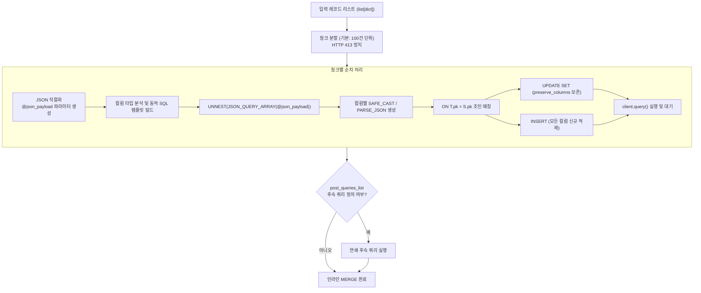

# 3.4. BigQuery 고성능 인라인 MERGE (Upsert) 쿼리 엔진 (`merge_table_from_json_data`)

> **소속 모듈**: `agent_common.clients.BigQueryClient`  
> **핵심 메서드**: `merge_table_from_json_data()`  
> **의존 패키지**: `google-cloud-bigquery>=3.10.0`

---

## 1. 개요 및 엔터프라이즈 배경

데이터 웨어하우스에 변경 데이터 캡처(CDC) 이벤트나 최신 상태 레코드를 적재할 때, 데이터 중복을 방지하고 최신 정보로 갱신하기 위해 **MERGE INTO (Upsert)** 연산이 필수적입니다.

기존의 전통적인 BigQuery MERGE 방식은 다음과 같은 문제점을 안고 있었습니다:
1. **임시 테이블 생성 오버헤드**: 데이터를 중간 스테이징(Staging) 테이블에 먼저 업로드한 뒤 MERGE 쿼리를 날려야 하므로 I/O와 테이블 생성/삭제 비용이 발생합니다.
2. **HTTP 413 및 쿼리 파라미터 크기 제한**: 대용량 JSON을 단일 파라미터로 전달할 경우 BigQuery API 요청 크기 한도(10MB/100MB)를 초과하여 작업이 실패합니다.
3. **특수문자 및 한글 컬럼명 구문 오류**: BigQuery 예약어나 한글 컬럼명이 포함되어 있을 경우 이스케이프 미처리로 인해 SQL 컴파일 오류가 발생합니다.
4. **엄격한 데이터 타입 불일치**: JSON 배열 언네스트(Unnest) 시 컬럼 타입이 명확히 캐스팅되지 않으면 BigQuery 타입 검증에서 거부됩니다.

`BigQueryClient.merge_table_from_json_data`는 임시 테이블 없이 단일 SQL 쿼리로 직접 인라인 MERGE를 수행하는 **고성능 순수 인라인 MERGE 엔진**입니다.

---

## 2. 인라인 MERGE 엔진 아키텍처



---

## 3. 주요 기능 및 파라미터 규격

### 3.1. 메서드 시그니처
```python
def merge_table_from_json_data(
    self,
    json_data_any: Any,
    pk_key_str: str = "id",
    preserve_columns_list: list[str] | None = None,
    column_types_dict: dict[str, str] | None = None,
    matched_condition_str: str | None = None,
    not_matched_condition_str: str | None = None,
    post_queries_list: list[dict[str, Any]] | None = None,
    chunk_size_int: int = 100,
    timeout_int: int | None = None,
) -> None
```

### 3.2. 파라미터 상세 규격
- `json_data_any`: Upsert 대상 단일 `dict` 또는 `list[dict]`
- `pk_key_str`: 레코드 식별 및 조인 기준이 되는 기본키(Primary Key) 컬럼명 (기본값: `'id'`)
- `preserve_columns_list`: 기존 레코드가 존재하여 UPDATE될 때, **덮어쓰지 않고 기존 테이블의 값을 유지해야 하는 컬럼 목록** (예: 최초 생성일시 `created_at` 등)
- `column_types_dict`: 컬럼별 명시적 SQL 타입 매핑 딕셔너리 (예: `{"price": "NUMERIC", "meta": "JSON", "reg_dt": "TIMESTAMP"}`). 미지정된 컬럼은 파이썬 데이터 타입에 따라 자동 추론되어 적절한 SQL 함수로 캐스팅됩니다:
  - `dict`, `list` -> `PARSE_JSON(JSON_QUERY(item, '$.\"col\"'))`
  - `bool` -> `SAFE_CAST(JSON_VALUE(...) AS BOOL)`
  - `int` -> `SAFE_CAST(JSON_VALUE(...) AS INT64)`
  - `float` -> `SAFE_CAST(JSON_VALUE(...) AS FLOAT64)`
  - `str` 등 -> `JSON_VALUE(...)`
- `matched_condition_str`: `WHEN MATCHED` 절에 부가할 추가 조건식 (예: `"AND S.updated_at > T.updated_at"`)
- `not_matched_condition_str`: `WHEN NOT MATCHED` 절에 부가할 추가 조건식 (예: `"AND S.is_deleted = FALSE"`)
- `post_queries_list`: MERGE 실행 직후 연쇄적으로 실행할 후속 쿼리 목록 (`[{"sql": "...", "params": [...]}, ...]`)
- `chunk_size_int`: BigQuery 파라미터 크기 제한을 방지하기 위한 청크 분할 단위 (기본값: `100`건)

---

## 4. 실전 사용 예시

### 4.1. 기본 Upsert (Primary Key 기준 삽입 및 수정)
```python
from agent_common.clients import BigQueryClient

bq_client = BigQueryClient(
    project_id_str="my-gcp-project",
    dataset_id_str="service_db",
    table_id_str="tb_member_profile",
)

# Upsert 대상 데이터 (신규 사용자 및 기존 수정 사용자 혼합)
members_data_list = [
    {
        "member_id": "M001",
        "name": "홍길동",
        "login_count": 42,
        "is_vip": True,
        "created_at": "2026-01-01 00:00:00+09:00",
        "last_login_at": "2026-08-24 15:30:00+09:00",
    },
    {
        "member_id": "M002",
        "name": "이순신",
        "login_count": 1,
        "is_vip": False,
        "created_at": "2026-08-24 15:35:00+09:00",
        "last_login_at": "2026-08-24 15:35:00+09:00",
    },
]

# created_at은 최초 가입일시이므로 UPDATE 시 덮어쓰지 않고 보존
bq_client.merge_table_from_json_data(
    json_data_any=members_data_list,
    pk_key_str="member_id",
    preserve_columns_list=["created_at"],
    chunk_size_int=100,
)
print("인라인 MERGE 완료 (기존 M001의 created_at은 유지되며 수정, M002는 신규 추가)")
```

### 4.2. 명시적 타입 지정 및 조건부 MERGE
```python
from agent_common.clients import BigQueryClient

bq_client = BigQueryClient(
    project_id_str="my-gcp-project",
    dataset_id_str="iot_lake",
    table_id_str="tb_device_telemetry",
)

telemetry_data_list = [
    {
        "device_id": "DEV-9901",
        "sensor_metrics": {"temp": 26.5, "humidity": 60},
        "event_time": "2026-08-24 16:00:00+09:00",
        "status": "NORMAL",
    }
]

# 복합 JSON 컬럼 및 TIMESTAMP 타입 명시 지정
bq_client.merge_table_from_json_data(
    json_data_any=telemetry_data_list,
    pk_key_str="device_id",
    column_types_dict={
        "sensor_metrics": "JSON",
        "event_time": "TIMESTAMP",
    },
    # 최신 이벤트 일시일 때만 UPDATE 적용
    matched_condition_str="AND S.event_time > T.event_time",
)
```

---

## 5. 생성되는 MERGE SQL 원리 분석

`merge_table_from_json_data()`가 내부적으로 조합하여 BigQuery로 전송하는 실제 SQL 구문 예시:

```sql
MERGE `my-gcp-project.service_db.tb_member_profile` T
USING (
    SELECT
      JSON_VALUE(item, '$."member_id"') AS `member_id`,
      JSON_VALUE(item, '$."name"') AS `name`,
      SAFE_CAST(JSON_VALUE(item, '$."login_count"') AS INT64) AS `login_count`,
      SAFE_CAST(JSON_VALUE(item, '$."is_vip"') AS BOOL) AS `is_vip`,
      TIMESTAMP(JSON_VALUE(item, '$."created_at"')) AS `created_at`,
      TIMESTAMP(JSON_VALUE(item, '$."last_login_at"')) AS `last_login_at`
    FROM UNNEST(JSON_QUERY_ARRAY(@json_payload)) AS item
) S
ON T.`member_id` = S.`member_id`
WHEN MATCHED THEN
  UPDATE SET
    T.`name` = S.`name`,
    T.`login_count` = S.`login_count`,
    T.`is_vip` = S.`is_vip`,
    T.`last_login_at` = S.`last_login_at`
WHEN NOT MATCHED THEN
  INSERT (`member_id`, `name`, `login_count`, `is_vip`, `created_at`, `last_login_at`)
  VALUES (S.`member_id`, S.`name`, S.`login_count`, S.`is_vip`, S.`created_at`, S.`last_login_at`)
```

- 모든 컬럼명이 백틱(`` ` ``)으로 둘러싸여 한글 및 예약어 충돌이 원천 차단됩니다.
- `created_at` 컬럼은 `preserve_columns_list`에 지정되어 `UPDATE SET` 목록에서 자동으로 제외되고 `INSERT` 목록에만 포함됩니다.

---

## 6. 예외 처리 및 장애 대응 가이드

| 발생 예외 | 주요 발생 원인 | 조치 방안 |
| :--- | :--- | :--- |
| `ValueError: 지원하지 않는 JSON 데이터 포맷 구조입니다` | `json_data_any`에 dict 또는 list가 아닌 타입 전달 | 입력 객체 타입 확인 |
| `RuntimeError: db_table_merge_failed (Invalid JSON)` | JSON 데이터 내 특수 제어 문자 또는 이스케이프 오류 | 원천 데이터의 UTF-8 문자열 인코딩 점검 |
| `RuntimeError: Type mismatch` | 추론된 SQL 타입과 실제 테이블 컬럼 타입 불일치 | `column_types_dict`에 명시적 BigQuery 타입(`NUMERIC`, `TIMESTAMP`, `JSON` 등) 선언 |
| `RuntimeError: Payload too large (413)` | 단일 청크 크기가 과도하게 큼 | `chunk_size_int` 값을 기본 100건에서 50건 또는 20건으로 축소 |
