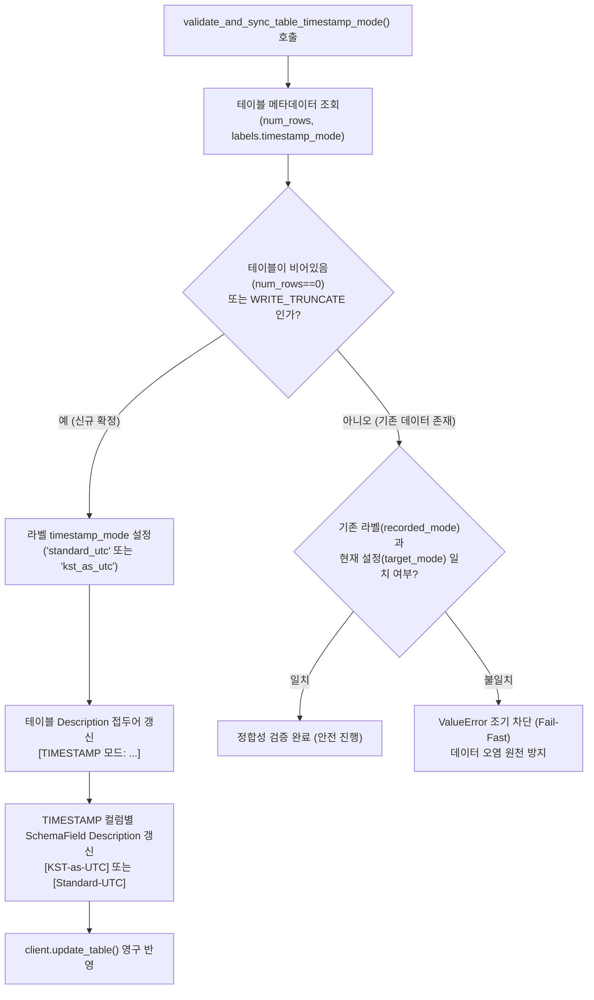

# 3.5. BigQuery 타임존 오프셋 변환 및 테이블 타임존 모드 검증·동기화

> **소속 모듈**: `agent_common.clients.BigQueryClient`  
> **핵심 메서드**: `convert_to_bigquery_timestamp()`, `validate_and_sync_table_timestamp_mode()`  
> **관련 설정**: `config.bigquery.timezone_offset_str`, `config.bigquery.kst_as_utc_timestamp_bool`

---

## 1. 개요 및 엔터프라이즈 배경

Google Cloud BigQuery의 `TIMESTAMP` 타입은 내부적으로 **항상 마이크로초 단위의 UTC(+00:00)**로 저장됩니다. 하지만 한국 엔터프라이즈 현장에서는 운영 및 데이터 분석 관점에서 두 가지 상반된 요구사항이 존재합니다:

1. **표준 UTC 모드 (`Standard-UTC`)**:
   - 글로벌 표준에 따라 정확한 일시를 보존하며, 쿼리 조회 시 `DATETIME(timestamp_col, 'Asia/Seoul')` 함수를 적용하여 한국 시각을 계산하는 방식.
2. **KST 화면 표시용 모드 (`KST-as-UTC`)**:
   - BigQuery 콘솔 UI, Looker Studio 대시보드, 타 서드파티 BI 툴에서 별도 함수 변환 없이 한국 시각(KST) 숫자가 화면에 그대로 나타나도록 한국 시각 일시에 강제로 `+00:00` 오프셋을 부여하여 저장하는 특수 방식.

만약 동일한 테이블에 두 가지 모드의 데이터가 섞여서 적재(혼용)되면, 9시간의 시차 오차가 발생하여 일일 배치 집계와 결산 데이터가 심각하게 왜곡됩니다.

`BigQueryClient`는 **다양한 원천 날짜 문자열을 표준 타임스탬프로 안전하게 정규화**하고, **테이블 메타데이터(라벨 및 컬럼 설명)를 동기화하여 불일치 시 작업을 즉시 차단(Fail-Fast)**하는 정밀 안전장치를 제공합니다.

---

## 2. 타임존 모드 검증 및 동기화 아키텍처



---

## 3. 주요 기능 및 메서드 규격

### 3.1. 일시 문자열 정규화 (`convert_to_bigquery_timestamp`)
```python
def convert_to_bigquery_timestamp(
    self,
    val_any: Any,
    default_tz_offset_str: Optional[str] = None,
) -> Optional[str]
```
- **지원 입력 포맷**:
  - `ISO 8601` 형식 (`2026-08-24T15:30:00+09:00`, `2026-08-24 15:30:00Z` 등)
  - 공백/슬래시 구분 일시 (`2026/08/24 15:30:00`)
  - 14자리 압축 일시 (`20260824153000`)
  - 8자리 일자 (`20260824` -> `2026-08-24 00:00:00`)
- **타임존 오프셋 해석 우선순위**:
  1. 원천 문자열 자체에 명시된 오프셋 (`Z`, `+09:00` 등)
  2. 파라미터 `default_tz_offset_str`
  3. 설정 파일 `config.bigquery.timezone_offset_str` (기본값: `+09:00`)
  4. 호스트 시스템 로컬 타임존 (`TimeUtils.get_system_timezone_offset_str()`)
- **KST-as-UTC 변환 로직**:
  - `kst_as_utc_timestamp_bool = True`인 경우, 원천 KST 시간 숫자를 보존하여 `+00:00` 오프셋 문자열을 반환합니다.

### 3.2. 테이블 타임존 모드 검증 및 메타 동기화 (`validate_and_sync_table_timestamp_mode`)
```python
def validate_and_sync_table_timestamp_mode(
    self,
    write_disposition_str: str = "WRITE_APPEND",
) -> None
```
- **검증 절차**:
  1. 대상 테이블의 행 수(`num_rows`)와 라벨(`labels["timestamp_mode"]`)을 조회합니다.
  2. **빈 테이블 또는 WRITE_TRUNCATE인 경우**: 현재 활성화된 모드(`kst_as_utc` 또는 `standard_utc`)로 테이블 라벨, 테이블 설명, TIMESTAMP 컬럼 설명을 최신 상태로 영구 갱신합니다.
  3. **기존 행이 존재하는 경우 (`num_rows > 0`)**: 테이블에 각인된 모드와 현재 프로그램의 설정이 다르면 `ValueError`를 발생시키고 즉시 프로세스를 중단(Fail-Fast)합니다.

---

## 4. 실전 사용 예시

### 4.1. 일시 문자열 정규화 예제
```python
from agent_common.clients import BigQueryClient

bq_client = BigQueryClient(
    project_id_str="my-project",
    dataset_id_str="analytics",
    table_id_str="tb_events",
)

# 1) 14자리 문자열 변환 -> "2026-08-24 15:30:00+09:00"
ts_1 = bq_client.convert_to_bigquery_timestamp("20260824153000")

# 2) 8자리 일자 변환 -> "2026-08-24 00:00:00+09:00"
ts_2 = bq_client.convert_to_bigquery_timestamp("20260824")

# 3) ISO 8601 변환
ts_3 = bq_client.convert_to_bigquery_timestamp("2026-08-24T15:30:00Z")

print(ts_1, ts_2, ts_3)
```

### 4.2. 파이프라인 기동 시 테이블 모드 정합성 검증 (배치 작업 표준)
```python
from agent_common.clients import BigQueryClient

bq_client = BigQueryClient(
    project_id_str="my-project",
    dataset_id_str="analytics",
    table_id_str="tb_daily_settlement",
)

# 배치 적재 전 타임존 모드 정합성 검증 및 테이블 라벨/설명 자동 동기화
# 기존 데이터와 설정 불일치 시 ValueError 발생하며 파이프라인 안전 차단
bq_client.validate_and_sync_table_timestamp_mode(write_disposition_str="WRITE_APPEND")

# 정합성 검증 통과 후 안심하고 적재 진행
bq_client.load_table_from_json_data(
    json_data_any=[{"settle_id": "S100", "settle_time": "2026-08-24 18:00:00+09:00"}],
    write_disposition_str="WRITE_APPEND",
)
```

---

## 5. 테이블 메타데이터 표기 표준

`validate_and_sync_table_timestamp_mode()` 실행 시 BigQuery 콘솔에 자동으로 반영되는 메타데이터 표준:

| 항목 | Standard-UTC 모드 (`False`) | KST-as-UTC 모드 (`True`) |
| :--- | :--- | :--- |
| **테이블 라벨** | `timestamp_mode: "standard_utc"` | `timestamp_mode: "kst_as_utc"` |
| **테이블 Description** | `[TIMESTAMP 모드: Standard-UTC] 표준 UTC 시각으로 기록되는 테이블입니다.` | `[TIMESTAMP 모드: KST-as-UTC] 고객사 화면 표시용 한국 시각(KST)이 UTC(+00:00)로 기록되는 테이블입니다.` |
| **컬럼 Description** | `[Standard-UTC] 이벤트 발생 일시` | `[KST-as-UTC] 이벤트 발생 일시` |

---

## 6. 예외 처리 및 장애 대응 가이드

| 발생 예외 | 주요 발생 원인 | 조치 방안 |
| :--- | :--- | :--- |
| `ValueError: 데이터 혼란 방지(Fail-Fast)` | 대상 테이블에 이미 데이터가 적재되어 있으며, 기존 테이블 라벨 모드와 현재 프로그램의 `kst_as_utc_timestamp_bool` 설정이 상반됨 | 1) 테이블을 `TRUNCATE`하여 신규 모드로 초기화하거나<br/>2) `config.yml`의 `kst_as_utc_timestamp_bool` 설정을 기존 테이블 모드와 일치시킴 |
| `RuntimeError: BigQuery 테이블 메타데이터 갱신 실패` | 서비스 계정에 `bigquery.tables.update` 권한이 부족함 | IAM 콘솔에서 BigQuery Admin 또는 Data Editor 권한 부여 |
