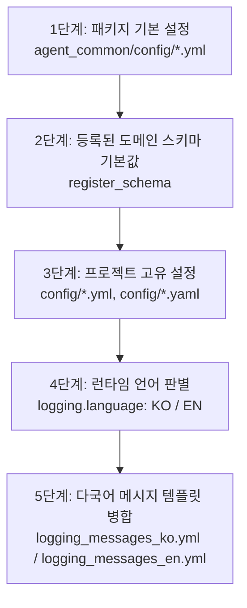

# 01. 계층적 YAML 설정 해석 및 병합 (Deep Merge)

> **소속 모듈**: `agent_common.config_loader.ConfigLoader`  
> **관련 주요 메서드**: `ConfigLoader.get_settings()`, `ConfigLoader._deep_merge()`

---

## 1. 개요 및 목적

`agent_common` 패키지는 대규모 분산 데이터 파이프라인 및 에이전트 서비스 환경에서 설정값의 중복을 제거하고, 전사 공통 표준 설정과 개별 애플리케이션의 고유 설정을 유연하게 결합하기 위해 **계층적 YAML 해석 및 재귀적 딥 머지(Deep Merge)** 아키텍처를 제공합니다.

단순한 딕셔너리 `update()`는 1단계 키만 덮어쓰므로 하위 중첩 구조(Nested Dict)가 소실되는 문제가 발생합니다. `ConfigLoader`는 하위 계층까지 탐색하여 동일 키는 덮어쓰고 새로운 키는 보존하는 인플레이스 재귀 병합을 수행합니다.

---

## 2. 5단계 계층적 병합 우선순위

`ConfigLoader.get_settings()` 호출 시 다음 5단계 순서로 설정이 누적 병합되며, 뒤 단계의 설정이 앞 단계의 설정을 오버라이드합니다:



1. **1단계 (기본 패키지 설정)**:
   - `agent_common/config/` 디렉터리 내의 `default_agent_common.yml`, `llmpool.yml` 등 패키지 기본 설정을 파일명 알파벳 순으로 로드합니다.
   - 단, `logging_messages*.yml` 파일은 4단계 언어 판별 이후 로드되도록 제외됩니다.
2. **2단계 (동적 등록 도메인 스키마)**:
   - 애플리케이션 기동 시 `ConfigLoader.register_schema()`를 통해 등록된 도메인 기본 스키마 딕셔너리가 병합됩니다.
3. **3단계 (프로젝트 고유 설정 오버라이드)**:
   - 프로젝트 루트의 `config/` 디렉터리에 존재하는 모든 `.yml` 및 `.yaml` 파일을 알파벳 순으로 읽어 병합합니다.
   - 프로젝트 고유 설정 파일(`config.yml`)에 정의된 값이 패키지 기본값을 덮어씁니다.
4. **4단계 (언어 판별)**:
   - 환경변수(`AGENT_LOG_LANGUAGE`, `LOGGING_LANGUAGE`), `logging.language` 설정, 또는 런타임 강제 지정값(`ConfigLoader.set_language()`)을 기반으로 언어(`KO` 또는 `EN`)를 결정합니다.
5. **5단계 (메시지 템플릿 병합)**:
   - 결정된 언어에 해당하는 패키지 기본 사전(`logging_messages_ko.yml` 또는 `logging_messages_en.yml`)을 로드하고, 프로젝트 `config/` 디렉터리에 프로젝트 고유의 메시지 파일이 있을 경우 해당 사전으로 최종 오버라이드합니다.

---

## 3. 재귀적 딥 머지(Deep Merge) 알고리즘

`ConfigLoader._deep_merge`는 다음과 같은 원리로 동작합니다:

```python
@staticmethod
def _deep_merge(target: dict[str, Any], incoming: dict[str, Any]) -> None:
    for key, value in incoming.items():
        if isinstance(value, dict) and isinstance(target.get(key), dict):
            ConfigLoader._deep_merge(target[key], value)
        else:
            target[key] = value
```

- **양쪽 모두 딕셔너리인 경우**: 하위 키로 재귀 진입하여 각 세부 속성을 개별적으로 병합합니다.
- **단일 값이거나 타입이 다른 경우**: `incoming`의 새로운 값이 `target`의 기존 값을 덮어씁니다.
- **리스트(List)인 경우**: 요소 병합이 아닌 통째 교체(Replacement) 방식으로 동작하여 명확한 의도를 유지합니다.

---

## 4. 실전 사용 예시

### 4.1. 설정 파일 구성

**패키지 기본 설정 (`agent_common/config/default_agent_common.yml`)**:
```yaml
ecs:
  endpoint_url: "http://10.200.10.10:9020"
  max_retries_int: 3
  timeout_int: 30

logging:
  level_str: "INFO"
  language: "KO"
```

**프로젝트 설정 (`config/config.yml`)**:
```yaml
ecs:
  # endpoint_url은 기본값 유지, max_retries_int만 재정의
  max_retries_int: 5

# 새로운 프로젝트 고유 설정 추가
transfer:
  max_workers_int: 8
```

### 4.2. 파이썬 코드에서 조회

```python
from agent_common.config_loader import config

# 1) 패키지 기본값과 프로젝트 오버라이드가 결합된 최종 설정 확인
print(config.ecs.endpoint_url)     # "http://10.200.10.10:9020" (패키지 기본값 유지)
print(config.ecs.max_retries_int)   # 5 (프로젝트 설정으로 오버라이드됨)
print(config.ecs.timeout_int)       # 30 (패키지 기본값 유지)
print(config.transfer.max_workers_int) # 8 (프로젝트 신규 설정 반영)
```

---

## 5. 프로젝트 루트 자동 탐색 (`_find_project_root`)

`ConfigLoader`는 별도의 경로 인자 없이도 다음과 같은 3중 폴백 전략으로 `config/config.yml`이 존재하는 최상위 프로젝트 루트를 자동 감지합니다:

1. **작업 디렉토리(CWD)**: `os.getcwd()` 및 그 상위 디렉터리 탐색
2. **엔트리포인트 스크립트 위치**: `sys.argv[0]`의 부모 디렉터리 및 상위 경로 탐색
3. **agent_common 패키지 위치**: 패키지 설치 경로의 상위 디렉터리 탐색

이를 통해 Airflow DAG 실행, 단위 테스트, CLI 실행 등 어떤 실행 컨텍스트에서도 항상 안정적으로 설정 파일을 찾아 로드합니다.
